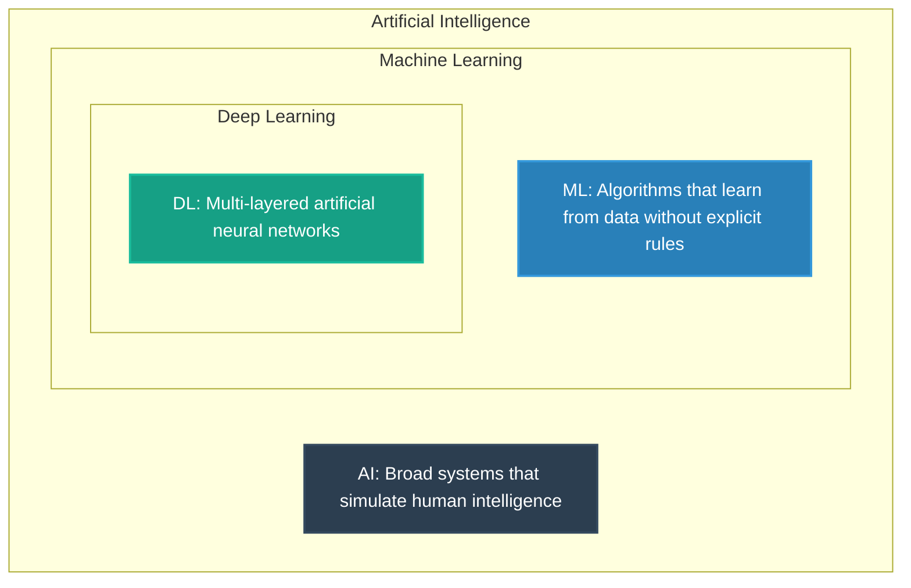

# AI vs. ML vs. DL

A common point of confusion for beginners is distinguishing between **Artificial Intelligence (AI)**, **Machine Learning (ML)**, and **Deep Learning (DL)**. While they are often used interchangeably in the media, they represent nested subsets of the same technological domain.



---

## 1. Artificial Intelligence (AI)

Artificial Intelligence is the broadest concept, originating in the 1950s. It refers to any machine or system that can perform tasks that would typically require human intelligence, such as decision-making, visual perception, translation, or logical reasoning.

### Symbolic AI (Expert Systems)

During the early decades of AI (1950s–1980s), the dominant paradigm was **Symbolic AI** (also known as **Rule-Based Systems** or **Expert Systems**).

- Programmers hardcoded logical rules into the computer.
- **Example: Chess Engines**. Programmers explicitly coded the rules of chess, piece values, board coordinates, and heuristics for choosing the best move.
- **The Bottleneck**: Symbolic AI works exceptionally well for closed systems with clear mathematical rules (like chess or calculators). However, it completely fails on unstructured real-world tasks like speech recognition or animal image classification, where rules cannot be cleanly defined.

---

## 2. Machine Learning (ML)

Machine Learning is a subset of AI that emerged as a solution to the rule-definition bottleneck of Symbolic AI. Instead of defining rules manually, we feed data to an algorithm and let it learn the rules itself.

### The Limitation of Machine Learning: Feature Engineering

While ML algorithms (like Logistic Regression, SVMs, or Decision Trees) are highly powerful, they suffer from a major limitation: **Feature Engineering**.

- In standard ML, raw data cannot be fed directly to the model. A human expert must manually identify and extract the most relevant characteristics (called **Features**).
- **Example: Dog vs. Cat Classifier**.
  - To train a traditional ML classifier, a human engineer must write code to extract features like _ear shape ratio_, _presence of whiskers_, _tail-to-body length ratio_, or _color histograms_.
  - If the human expert chooses the wrong features, the model's accuracy drops significantly. This manual process is slow, expensive, and prone to error.

---

## 3. Deep Learning (DL)

Deep Learning is a specialized subset of Machine Learning based on **Artificial Neural Networks (ANN)** with multiple hidden layers. It was designed to solve the feature engineering bottleneck of ML.

### How Deep Learning Works: Automatic Feature Extraction

Unlike traditional ML, Deep Learning does not require manual feature engineering. You can feed raw data (like raw image pixel intensities) directly into a Deep Neural Network.
The network learns features hierarchically across its multiple layers:

```
Raw Image (Pixels) ──► Layer 1: Edges ──► Layer 2: Shapes ──► Layer 3: Parts (Eyes/Nose) ──► Output (Dog/Cat)
```

1. **Lower Layers**: Detect simple low-level features (e.g., horizontal/vertical lines, edges, gradients).
2. **Middle Layers**: Combine edges to detect shapes and textures (e.g., circles, triangles, fur textures).
3. **Higher Layers**: Combine shapes to detect complex parts (e.g., eyes, nose, ears, paws).
4. **Output Layer**: Performs the final classification (e.g., "Dog" or "Cat").

---

## 4. Key Differences: ML vs. DL

To choose the right approach for a project, we must compare ML and DL across several critical dimensions:

```
Performance
  ▲                                     /  Deep Learning
  │                                    /
  │                                   /
  │                                  /
  │               ──────────────────/◄--- Machine Learning Plateaus
  │              /
  │             /
  └────────────┴────────────────────────► Data Scale (Volume)
```

### A. Performance vs. Data Scale

- **Machine Learning**: Traditional models improve in accuracy as you feed them more data, but only up to a certain point. Eventually, their performance plateaus. Adding more data does not make them more accurate.
- **Deep Learning**: Performance continues to scale upwards as you feed it more data, provided you have a large enough neural network and sufficient compute power.

### B. Hardware Requirements

- **Machine Learning**: Can run easily on standard CPUs. Training takes seconds to minutes and requires very little memory.
- **Deep Learning**: Requires massive parallel computing capability. Training is virtually impossible without dedicated graphic processing units (**GPUs**) or Tensor Processing Units (**TPUs**). Training can take hours, days, or weeks.

### C. Interpretability (Black Box vs. White Box)

- **Machine Learning**: Models are generally more interpretable. For instance, in a Decision Tree or Linear Regression, you can look at the math or rules and explain exactly why the model made a specific prediction (referred to as a "White Box" model).
- **Deep Learning**: Extremely hard to interpret. A model may have 100 million weights/parameters across 50 layers. It is very difficult to explain _why_ a neural network classified a specific image as a dog (referred to as a "Black Box" model).

### Summary Comparison Table

| Feature               | Machine Learning                                                | Deep Learning                                                       |
| :-------------------- | :-------------------------------------------------------------- | :------------------------------------------------------------------ |
| **Data Size**         | Works well on small to medium datasets (1,000 to 100,000 rows). | Requires very large datasets (100,000+ to millions of rows).        |
| **Hardware**          | Runs on low-cost CPUs.                                          | Requires high-performance GPUs/TPUs.                                |
| **Feature Selection** | Requires manual feature engineering.                            | Performs automatic, hierarchical feature extraction.                |
| **Training Time**     | Seconds to hours.                                               | Days to weeks.                                                      |
| **Inference Time**    | Extremely fast (microseconds).                                  | Slower (requires deep matrix math operations).                      |
| **Tabular Data**      | Highly superior for standard business databases (Excel, SQL).   | Often overkills and underperforms compared to trees (XGBoost).      |
| **Unstructured Data** | Struggles on raw images, video, text, and speech.               | Highly dominant in Computer Vision and Natural Language Processing. |
