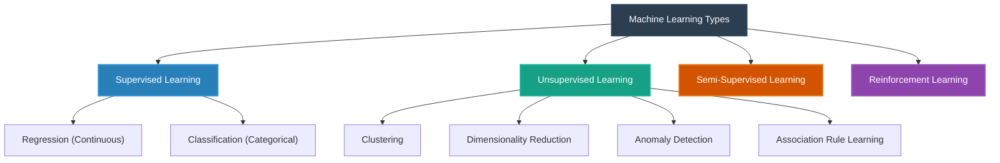

# Types of Machine Learning

Machine Learning algorithms are categorized based on how they learn and the type of feedback they receive during training. The four primary paradigms are **Supervised Learning**, **Unsupervised Learning**, **Semi-Supervised Learning**, and **Reinforcement Learning**.



---

## 1. Supervised Machine Learning

Supervised learning is the most common form of machine learning. In this setup, the algorithm is trained on a labeled dataset, meaning every input data point is paired with its correct output label. The goal is to learn a mathematical relationship (mapping function) between inputs ($X$) and outputs ($y$), so that we can predict the output for new, unseen inputs.

$$y = f(X)$$

### The Student Placement Example

Imagine we have a dataset containing historical records of 5,000 college students:

- **Inputs ($X$)**: Student IQ score, CGPA.
- **Output ($y$)**: Placement status (Yes or No).

| Student ID | IQ Score ($X_1$) | CGPA ($X_2$) | Placed? ($y$) |
| :--------- | :--------------- | :----------- | :------------ |
| 1          | 110              | 8.5          | Yes           |
| 2          | 95               | 6.2          | No            |
| 3          | 120              | 9.1          | Yes           |
| ...        | ...              | ...          | ...           |

The machine learning model analyzes this data to establish a mathematical decision boundary. When a new student joins with an IQ of 105 and a CGPA of 7.8, the model uses this relationship to predict whether they will get placed.

### Subtypes of Supervised Learning

Supervised learning tasks are divided based on the data type of the target variable ($y$):

#### A. Regression

Used when the target output is a **continuous numerical value**.

- **Examples**: Predicting house prices (e.g., \$350,000), predicting salary based on experience, predicting a person's life expectancy.
- **Data Types**: The target is a real number ($\mathbb{R}$).

#### B. Classification

Used when the target output is a **categorical variable** (discrete classes).

- **Examples**: Predicting if an email is spam or not (binary classification: 0 or 1), predicting if a patient has disease A, B, or is healthy (multiclass classification).
- **Data Types**: The target belongs to a finite set of labels (e.g., $\{\text{Spam}, \text{Not Spam}\}$).

---

## 2. Unsupervised Machine Learning

In Unsupervised Learning, the dataset consists only of inputs ($X$) without any output labels ($y$). The algorithm must explore the data to find underlying patterns, structures, or groupings on its own.

### Subtypes of Unsupervised Learning

#### A. Clustering

Grouping data points together based on similarity.

- **Example: Customer Segmentation**. An e-commerce company wants to group its customers into distinct buyer personas (e.g., bargain hunters, high-spenders, casual browsers) without pre-defined labels. The model clusters them based on purchase frequency, average order value, and browsing time.

#### B. Dimensionality Reduction

Reducing the number of input variables (columns) in a dataset while retaining as much information as possible.

- **Why it is used**: High-dimensional datasets (e.g., 100+ columns) are hard to visualize and computationally expensive to process (referred to as the "Curse of Dimensionality").
- **Techniques**: PCA (Principal Component Analysis), t-SNE (t-Distributed Stochastic Neighbor Embedding). It allows us to project high-dimensional data into a 2D or 3D space for visualization.

#### C. Anomaly Detection

Identifying unusual data points that differ significantly from the majority of the data (outliers).

- **Examples**: Credit card fraud detection (flagging a transaction in a foreign country that deviates from regular spending behavior), detecting manufacturing defects in a factory assembly line.

#### D. Association Rule Learning

Finding interesting relationships and rules between variables in large databases.

- **The "Walmart Diaper-Beer" Case Study**:
  - A famous supermarket case study (Walmart) analyzed purchase receipts and discovered a strong association: customers who bought diapers on Friday evenings were highly likely to also buy beer.
  - **The Context**: Young fathers were sent by their wives to buy diapers after work, and they grabbed a pack of beer for the weekend.
  - **Action**: By placing diapers and beer near each other, supermarkets successfully boosted sales of both products.

---

## 3. Semi-Supervised Machine Learning

Semi-Supervised Learning sits between supervised and unsupervised learning. It is used when labeling data is expensive, slow, or requires human experts, resulting in a dataset with a **small amount of labeled data** and a **large amount of unlabeled data**.

### Example: Google Photos

1. **Unsupervised Phase (Clustering)**: When you upload photos to Google Photos, the algorithm scans all images and groups similar faces together into unlabeled clusters (Cluster A, Cluster B, etc.).
2. **Supervised Phase (Labeling)**: The user goes in and tags a single photo in Cluster A with the name "John".
3. **Propagation**: The system immediately propagates the label "John" to all other photos in that cluster, automatically labeling hundreds of images from just a single user action.

---

## 4. Reinforcement Learning (RL)

Reinforcement Learning is a completely different paradigm where an autonomous agent learns to make decisions by interacting with an environment to maximize some cumulative reward.

```
                  ┌──────────────────────┐
                  │                      │
                  │     Environment      │
                  │                      │
                  └──────┬────────▲──────┘
             State /     │        │
             Observation │        │ Action
                         ▼        │
                  ┌──────┴────────┴──────┐
                  │                      │
                  │        Agent         │
                  │  (Learns via Policy) │
                  │                      │
                  └──────────────────────┘
```

### The Core Components

- **Agent**: The decision-maker (e.g., a robot, a game character, a self-driving car).
- **Environment**: The world the agent interacts with (e.g., a maze, a chess board, a virtual highway).
- **Action**: The choices the agent can make.
- **State/Observation**: The current situation of the agent in the environment.
- **Policy**: The rules or strategy the agent follows to choose its next action.
- **Reward/Punishment**: The feedback received from the environment. Positive rewards encourage behavior; negative punishments discourage it.

### The Dog Training Analogy

Think of training a puppy:

- If the puppy sits on command (Action), you give it a treat (Positive Reward).
- If the puppy bites the furniture (Action), you scold it or say "No" (Negative Reward/Punishment).
- Over time, the puppy updates its internal behavior rules (Policy) to maximize treats.

### Google DeepMind's AlphaGo

A landmark achievement in Reinforcement Learning occurred in 2016 when Google DeepMind's agent **AlphaGo** beat the world champion Lee Sedol in the ancient game of Go by a score of 4-1. Go is highly complex, with more board configurations than there are atoms in the observable universe, making brute-force search impossible. AlphaGo learned by playing millions of games against itself, refining its policy through reward maximization.
