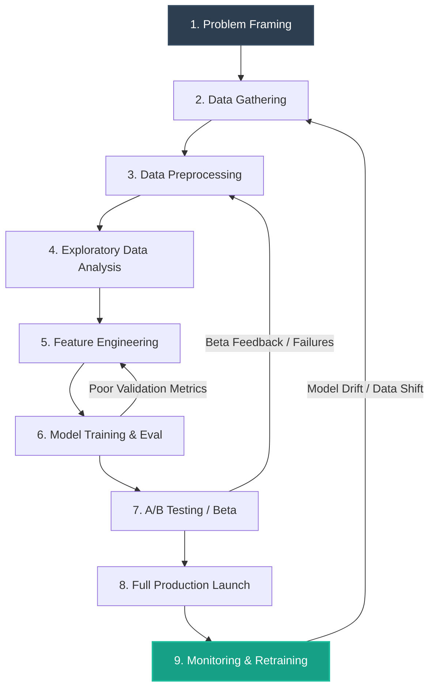

# Machine Learning Development Life Cycle (MLDLC)

In professional enterprise environments, building a machine learning system is not a linear process of writing code and fitting a model. It is a highly iterative engineering cycle known as the **Machine Learning Development Life Cycle (MLDLC)**.

---

## The 9 Stages of MLDLC

Let's analyze each stage of the life cycle in depth:

### Stage 1: Problem Framing

This is the most critical stage. Before writing a single line of code, you must align the technical objectives with business goals.

- **Business Alignment**: What specific problem are we solving? Who are the target customers? What is the budget? What is the size and skill level of our team?
- **Technical Formulation**:
  - Is this a machine learning problem, or can it be solved with simple rules?
  - What paradigm should we use? (Supervised, Unsupervised, Batch, Online).
  - What are the key metrics? We distinguish between **Business Metrics** (e.g., increase sales conversion by 5%) and **ML Metrics** (e.g., achieve an F1-score of 0.85).

### Stage 2: Data Gathering

In academic environments, datasets are pre-packaged (e.g., a `.csv` file downloaded from Kaggle). In the real world, data is fragmented and must be actively gathered.

- **Collection Techniques**:
  - Querying SQL databases or data warehouses (big data storage).
  - Fetching data from internal or third-party web APIs (ingesting JSON formats).
  - Writing web scrapers (using Python tools like BeautifulSoup or Scrapy).
  - Streaming raw data from IoT sensor networks.

### Stage 3: Data Preprocessing (Data Cleaning)

Raw data is notoriously dirty. Before feeding it to an algorithm, it must be cleaned.

- **Key Preprocessing Steps**:
  - Imputing missing values (replacing blanks with mean, median, or using ML imputers).
  - Removing duplicate entries.
  - Detecting and handling outliers (e.g., using Z-score or IQR thresholds).
  - Text normalization (tokenization, lowercasing, stemming/lemmatization).
  - Resolving class imbalance (e.g., in fraud detection where 99.9% of transactions are legitimate).

### Stage 4: Exploratory Data Analysis (EDA)

EDA is the process of studying the data to understand its shape, distribution, and patterns.

- **Tools**: Plotting correlation heatmaps, box plots, scatter plots, and histograms.
- **Goal**: Finding correlations between input features and target labels, identifying noisy variables, and establishing a mental model of the dataset.

### Stage 5: Feature Engineering & Selection

This is where domain expertise meets data science.

- **Feature Engineering**: Creating new input variables from raw columns. For example, converting a raw timestamp (e.g., `2026-05-20 23:30:52`) into categorical features like `Hour_of_Day`, `Day_of_Week`, or boolean variables like `Is_Weekend`.
- **Feature Selection**: Dropping redundant, highly correlated, or irrelevant features to simplify the model, prevent overfitting, and speed up training.

### Stage 6: Model Training & Evaluation

- **Data Splitting**: Dividing the data into **Train**, **Validation**, and **Test** sets.
- **Training**: Running multiple algorithms (e.g., Random Forests, Gradient Boosted Trees, Neural Networks) to compare performance.
- **Evaluation**: Calculating evaluation metrics like Accuracy, Precision, Recall, F1-score, and Area Under the ROC Curve (AUC) for classification; or RMSE and MAE for regression.

### Stage 7: A/B Testing & Beta Testing

Before exposing a new ML model to millions of users, it must be validated in a controlled environment.

- **Beta Testing**: Releasing the model to a small cohort of trusted, active users (e.g., internal staff or premium users) to get qualitative feedback.
- **A/B Testing**: Splitting live traffic in production. For example, 90% of users see recommendations generated by the old model (control group), while 10% see recommendations generated by the new model (test group). If the test group yields higher engagement and conversion metrics over a two-week period, the model is approved.

### Stage 8: Full Production Launch

The model is fully deployed and scaled for all users.

- **Format**: The model is typically packaged using Docker containers and deployed as a microservice API (e.g., using Flask, FastAPI, or Streamlit) on cloud platforms (AWS, GCP, Azure).
- **Engineering Requirements**: Setting up load balancers to route API requests, database pipelines for logging inputs/outputs, and establishing rollback strategies (so if the system crashes, it automatically rolls back to the previous stable version).

### Stage 9: Monitoring & Retraining (MLOps)

Models are not static; they decay over time. This is called **Model Drift** or **Rotting**.

- **Example**: A model classifying face masks in security footage must be retrained as users begin wearing different mask styles or colors that the training set did not contain.
- **Operations**:
  - Monitoring latency (how fast the model predicts) and drift (monitoring if prediction accuracy drops).
  - Setting up automated retraining pipelines (e.g., automatically downloading new data, retraining the model, running unit tests, and redeploying every Sunday night).
