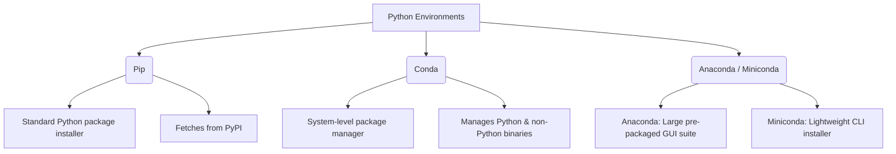

# Installing Anaconda & Development Environments

To write machine learning algorithms, you need an environment configured with specific libraries (like NumPy, Pandas, Scikit-Learn, and Jupyter). The most reliable way to manage these libraries and avoid version conflicts is using the **Anaconda Distribution** and **Conda Environments** locally, or using cloud-based tools like **Google Colab**.

---

## 1. Package & Environment Management Concepts

In Python development, you will encounter three core terms:



### Pip vs. Conda

- **pip**: The default package installer for Python. It installs packages from the Python Package Index (PyPI). It is strictly a Python package manager.
- **conda**: A language-agnostic package and environment manager. It can install Python packages, but it also installs system binaries (like C/C++ libraries, CUDA drivers, and Python versions themselves).

### Anaconda vs. Miniconda

- **Anaconda**: A complete data science suite. It includes the Conda package manager, Python, and over 250 data science packages pre-installed, along with a graphical user interface (Anaconda Navigator). (Installer size: ~1 GB).
- **Miniconda**: A lightweight bootstrap version of Anaconda. It contains only Conda, Python, and their basic dependencies. (Installer size: ~70 MB). _Recommended for developers who prefer clean command-line environments._

---

## 2. Conda Command-Line Cheat Sheet

A virtual environment is an isolated directory that contains a specific version of Python and a set of libraries. This prevents conflicts when project A requires `numpy 1.19` and project B requires `numpy 1.25`.

### Creating and Managing Environments

1. **Create a New Environment with a Specific Python Version**:

   ```bash
   conda create --name ml_env python=3.10
   ```

2. **Activate the Environment**:

   ```bash
   conda activate ml_env
   ```

3. **Install Essential Packages**:

   ```bash
   conda install numpy pandas matplotlib scikit-learn jupyter
   ```

   _Alternatively, if a package is not available on conda channels, use pip within the activated environment:_

   ```bash
   pip install seaborn
   ```

4. **List Installed Packages**:

   ```bash
   conda list
   ```

5. **Deactivate the Environment**:

   ```bash
   conda deactivate
   ```

6. **Export Environment Configuration (for reproducibility)**:

   ```bash
   conda env export > environment.yml
   ```

7. **Recreate Environment from a Configuration File**:

   ```bash
   conda env create -f environment.yml
   ```

8. **Remove an Environment**:

   ```bash
   conda env remove --name ml_env --all
   ```

---

## 3. Local Setup: Jupyter Notebook

Unlike traditional IDEs (like PyCharm or VS Code) which execute a script from top to bottom, Jupyter Notebook executes code **cell-by-cell**.

### Core Features

- **State Retention**: When you run a code cell, its variables, imports, and state remain loaded in system memory (RAM). You can write and run a subsequent cell that uses those variables without needing to re-run the entire notebook or re-load massive datasets.
- **Rich Media**: You can write formatted text (Markdown), embed mathematical equations, display charts inline, and style text using HTML/CSS.
- **Data Sharing**: Notebooks are saved as `.ipynb` files, which contain both the code and the output (including plots and text), making them easy to share.

### Keyboard Shortcuts (Command Mode - `Esc` / Edit Mode - `Enter`)

| Shortcut                  | Action                                                           |
| :------------------------ | :--------------------------------------------------------------- |
| **`Shift + Enter`**       | Run the current cell and select the cell below.                  |
| **`Alt + Enter`**         | Run the current cell and insert a new blank cell directly below. |
| **`Ctrl + Enter`**        | Run the active cell in place.                                    |
| **`A`**                   | Insert a new cell **Above** the current cell.                    |
| **`B`**                   | Insert a new cell **Below** the current cell.                    |
| **`D, D`** (Double press) | **Delete** the current cell.                                     |
| **`M`**                   | Change cell type to **Markdown**.                                |
| **`Y`**                   | Change cell type to **Code**.                                    |

### Markdown in Jupyter Notebook

- **Headings**: Use `#` for H1, `##` for H2, `###` for H3.
- **Formatting**: Use `**bold**` or `*italics*`.
- **Inline HTML**: Use HTML elements directly to style text:

  ```html
  <span style="color:red; font-weight:bold;">Important Text</span>
  ```

---

## 4. Google Colab (Cloud-based Alternative)

Google Colaboratory (Colab) is a free, cloud-based Jupyter Notebook environment that runs entirely in your web browser.

### Why Use Google Colab?

1. **Zero Configuration**: No installation needed; all data science packages come pre-installed.
2. **Free Hardware Acceleration**: Google provides free access to **GPUs (Graphics Processing Units)** and **TPUs (Tensor Processing Units)**. These processors are up to $50\times$ faster than standard laptop CPUs for training heavy Deep Learning models.
3. **Collaboration**: Notebooks are saved directly to Google Drive, making sharing and real-time co-authoring as simple as Google Docs.

### How to use Google Colab

1. Navigate to [colab.research.google.com](https://colab.research.google.com/).
2. Click **New Notebook**.
3. To enable GPU acceleration: Go to **Runtime** ──► **Change runtime type** ──► Select **T4 GPU** (or GPU/TPU) from the hardware accelerator dropdown.

### Importing Large Datasets via Kaggle API in Colab

Instead of downloading a huge dataset to your local machine and then uploading it to Colab (which is slow and bandwidth-heavy), you can download datasets directly from Kaggle using their API:

1. **Get the API Key**: Log in to Kaggle, go to **Settings**, and click **Create New Token**. This downloads a `kaggle.json` file.
2. **Upload to Colab**: Upload `kaggle.json` to your Colab environment.
3. **Configure Kaggle Directory**:

   ```bash
   # Create directory and move file
   !mkdir -p ~/.kaggle
   !cp kaggle.json ~/.kaggle/

   # Secure the API key file permissions
   !chmod 600 ~/.kaggle/kaggle.json
   ```

4. **Download Dataset**: Copy the API command from the Kaggle dataset page (e.g., `kaggle datasets download -d <dataset-owner/dataset-name>`) and run it with an exclamation mark prefix:

   ```bash
   !kaggle datasets download -d developer/placement-dataset
   ```

5. **Extract Zip File**:

   ```python
   import zipfile

   # Unzip the downloaded file
   with zipfile.ZipFile('placement-dataset.zip', 'r') as zip_ref:
       zip_ref.extractall('/content')
   ```
