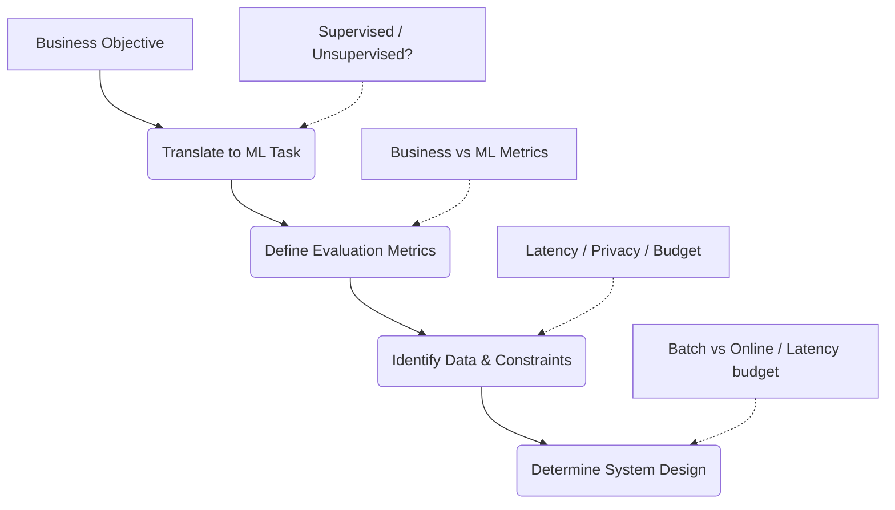

# Framing Machine Learning Problems

Many junior developers jump straight into writing code and training models. However, the most critical phase of any machine learning project happens before coding: **Problem Framing**. This is the process of translating an ambiguous business problem into a concrete, solvable machine learning task with clear constraints, data definitions, and evaluation metrics.

---

## 1. The Problem Framing Workflow



---

## 2. Step-by-Step Framing Process

### Step 1: Translate the Business Objective into an ML Task

Start by identifying the category of the ML task:

- **Supervised Learning:** Do we have input features $X$ and labeled targets $y$?
  - _Regression:_ Predicting a continuous numerical value (e.g., predicting house prices, stock market values, or temperature).
  - _Classification:_ Predicting a discrete category/label.
    - **Binary:** Two classes (e.g., Spam vs. Not Spam, Churn vs. Retained).
    - **Multi-class:** More than two classes, where each instance belongs to exactly one class (e.g., classifying hand-written digits 0-9).
    - **Multi-label:** An instance can belong to multiple classes simultaneously (e.g., tagging a movie as both "Action" and "Comedy").
- **Unsupervised Learning:** Finding patterns in unlabeled data.
  - _Clustering:_ Grouping similar objects (e.g., customer segmentation).
  - _Anomaly Detection:_ Identifying unusual patterns (e.g., credit card fraud, server health checks).
  - _Dimensionality Reduction:_ Compressing features while retaining information (e.g., PCA, t-SNE).
- **Recommendation Systems:** Matching users with content (Collaborative Filtering, Content-Based, or Hybrid approaches).

### Step 2: Define Evaluation Metrics

You must separate business metrics (used by stakeholders) from technical ML metrics (used by the model/developers).

| Goal                    | Technical ML Metric                | Business Metric                        |
| :---------------------- | :--------------------------------- | :------------------------------------- |
| **User Retention**      | ROC-AUC, F1-Score                  | Churn rate reduction (%)               |
| **Sales Forecasting**   | RMSE, MAE, MAPE                    | Reduced warehousing overhead costs ($) |
| **Ad Click Prediction** | Log-Loss, Precision                | Click-Through Rate (CTR), Ad Revenue   |
| **Product Search**      | Mean Average Precision (MAP), NDCG | Purchase conversion rate (%)           |

> [!IMPORTANT]
> **Precision vs. Recall Trade-off:**
>
> - **High Precision:** Minimizes false positives (e.g., in spam filtering, we don't want a legitimate email classified as spam).
> - **High Recall:** Minimizes false negatives (e.g., in cancer detection, we cannot afford to miss a positive patient, even if it leads to some false alarms).

### Step 3: Identify Data Sources & Constraints

Evaluate the availability and feasibility of data:

- **Label Availability:** Do we have historical labels? If not, do we need manual labeling (expensive) or can we use self-labeled user actions (e.g., clicks, purchases)?
- **Data Quality:** Are there major gaps, noise, or bias in the history?
- **Constraints:**
  - _Privacy:_ Are there compliance requirements (GDPR, HIPAA) that restrict using personal data?
  - _Volume:_ Is there enough data to train complex deep learning models, or should we use simpler linear models?

### Step 4: System Design Architecture

Decide how the model will run in production:

- **Prediction Latency Budget:**
  - _Real-time (Online):_ Predictions must be returned in milliseconds (e.g., search auto-complete, fraud checks). Requires low-latency servers (like FastAPI) and fast inference models.
  - _Batch (Offline):_ Predictions are calculated periodically in large batches (e.g., daily recommendations, monthly inventory forecasting). Can use computationally intensive models since time is not critical.
- **Learning Mode:**
  - _Batch Learning:_ The model is trained offline and redeployed periodically.
  - _Online Learning:_ The model continuously learns from real-time data streams.

---

## 3. Case Study: Reducing Subscriber Churn (Netflix)

Let's look at how a real company like Netflix frames a business problem:

```
[Raw Business Goal] ──► Increase Revenue & Profit
                             │
                             ▼
[Refined Strategy]  ──► Reduce Churn Rate (Keep existing users)
                             │
                             ▼
[ML Problem Form]   ──► Binary Classification: Will this user cancel subscription next month? (0 or 1)
                             │
                             ▼
[Action/Retention]  ──► Auto-send targeted discounts, recommendations, or email prompts
```

### A. The Business Goal

The leadership's high-level goal is: **"Increase revenue and profits."**
To increase revenue, a company has three main levers:

1. **Acquire New Customers**: Highly expensive due to marketing and acquisition costs.
2. **Increase Prices**: Risky, as it can cause negative PR and drive users to competitors.
3. **Decrease Churn Rate (Retention)**: Keeping the users you already have. This is highly cost-effective.

### B. Defining Churn Rate

**Churn Rate** is the percentage of active subscribers who cancel their subscription within a given time period (e.g., monthly).

- **The Birth/Death Analogy**: Think of your customer base as a population. Acquiring new customers is the _birth rate_, and churn is the _death rate_. If your churn rate is high, you must acquire customers incredibly fast just to stay flat. If you can lower the churn rate, your user base grows naturally.
- **The Financial Impact**: For a company with 200 million subscribers, even a tiny 0.25% drop in churn saves millions of dollars in monthly recurring revenue.

### C. Translating Netflix Churn to ML Terms

Once the strategy (Reduce Churn) is chosen, the Data Scientist must translate it into mathematical and programmatic terms.

| Business Problem / Metric                                                                                                                          | Machine Learning Formulation                                                                                                                                    | ML Metric                                                                                                                                                                           |
| :------------------------------------------------------------------------------------------------------------------------------------------------- | :-------------------------------------------------------------------------------------------------------------------------------------------------------------- | :---------------------------------------------------------------------------------------------------------------------------------------------------------------------------------- |
| **Business Problem**: Reduce Subscriber Churn (from 4.0% to 3.75%).                                                                                | **ML Problem**: Classify whether a user will cancel their subscription within the next 30 days (**Binary Classification**: `0 = Will Stay`, `1 = Will Cancel`). | **Precision & Recall**: High Precision avoids wasting promotional discounts on users who weren't planning to leave; High Recall ensures we catch as many leaving users as possible. |
| **Business Action**: If output is `1` (Will Cancel), trigger targeted retention emails, special discount codes, or recommend highly-rated content. | **ML Inputs (Features)**: Behavioral logs, payment status, demographic metadata.                                                                                | **Inference Type**: Batch Prediction (e.g., run nightly offline processing to generate risk scores for the customer base).                                                          |

### D. System Details and Feature Auditing

- **Feature Auditing & Collaboration**: A data scientist cannot work in isolation. You must consult with **Data Engineers** to verify if the behavioral features you want are actually being logged and stored (e.g., "Number of times a user searched for a movie and got 'no results'").
- **Architectural & System Constraints**: Churn modeling is naturally suited for **Batch Processing** (e.g., run a nightly script at 3:00 AM to score all users), saving substantial GPU/CPU infrastructure costs compared to real-time.
- **Geographic Assumptions**: Separate regional models (e.g., India vs US) are often needed because user behavior, viewing patterns, and pricing elasticities differ dramatically across countries.
