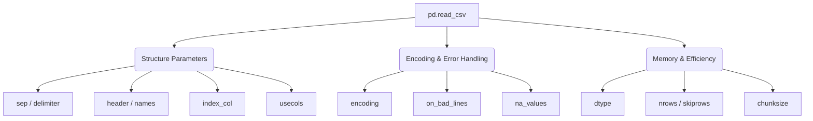

# Working with CSV Files in Pandas

Reading data from tabular files is the starting point of most machine learning pipelines. Pandas provides the highly versatile `pd.read_csv()` function. While it is commonly used with default settings, it contains over 50 parameters to handle messy, non-standard datasets efficiently.

---

## 1. Parameters Reference Workflow



---

## 2. Core Parameters of `pd.read_csv()`

### A. Column Separators (`sep` / `delimiter`)

CSV (Comma-Separated Values) files are separated by commas by default. However, files are often separated by tabs (TSV), semicolons, or custom spaces.

- **Tab Separated Values (TSV)**:

```python
df = pd.read_csv('movie_titles.tsv', sep='\t')
```

### B. Custom Header Handling (`header` & `names`)

- **No Header Row**: If your file starts directly with data without column titles, set `header=None` to prevent Pandas from treating the first row as headers. Columns will be named numerically (`0, 1, 2, ...`).

```python
df = pd.read_csv('data.csv', header=None)
```

- **Custom Header Names**: Pass a list of column names using the `names` parameter to assign names directly during data load.

```python
col_names = ['id', 'name', 'age', 'placement_status']
df = pd.read_csv('data.csv', header=None, names=col_names)
```

### C. Setting the Index Column (`index_col`)

By default, Pandas generates an integer index (`0, 1, 2, ...`). If your file already has an ID or index column, you can convert it into the Pandas DataFrame index.

```python
df = pd.read_csv('data.csv', index_col='id')
```

### D. Selecting a Subset of Columns (`usecols`)

Instead of loading a massive table and then dropping columns, use `usecols` to load only specific columns into memory. This significantly reduces RAM usage.

```python
df = pd.read_csv('large_data.csv', usecols=['name', 'age'])
```

### E. Row Slicing & Sampling (`skiprows` & `nrows`)

- **`skiprows`**: Skips the first $N$ rows (useful if there is metadata text at the top of the file) or skips specific row indices.

```python
df = pd.read_csv('data.csv', skiprows=5)  # Skips first 5 rows
df = pd.read_csv('data.csv', skiprows=[0, 2]) # Skips row 0 and 2
```

- **`nrows`**: Loads only the first $N$ rows. Excellent for previewing a sample of a multi-gigabyte dataset before loading the entire file.

```python
df = pd.read_csv('huge_data.csv', nrows=100)
```

### F. Character Encodings (`encoding`)

If your file contains non-English characters or symbols, you may encounter a `UnicodeDecodeError`. Specify the correct encoding format to resolve this:

```python
# Common alternatives: 'latin-1', 'iso-8859-1', 'gbk' (Chinese), 'utf-16'
df = pd.read_csv('foreign_text.csv', encoding='latin-1')
```

### G. Skipping Bad Lines (`on_bad_lines`)

Messy files might contain rows with too many delimiters (e.g., 5 columns in a 4-column schema), which normally crashes the reader with a parser error.

```python
# Options: 'error' (raise exception), 'skip' (skip bad rows), 'warn' (skip and print warning)
df = pd.read_csv('dirty_data.csv', on_bad_lines='skip')
```

### H. Custom Missing Values (`na_values`)

By default, Pandas flags strings like `NaN`, `null`, and empty spaces as missing values. If your dataset uses custom placeholders (like `?`, `-`, or `n/a`), you can instruct Pandas to treat them as null during loading:

```python
# Treat '?', '-', and 'n/a' as missing values
df = pd.read_csv('survey_results.csv', na_values=['?', '-', 'n/a'])
```

### I. Data Type Declaration (`dtype`)

By default, Pandas infers column data types automatically, which consumes extra memory (e.g., using `float64` for numbers that fit in `float32`). Pre-defining types optimizes memory usage:

```python
import numpy as np
df = pd.read_csv('data.csv', dtype={'age': np.int8, 'salary': np.float32})
```

---

## 3. Advanced Loading Capabilities

### A. Direct URL Loading

Pandas can download files directly from a web URL:

```python
url = "https://raw.githubusercontent.com/datasets/gdp/master/data/gdp.csv"
df = pd.read_csv(url)
```

### B. Automatic Compression Extraction

Pandas can read compressed files (`zip`, `gz`, `bz2`, `xz`) directly without manual extraction:

```python
df = pd.read_csv('data.zip', compression='zip')
```

---

## 4. Memory Optimization: Reading in Chunks (`chunksize`)

When a dataset is too large to fit in your system's RAM (e.g., a $10\text{ GB}$ CSV on an $8\text{ GB}$ RAM laptop), loading it directly will crash your computer with an Out Of Memory (OOM) error.

### The Solution: Batch Processing

By setting `chunksize`, Pandas returns an iterable **TextFileReader** object instead of loading everything at once. You can loop through this object to process the data in small, manageable batches.

```python
import pandas as pd

# Load the file in chunks of 5,000 rows at a time
chunk_reader = pd.read_csv('huge_dataset.csv', chunksize=5000)

for index, chunk in enumerate(chunk_reader):
    print(f"Processing Chunk #{index}: Shape = {chunk.shape}")

    # Run data cleaning, feature engineering, or model training on the chunk
    processed_chunk = chunk[chunk['age'] > 18].dropna()

    # Append the cleaned chunk directly to a new file
    processed_chunk.to_csv('cleaned_dataset.csv', mode='a', index=False, header=(index == 0))
```

> [!TIP]
> Reading data in chunks allows you to process datasets of arbitrary size (even terabytes) on a machine with limited memory, serving as a core pipeline optimization strategy in production environments.
