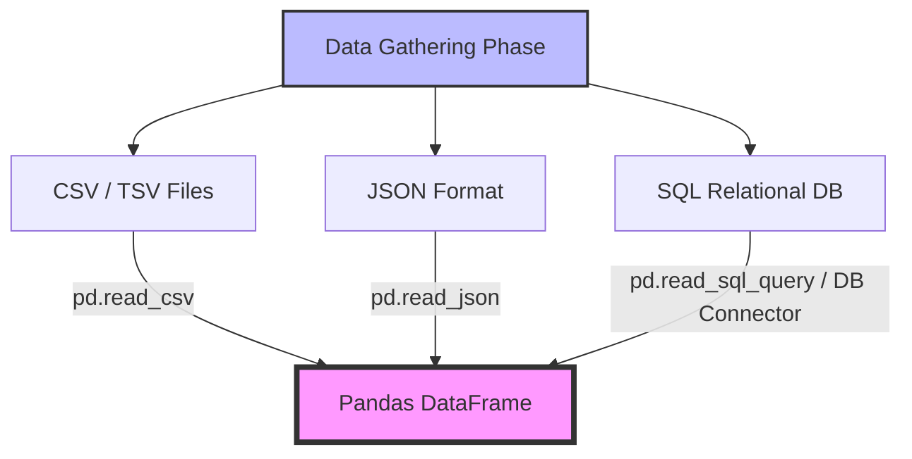
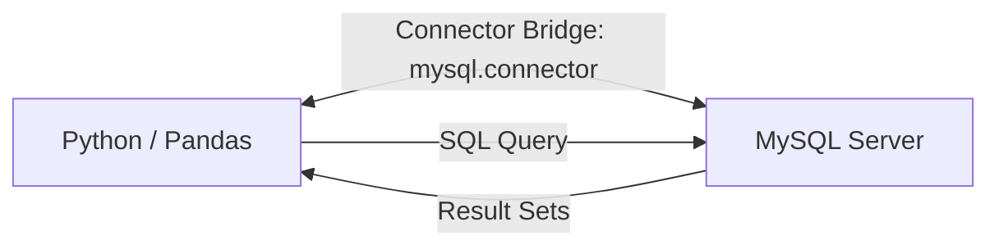

# Working with JSON & SQL in Pandas

In this study guide, we expand our data gathering toolkit from flat CSV/TSV files to two of the most popular data storage formats in modern software architectures: **JSON** (JavaScript Object Notation) and **SQL** (Structured Query Language) relational databases.

---

## 1. Data Formats Pipeline Overview

Different data sources require specialized connectors and drivers to be ingested into Pandas. The diagram below illustrates how CSV/TSV files, JSON web structures, and relational SQL tables are brought into memory as standard Pandas DataFrames:



---

## 2. Working with JSON (JavaScript Object Notation)

### 2.1. What is JSON?

- **Definition**: JSON is a lightweight, text-based, language-independent data-interchange format. It represents structured data based on JavaScript object syntax: **key-value pairs** (dictionaries) and **ordered lists** (arrays).
- **Ubiquity**: Almost all REST APIs and web servers communicate using JSON because it is highly human-readable, easily parsed by browsers, and supported by every major programming language.
- **Complexity**: Unlike flat CSVs, JSON can represent **hierarchical (nested) structures**, which require special handling during flattening.

### 2.2. Reading Local JSON Files

Pandas provides the `pd.read_json()` function to load JSON data directly into a DataFrame.

#### Dataset Example: Cuisine Recipes (`recipes.json`)

The dataset contains lists of ingredients mapping to cuisines. Each recipe is represented as a nested object:

```json
[
  {
    "id": 10259,
    "cuisine": "greek",
    "ingredients": [
      "romaine lettuce",
      "black olives",
      "grape tomatoes",
      "garlic",
      "pepper",
      "purple onion",
      "feta cheese crumbles"
    ]
  },
  {
    "id": 25693,
    "cuisine": "southern_us",
    "ingredients": [
      "plain flour",
      "ground black pepper",
      "salt",
      "tomatoes",
      "ground pepper",
      "thyme",
      "eggs",
      "green tomatoes"
    ]
  }
]
```

#### Code Implementation

```python
import pandas as pd

# Load the local JSON file
df_recipes = pd.read_json('recipes.json')

# Inspect the loaded DataFrame
print("DataFrame Shape:", df_recipes.shape)
print("\nFirst 5 Recipes:")
print(df_recipes.head())
```

### 2.3. Reading JSON from an API URL

`pd.read_json()` can dynamically request JSON from online URLs or API endpoints.

#### Code Implementation (GitHub API Issues)

```python
import pandas as pd

# Fetch live issue data from pandas-dev github repository
github_issues_url = 'https://api.github.com/repos/pandas-dev/pandas/issues'
df_issues = pd.read_json(github_issues_url)

# Select and display key columns
print(df_issues[['id', 'number', 'title', 'state', 'user']].head())
```

---

### 2.4. Pandas `pd.read_json()` Parameter Checklist

| Parameter            | Type                      | Default Value | Description                                                                                                                                                          |
| :------------------- | :------------------------ | :------------ | :------------------------------------------------------------------------------------------------------------------------------------------------------------------- |
| `path_or_buf`        | String / Path / File-like | _Required_    | Path to JSON file, URL endpoint, or buffer object containing valid JSON.                                                                                             |
| `orient`             | String                    | `None`        | Indication of expected JSON string format. Options: `'split'`, `'records'`, `'index'`, `'columns'`, `'values'`. Helps map key-value orientation to rows and columns. |
| `typ`                | String                    | `'frame'`     | Expected object type to return. Options: `'frame'` (DataFrame) or `'series'` (Series).                                                                               |
| `dtype`              | Dict / Bool               | `True`        | Direct mapping of column data types or automatic type inference boolean.                                                                                             |
| `convert_dates`      | List / Bool               | `True`        | Converts keys/values containing date-like strings to datetime objects.                                                                                               |
| `keep_default_dates` | Bool                      | `True`        | If parsed dates are standard strings, keeps the default parsing format.                                                                                              |
| `precise_float`      | Bool                      | `False`       | Uses a higher precision floating-point parser during conversion.                                                                                                     |
| `encoding`           | String                    | `'utf-8'`     | Set character encoding (e.g., `'latin-1'`, `'utf-16'`) when reading files.                                                                                           |
| `chunksize`          | Integer                   | `None`        | Returns a JsonReader object for processing JSON file in smaller chunks (out-of-core).                                                                                |
| `nrows`              | Integer                   | `None`        | Limits the maximum number of rows read from the JSON line file.                                                                                                      |

---

## 3. Working with SQL Databases

When working with production systems, data is rarely saved as flat files on disk. Instead, it is stored in Relational Databases (RDBMS) like **MySQL**, **PostgreSQL**, or **SQL Server**. To import this data, Python needs a "bridge" (database connector) to query the database and retrieve records directly into Pandas.



### 3.1. Establishing the Connection (MySQL Example)

To communicate with a MySQL server, we install the official connector driver:

```bash
pip install mysql-connector-python
```

#### Step-by-Step Connection Code

```python
import mysql.connector
import pandas as pd

# 1. Establish the database connection
connection = mysql.connector.connect(
    host='localhost',       # Database server IP (local or remote)
    user='root',           # Database Username
    password='',           # Database Password
    database='world'       # Target database name
)

# 2. Define the SQL query to select records
sql_query = "SELECT * FROM city"

# 3. Load database records directly into a Pandas DataFrame
df_cities = pd.read_sql_query(sql_query, connection)

# 4. Close database connection to release system resources
connection.close()

# Inspect retrieved database table
print("Cities loaded from Database:", df_cities.shape[0])
print(df_cities.head())
```

### 3.2. Executing Complex Queries with Filters

Pandas allows the execution of complex SQL filtering, grouping, and joining before importing data into memory. This reduces system memory load when working with large tables.

```python
import mysql.connector
import pandas as pd

# Establish connection
conn = mysql.connector.connect(
    host='localhost',
    user='root',
    password='',
    database='world'
)

# Execute filtering and sorting query in RDBMS
advanced_query = """
    SELECT Name, CountryCode, Population
    FROM city
    WHERE Population > 1000000
    ORDER BY Population DESC
"""

df_large_cities = pd.read_sql_query(advanced_query, conn)
conn.close()

print(df_large_cities.head(10))
```

---

## 4. Practical Tips and Analogies

> [!TIP]
>
> - **The "Bridge" Analogy**: Think of `mysql-connector-python` as a physical bridge connecting two cities (Python and MySQL Server). Python speaks one language, MySQL speaks another. The connector bridge acts as the translator and shipping port.
> - **In-Database Filtering**: Never do `SELECT *` on massive database tables and filter in Pandas. Always filter in the SQL query using `WHERE` statements or limit clauses to reduce payload transmission and memory footprints.
