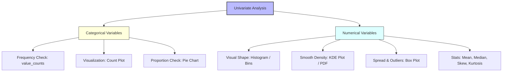

# Exploratory Data Analysis (EDA) - Univariate Analysis

Exploratory Data Analysis (EDA) is the process of analyzing a dataset to summarize its main characteristics, often using visual methods. In this guide, we dive into **Univariate Analysis**—the inspection of a single variable (column) in isolation.

---

## 1. Univariate Analysis Architecture

When performing univariate analysis, the first step is identifying the data type of the column. Different data types require different statistical metrics and visualization techniques:



---

## 2. Analyzing Categorical Variables

Categorical variables represent discrete groups or labels (e.g., `Survived`, `Pclass`, `Sex`, `Embarked`).

### 2.1. Frequency Count & Bar Plot (`sns.countplot`)

A Count Plot shows the frequency (count) of values in each category using bars.

- **Pandas equivalent**: `df['col'].value_counts().plot(kind='bar')`
- **Seaborn equivalent**: `sns.countplot(data=df, x='col')`

### 2.2. Proportional Distribution (`plt.pie`)

Pie charts show the relative percentage of each category out of the total.

- **Pandas code**:

```python
import pandas as pd
df = pd.read_csv("https://raw.githubusercontent.com/datasciencedojo/datasets/master/titanic.csv")
df['Embarked'].value_counts().plot(kind='pie', autopct='%1.1f%%')
```

---

## 3. Analyzing Numerical Variables

Numerical variables represent continuous or discrete quantities (e.g., `Age`, `Fare`).

### 3.1. Frequency Distribution: Histogram

A histogram groups continuous values into range-intervals called **bins** and plots the frequency of values falling inside each bin.

- **Binning Sensitivity**: If the number of bins is too small, the details are smoothed out. If the bins are too large, the plot becomes noisy and jagged.

### 3.2. Probability Density Function: KDE (Kernel Density Estimation)

KDE estimates the probability density function (PDF) of a continuous variable. The y-axis represents **probability density**, and the total area under the curve equals $1$.

- **Interpretation**: If you pick a random passenger, the peak of the KDE curve indicates the value range they are most likely to belong to.
- **Python Code**: `sns.kdeplot(df['Age'])` or `sns.histplot(df['Age'], kde=True)`

### 3.3. Outliers & Spread: Box Plot

The Box Plot (Whisker Plot) visualizes the **five-number summary** (minimum, Q1, median, Q3, maximum) and identifies outliers mathematically.

```mermaid
box-chart
    title Box Plot Visual Anatomy
    %% Representing the box plot components textually
    %% Lower Whisker |--- [ Q1 === Median === Q3 ] ---| Upper Whisker  * (Outliers)
```

#### Mathematical Formulation of Box Plot Fences

1. **Interquartile Range (IQR)**: The distance between the 75th percentile ($Q_3$) and the 25th percentile ($Q_1$).
    $$\text{IQR} = Q_3 - Q_1$$
2. **Lower Fence**: The threshold below which a data point is flagged as a lower outlier.
    $$\text{Lower Fence} = Q_1 - 1.5 \times \text{IQR}$$
3. **Upper Fence**: The threshold above which a data point is flagged as an upper outlier.
    $$\text{Upper Fence} = Q_3 + 1.5 \times \text{IQR}$$

_Any data point outside the Lower and Upper Fences is plotted as an individual dot representing an outlier._

---

### 3.4. Skewness and Kurtosis

- **Skewness**: Measures the asymmetry of the probability distribution.
  - **Skewness = 0**: Perfectly symmetric (Normal distribution).
  - **Positive Skew (Right-tailed)**: Long tail on the right (e.g., `Fare`). Most data points are clustered on the left.
  - **Negative Skew (Left-tailed)**: Long tail on the left. Most data points are clustered on the right.
- **Kurtosis**: Measures the "peakedness" or tail-heaviness of the distribution. High kurtosis indicates long, fat tails with a higher probability of extreme values (outliers).

---

## 4. End-to-End Univariate Analysis Code

Below is a complete, runnable script using Pandas, Matplotlib, and Seaborn to analyze both categorical and numerical columns from the Titanic dataset:

```python
import pandas as pd
import matplotlib.pyplot as plt
import seaborn as sns

# 1. Load Data
url = "https://raw.githubusercontent.com/datasciencedojo/datasets/master/titanic.csv"
df = pd.read_csv(url)

# Clean missing values for plotting
df['Age'].fillna(df['Age'].median(), inplace=True)
df['Embarked'].fillna(df['Embarked'].mode()[0], inplace=True)

# Set styling
sns.set_theme(style="whitegrid")
fig, axes = plt.subplots(3, 2, figsize=(15, 18))

# ================= CATEGORICAL ANALYSIS =================

# Plot A: Countplot of Survival status
sns.countplot(data=df, x='Survived', ax=axes[0, 0], palette='pastel')
axes[0, 0].set_title('Frequency Count: Survived (0 = No, 1 = Yes)')
axes[0, 0].set_xlabel('Survival Status')
axes[0, 0].set_ylabel('Passenger Count')

# Plot B: Pie Chart of Passenger Class (Pclass)
pclass_counts = df['Pclass'].value_counts()
axes[0, 1].pie(pclass_counts, labels=[f"Class {i}" for i in pclass_counts.index],
               autopct='%1.1f%%', startangle=90, colors=['#ff9999','#66b3ff','#99ff99'])
axes[0, 1].set_title('Proportional Distribution: Pclass')

# Plot C: Countplot of Gender (Sex)
sns.countplot(data=df, x='Sex', ax=axes[1, 0], palette='muted')
axes[1, 0].set_title('Gender Distribution of Passengers')

# ================= NUMERICAL ANALYSIS =================

# Plot D: Histogram & KDE of Passenger Age
sns.histplot(data=df, x='Age', kde=True, bins=30, ax=axes[1, 1], color='purple')
axes[1, 1].set_title('Age Distribution (Histogram + KDE)')
axes[1, 1].set_xlabel('Age')

# Plot E: Boxplot of Passenger Fares
sns.boxplot(data=df, x='Fare', ax=axes[2, 0], color='lightgreen')
axes[2, 0].set_title('Box Plot of Ticket Fares (Outlier Detection)')
axes[2, 0].set_xlabel('Fare ($)')

# Plot F: KDE of Passenger Fares to visualize Skewness
sns.kdeplot(data=df, x='Fare', ax=axes[2, 1], fill=True, color='red')
axes[2, 1].set_title('KDE: Fare Density showing Positive Skew')
axes[2, 1].set_xlabel('Fare ($)')

# Print Mathematical statistics for Numerical columns
print("=== Mathematical Descriptive Stats ===")
print(df[['Age', 'Fare']].describe())

print("\n=== Skewness and Kurtosis ===")
print(f"Age Skewness: {df['Age'].skew():.4f} (Ideal normal ~ 0)")
print(f"Fare Skewness: {df['Fare'].skew():.4f} (Strong positive skew)")
print(f"Fare Kurtosis: {df['Fare'].kurt():.4f} (Very high peak and heavy tail)")

# Show all plots
plt.tight_layout()
plt.show()
```

---

## 5. YouTuber Analogies and Practical Tips

> [!NOTE]
> **The Box Plot "Whisker" Myth**: Beginners often think the whiskers of a box plot represent the minimum and maximum values of the dataset. This is incorrect. The whiskers represent the **Fences** ($Q_1 - 1.5 \times \text{IQR}$ and $Q_3 + 1.5 \times \text{IQR}$). Any points plotted beyond the whiskers are mathematically defined outliers.

> [!TIP]
> **Checking Skewness Before Models**: Many algorithms (like Linear Regression) assume that features are normally distributed. If a variable is highly skewed (like `Fare`, skewness $> 1.0$), you will need to apply a mathematical transformation (like a Log transform or Box-Cox) in the feature engineering step to make it normal.
