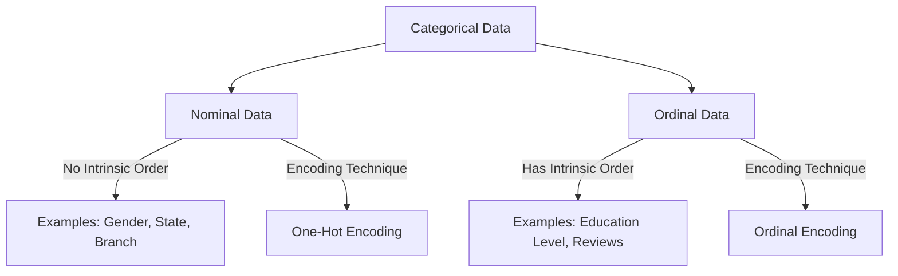

# Encoding Categorical Data (Ordinal Encoding & Label Encoding)

In feature engineering, **Feature Transformation** is a crucial phase. While numerical data can be scaled, machine learning algorithms fundamentally expect numerical inputs. Categorical data (strings or text labels) must therefore be converted into numbers using encoding techniques.

This guide details two primary encoding techniques: **Ordinal Encoding** and **Label Encoding**.

---

## 1. Categorical Data Types

Categorical data is split into two major sub-categories:



### Nominal Categorical Data

Nominal data consists of categories that have no inherent mathematical or logical order. You cannot state that one category is "greater" or "better" than another.

- **Examples**: State of residence (Maharashtra, Karnataka, West Bengal), Engineering Branch (CSE, ECE, ME), Gender (Male, Female).
- **Encoding**: Primarily handled using **One-Hot Encoding** (covered in Day 27).

### Ordinal Categorical Data

Ordinal data consists of categories that have a clear, logical, or hierarchical order. The relationships between categories imply ranking.

- **Examples**:
  - _Education_: High School < Under Graduate (UG) < Post Graduate (PG).
  - _Customer Reviews_: Poor < Average < Good.
  - _Product Rating_: 1-Star < 2-Star < 3-Star.
- **Encoding**: Handled using **Ordinal Encoding**.

---

## 2. Ordinal Encoding vs. Label Encoding

A common mistake is using `LabelEncoder` for features (inputs $X$) and `OrdinalEncoder` interchangeably. However, they serve separate purposes in `scikit-learn`:

| Metric / Feature    | Ordinal Encoding (`OrdinalEncoder`)                      | Label Encoding (`LabelEncoder`)                        |
| :------------------ | :------------------------------------------------------- | :----------------------------------------------------- |
| **Target Variable** | Input Features ($X$)                                     | Target Label ($y$)                                     |
| **Purpose**         | Used to encode ordinal features in the training dataset. | Used to encode target classification labels (classes). |
| **Dimensions**      | Designed to transform 2D data (multiple columns).        | Designed to transform 1D data (single target vector).  |
| **Manual Ordering** | Allows passing manual order of levels via `categories`.  | Orders alphabetically/arbitrarily automatically.       |

> [!WARNING]
> **Do not use `LabelEncoder` on input features ($X$)**.
> The Scikit-Learn documentation explicitly states that `LabelEncoder` is only meant for target labels $y$. If used on $X$, it can lead to pipeline integration errors and does not allow you to specify the hierarchical order of ordinal columns.

---

## 3. How Ordinal Encoding Works

Consider an input column `Education`:

- Categories: `["school", "UG", "PG"]`
- Instead of letting the computer decide, we explicitly assign an order:
  $$\text{school} \to 0$$
  $$\text{UG} \to 1$$
  $$\text{PG} \to 2$$

This mapping preserves the relationship $0 < 1 < 2$, matching the real-world education hierarchy.

---

## 4. Implementation Code

Below is the complete, runnable Python code showing how to apply `OrdinalEncoder` to input features and `LabelEncoder` to the target column.

```python
import numpy as np
import pandas as pd
from sklearn.model_selection import train_test_split
from sklearn.preprocessing import OrdinalEncoder, LabelEncoder

# 1. Create a dummy customer review dataset
data = {
    'age': [30, 24, 45, 50, 22, 35, 40, 28, 32, 44],
    'gender': ['Male', 'Female', 'Female', 'Male', 'Female', 'Male', 'Female', 'Male', 'Female', 'Male'],
    'review': ['average', 'good', 'poor', 'good', 'average', 'poor', 'average', 'good', 'poor', 'good'],
    'education': ['school', 'UG', 'PG', 'PG', 'UG', 'school', 'UG', 'PG', 'school', 'UG'],
    'purchased': ['no', 'yes', 'yes', 'no', 'yes', 'no', 'no', 'yes', 'no', 'yes']
}

df = pd.DataFrame(data)

# Split features (X) and target (y)
# We drop age and gender for this specific walkthrough to focus purely on Ordinal Encoding
X = df[['review', 'education']]
y = df['purchased']

# Splitting dataset into training and testing sets to avoid data leakage
X_train, X_test, y_train, y_test = train_test_split(
    X, y, test_size=0.3, random_state=42
)

print("--- Original X_train ---")
print(X_train)

# 2. Apply Ordinal Encoder to X
# We define the categories list representing the strict mathematical hierarchy
review_order = ['poor', 'average', 'good']
education_order = ['school', 'UG', 'PG']

oe = OrdinalEncoder(categories=[review_order, education_order])

# Fit on X_train to learn classes, and transform
X_train_encoded = oe.fit_transform(X_train)
X_test_encoded = oe.transform(X_test)

# Convert back to DataFrame for readable viewing
X_train_encoded_df = pd.DataFrame(X_train_encoded, columns=X_train.columns, index=X_train.index)
print("\n--- Encoded X_train ---")
print(X_train_encoded_df)

# 3. Apply Label Encoder to y
le = LabelEncoder()

# Fit and transform target labels
y_train_encoded = le.fit_transform(y_train)
y_test_encoded = le.transform(y_test)

print("\n--- Encoded Target y_train ---")
print(pd.Series(y_train_encoded, index=y_train.index))

# Checking mapping properties
print("\n--- Classes Learned ---")
print("Ordinal Encoder Categories:", oe.categories_)
print("Label Encoder Classes:", le.classes_)
```

---

## 5. Key Highlights

1. **Train-Test Split First**: Preprocessing parameters (such as unique categories and target labels) should only be fit on the training subset to prevent data leakage from the test subset.
2. **Categories Parameter**: In `OrdinalEncoder`, if `categories='auto'` is used, sorting is alphabetical. This can ruin the ordinal value mapping (e.g., `average` becomes 0, `good` becomes 1, `poor` becomes 2, which fails to capture order). Always pass your list of ordered categories explicitly.
3. **Handling Unseen Categories**: In newer versions of Scikit-Learn, `OrdinalEncoder` has an `unknown_value` and `handle_unknown` parameter. Setting `handle_unknown='use_encoded_value'` allows you to assign a default integer (e.g., `-1` or `np.nan`) to categories in test sets that were not seen during training.
