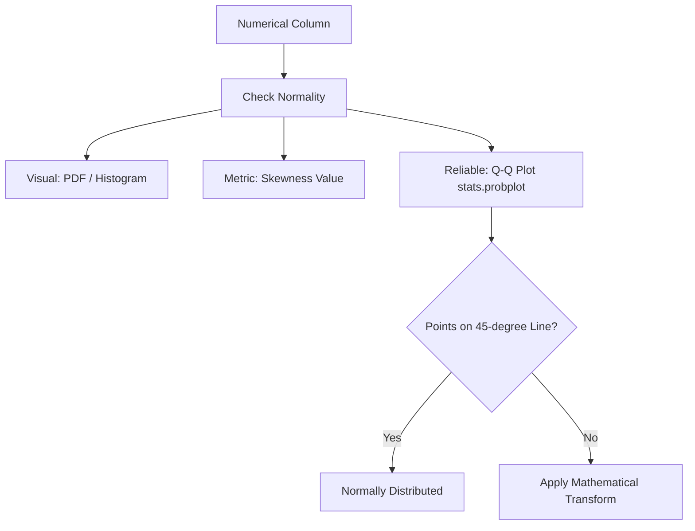

# Function Transformer & Mathematical Transforms

In machine learning, features in your raw dataset may have skewed distributions. Many parametric models (such as Linear Regression, Logistic Regression, Support Vector Machines, and Naive Bayes) assume that the numerical features are normally distributed. When this assumption is violated, their predictive accuracy and mathematical properties degrade.

**Mathematical transformations** are functions applied to numerical features to stabilize variance, reduce skewness, and convert the data distribution into a normal (or near-normal) distribution.

---

## 1. Why Normalize the Distribution?

- **Linear Models**: Algorithms that use gradient descent or calculate coefficients analytically assume linear relationships and normal distributions for features to make correct statistical inferences and converge faster.
- **Tree-based Models**: Decision Trees, Random Forests, and Gradient Boosting are **distribution-free (non-parametric)** and invariant to monotonic transformations. They split the data based on thresholds and do not care about the distribution shape.
- **Stats & Outliers**: Normal distributions are easier to model, make outlier detection via standard deviations possible, and simplify hypothesis testing.

---

## 2. Checking for Normality

To check if a numerical column is normally distributed, we use three primary tools:

### A. Probability Density Function (PDF)

A visual plot (using Seaborn's `kdeplot` or `histplot` with `kde=True`) showing the probability density. A normal distribution should look like a symmetric bell curve.

### B. Skewness Coefficient

Calculated as:
$$Skew = \frac{3(\text{Mean} - \text{Median})}{\text{Standard Deviation}}$$

- **Skew = 0**: Perfectly symmetric.
- **Skew > 0**: Right-skewed (tail extends towards the right).
- **Skew < 0**: Left-skewed (tail extends towards the left).

### C. Q-Q Plot (Quantile-Quantile Plot)

A scatter plot comparing the sample quantiles of the data against the theoretical quantiles of a standard normal distribution.

- If the sample points lie precisely on the **45-degree straight diagonal line**, the data is **normally distributed**.
- Deviations from the line indicate skewness, fat tails, or light tails.



---

## 3. Types of Function Transformations

Scikit-Learn provides [FunctionTransformer](file:///Users/prime/Developer/ml/030_function_transformer.md#functiontransformer) to apply arbitrary Python functions to feature values.

### 1. Log Transform

Transforms $x \to \log(x)$.

- **Best for**: Right-skewed distributions. It pulls large values closer together, compressing the tail.
- **Math Issue**: $\log(0) = -\infty$ and log of negative numbers is undefined.
- **Solution**: Use $\log(x + 1)$ instead. In NumPy/Scikit-Learn, this is `np.log1p`.

### 2. Reciprocal Transform

Transforms $x \to \frac{1}{x}$.

- Reverses order: small values become large, and large values become small.

### 3. Square Transform

Transforms $x \to x^2$.

- **Best for**: Left-skewed distributions. It stretches the tail to the right.

### 4. Square Root Transform

Transforms $x \to \sqrt{x}$.

- Moderately reduces right skewness (milder than Log Transform).

---

## 4. Implementation Code

Below is the complete, runnable Python code using a mock dataset to demonstrate how to diagnose skewness, plot Q-Q plots, use [FunctionTransformer](file:///Users/prime/Developer/ml/030_function_transformer.md#functiontransformer) with `np.log1p`, and run comparisons.

```python
import numpy as np
import pandas as pd
import scipy.stats as stats
from sklearn.model_selection import train_test_split, cross_val_score
from sklearn.preprocessing import FunctionTransformer
from sklearn.compose import ColumnTransformer
from sklearn.linear_model import LogisticRegression
from sklearn.tree import DecisionTreeClassifier

# 1. Create a Mock Dataset with Right-Skewed Feature (Fare)
np.random.seed(42)
n_samples = 200

# Normally distributed feature
age = np.random.normal(loc=30, scale=10, size=n_samples)

# Highly right-skewed feature (using exponential distribution)
fare = np.random.exponential(scale=50, size=n_samples)

# Target label
y = np.where(age + 0.5 * fare > 50, 1, 0)

df = pd.DataFrame({'Age': age, 'Fare': fare})
X_train, X_test, y_train, y_test = train_test_split(df, y, test_size=0.2, random_state=42)

print("Original Skewness:")
print("Age:", X_train['Age'].skew())
print("Fare:", X_train['Fare'].skew())

# 2. Benchmark Models Before Transformation
clf_lr = LogisticRegression()
clf_dt = DecisionTreeClassifier()

clf_lr.fit(X_train, y_train)
clf_dt.fit(X_train, y_train)

print("\n--- Accuracy Before Transformation ---")
print("Logistic Regression CV score:", np.mean(cross_val_score(clf_lr, X_train, y_train, cv=5, scoring='accuracy')))
print("Decision Tree CV score:", np.mean(cross_val_score(clf_dt, X_train, y_train, cv=5, scoring='accuracy')))

# 3. Create FunctionTransformer for Log Transform: np.log1p
# np.log1p computes log(1 + x) to handle zero values safely
log_transformer = FunctionTransformer(func=np.log1p)

# We only apply log transform to 'Fare' column because 'Age' is already normal
trf = ColumnTransformer(
    transformers=[
        ('log_transform_fare', log_transformer, ['Fare'])
    ],
    remainder='passthrough'
)

# 4. Transform training and test data
X_train_transformed = trf.fit_transform(X_train)
X_test_transformed = trf.transform(X_test)

# Convert to DataFrame to check skewness
X_train_transformed_df = pd.DataFrame(X_train_transformed, columns=['Fare', 'Age'])
print("\nSkewness After Log Transformation of Fare:")
print("Age (Passthrough):", X_train_transformed_df['Age'].skew())
print("Fare (Log Transformed):", X_train_transformed_df['Fare'].skew())

# 5. Benchmark Models After Transformation
clf_lr_trans = LogisticRegression()
clf_dt_trans = DecisionTreeClassifier()

print("\n--- Accuracy After Transformation ---")
print("Logistic Regression CV score:", np.mean(cross_val_score(clf_lr_trans, X_train_transformed, y_train, cv=5, scoring='accuracy')))
print("Decision Tree CV score:", np.mean(cross_val_score(clf_dt_trans, X_train_transformed, y_train, cv=5, scoring='accuracy')))
```

---

## 5. Key Highlights

1. **Selectivity**: Do not apply Log Transform blindly to all features. Only apply it to highly **right-skewed** numerical features. If applied to a feature that is already normally distributed (like `Age` in our example), it can degrade its normality and skew it left.
2. **Model Sensitivity**: As shown in the code, `LogisticRegression` (a linear parametric model) benefits significantly from feature normalization, whereas `DecisionTreeClassifier` shows little to no improvement since its mathematical splitting logic is unaffected by scale or skew.
3. **Safer Logarithm (`log1p`)**: Standard `np.log` raises errors or returns $-\infty$ if a value is exactly zero. Always prefer `np.log1p` for preprocessing columns that may contain zero values.
