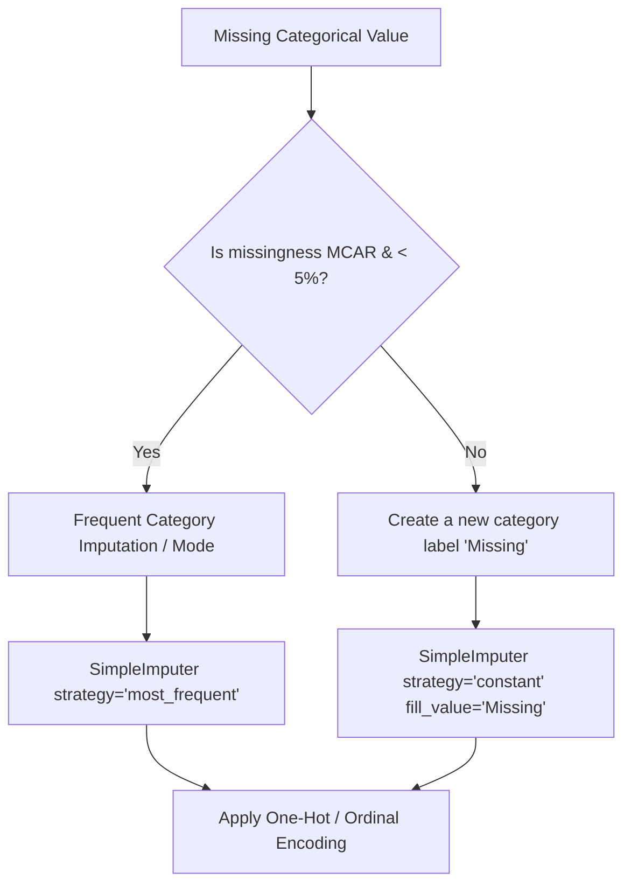

# Handling Missing Data Part 3: Categorical Imputation

Unlike numerical features, we cannot compute numerical statistics like means or medians for categorical columns. Instead, we use distinct strategies tailored to categorical fields (classes or strings).

---

## 1. Core Imputation Methods for Categorical Data

| Strategy                                   | Logic                                                                           | Best Used For                                                                                          |
| :----------------------------------------- | :------------------------------------------------------------------------------ | :----------------------------------------------------------------------------------------------------- |
| **Frequent Category Imputation (Mode)**    | Fill missing values with the most frequent class (mode) in the observed column. | - Missingness is **MCAR**.<br>- Missing ratio is very low (**< 5%**).                                  |
| **Missing Category Imputation (Constant)** | Fill missing values with a new category label like `'Missing'` or `'Unknown'`.  | - Missingness is **not MCAR** (there is a reason it's missing).<br>- Missing ratio is high (**> 5%**). |

---

## 2. Decision Tree for Categorical Imputation



### Advantages and Disadvantages

#### Frequent Category (Mode)

- **Pros**: Easy to implement.
- **Cons**: Distorts the original relative frequency of categories by artificially inflating the count of the mode. Can lead to biased associations if missingness is correlated with the target.

#### Missing Category

- **Pros**: Preserves the information about missingness. Tree models can split on the `'Missing'` flag to segment observations.
- **Cons**: Adds a new category, increasing dimensionality during One-Hot Encoding.

---

## 3. Implementation Code

Below is the complete, runnable Python code demonstrating how to use Scikit-Learn's [SimpleImputer](file:///Users/prime/Developer/ml/037_handling_missing_categorical_data.md#simpleimputer) for categorical features, applying both `most_frequent` and `constant` strategies, followed by One-Hot Encoding.

```python
import numpy as np
import pandas as pd
from sklearn.model_selection import train_test_split
from sklearn.impute import SimpleImputer
from sklearn.preprocessing import OneHotEncoder
from sklearn.pipeline import Pipeline
from sklearn.compose import ColumnTransformer
from sklearn.ensemble import RandomForestClassifier

# 1. Create a Mock Dataset (Titanic-like Cabin and Embarked columns)
np.random.seed(42)
n_samples = 300

# Embarked: high-frequency port 'S', lower ports 'C' and 'Q'
embarked = np.random.choice(['S', 'C', 'Q'], p=[0.7, 0.2, 0.1], size=n_samples)
# Cabin: Deck codes (mostly missing representing third class)
cabin = np.random.choice(['A', 'B', 'C', 'D', 'E', np.nan], p=[0.05, 0.05, 0.1, 0.05, 0.05, 0.7], size=n_samples)

# Convert some Embarked values to NaN (MCAR)
embarked_nan_idx = np.random.choice(n_samples, size=10, replace=False)
embarked = list(embarked)
for idx in embarked_nan_idx:
    embarked[idx] = np.nan

y = np.random.choice([0, 1], size=n_samples)

df = pd.DataFrame({
    'Embarked': embarked,
    'Cabin': cabin
})

X_train, X_test, y_train, y_test = train_test_split(df, y, test_size=0.2, random_state=42)

print("Original Missing Counts in Training Set:")
print(X_train.isnull().sum())

# 2. Imputation Setup
# For Embarked (low missingness, MCAR): Use 'most_frequent'
imputer_mode = SimpleImputer(strategy='most_frequent')

# For Cabin (high missingness, MNAR/MAR): Use constant 'Missing'
imputer_missing = SimpleImputer(strategy='constant', fill_value='Missing')

# Apply transformations
X_train_imputed = X_train.copy()
X_train_imputed['Embarked'] = imputer_mode.fit_transform(X_train[['Embarked']]).ravel()
X_train_imputed['Cabin'] = imputer_missing.fit_transform(X_train[['Cabin']]).ravel()

print("\nMissing Counts after Imputation:")
print(X_train_imputed.isnull().sum())
print("\nUnique values in Cabin column after Imputation:")
print(X_train_imputed['Cabin'].value_counts())

# 3. Create a Preprocessing Pipeline
preprocessor = ColumnTransformer(
    transformers=[
        ('embarked_impute', Pipeline([
            ('imputer', SimpleImputer(strategy='most_frequent')),
            ('ohe', OneHotEncoder(handle_unknown='ignore', sparse_output=False))
        ]), ['Embarked']),
        ('cabin_impute', Pipeline([
            ('imputer', SimpleImputer(strategy='constant', fill_value='Missing')),
            ('ohe', OneHotEncoder(handle_unknown='ignore', sparse_output=False))
        ]), ['Cabin'])
    ]
)

clf = Pipeline([
    ('preprocessor', preprocessor),
    ('model', RandomForestClassifier(random_state=42))
])

clf.fit(X_train, y_train)
acc = clf.score(X_test, y_test)
print(f"\nModel Accuracy after end-to-end Preprocessing: {acc * 100:.2f}%")
```

---

## 4. Key Highlights & Settings

1. **Implicit Relationship Representation**: Creating a separate `'Missing'` category is extremely powerful in fields like medical history. For instance, if a column represents `HasSmokedHistory` and it is null, setting it to `'Missing'` rather than the most frequent category `'No'` avoids introducing dangerous clinical assumptions into the feature space.
2. **Avoid Mode Overfitting**: If 90% of a column is already `'S'` and we impute the remaining 10% as `'S'`, we raise the frequency of `'S'` to 100%. This completely removes variance from the column, making it useless for predicting targets. If missingness is high, always prefer creating a new category.
