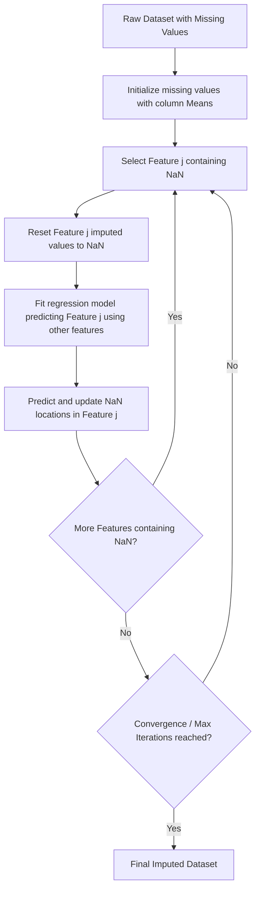

# Multivariate Imputation by Chained Equations (MICE)

Single-imputation strategies like mean, median, or KNN do not model features conditionally on all other variables in a cyclic, statistical way. **MICE** (also known as **Iterative Imputer** in Scikit-Learn) treats imputation as a series of regression problems where each feature with missing values is predicted using the other features in the dataset.

---

## 1. The MICE Algorithm Workflow

The chained equations process is an iterative, round-robin algorithm:

1. **Initialize**: Fill missing values in all columns with a simple starting initial guess (e.g., column mean).
2. **Un-impute**: For a target column $X_j$, restore its original missing values (replace these temporary values back with `NaN`).
3. **Regress**: Fit a regression model (like Ridge, Bayesian Ridge, or Random Forest) where:
    - **Target ($y$)**: The observed (non-null) values in column $X_j$.
    - **Features ($X$)**: All other columns (excluding $X_j$) corresponding to the observed rows.
4. **Predict**: Predict the missing values in column $X_j$ using the fitted regression model.
5. **Cycle**: Repeat steps 2-4 for all columns containing missing values. This constitutes one full **iteration**.
6. **Iterate**: Run this cycle for multiple iterations (e.g., $10$) until the imputed values stabilize.



---

## 2. Mathematical Formulation

Let the dataset have features $X_1, X_2, \dots, X_p$. For feature $X_j$ at iteration $t$:

$$X_j^{(t)} \sim \beta_0^{(t)} + \sum_{k \neq j} \beta_k^{(t)} X_k^{(t-1)} + \epsilon$$

Where:

- $X_k^{(t-1)}$ represents the imputed values of feature $X_k$ from the previous iteration (or current iteration if already computed).
- $\beta^{(t)}$ are the model coefficients learned by fitting the observed values of $X_j$ against the other features.
- $\epsilon$ is the error term, which can be sampled from the posterior predictive distribution to reflect statistical uncertainty (stochastic MICE).

---

## 3. Implementation Code

To use MICE in Scikit-Learn, you must explicitly enable the experimental feature `enable_iterative_imputer` before importing `IterativeImputer`.

Below is a complete, runnable script showing how to use `IterativeImputer` with both linear (Bayesian Ridge) and tree-based (Extra Trees) estimators.

```python
import numpy as np
import pandas as pd
# 1. Enable and import IterativeImputer
from sklearn.experimental import enable_iterative_imputer
from sklearn.impute import IterativeImputer
from sklearn.linear_model import BayesianRidge
from sklearn.ensemble import ExtraTreesRegressor
from sklearn.model_selection import train_test_split
from sklearn.metrics import mean_squared_error

# 2. Generate a Multi-correlated Dataset
np.random.seed(42)
n_samples = 500

# Base features with complex relationships
x1 = np.random.normal(loc=5.0, scale=2.0, size=n_samples)
x2 = 3.0 * x1 + np.random.normal(loc=0.0, scale=1.5, size=n_samples)
x3 = -1.5 * x1 + 0.5 * x2 + np.random.normal(loc=10.0, scale=1.0, size=n_samples)

df = pd.DataFrame({'X1': x1, 'X2': x2, 'X3': x3})

# Copy for benchmarking ground truth
df_true = df.copy()

# Inject missing values (MAR - missingness in X3 depends on values of X1)
nan_idx_x2 = np.random.choice(n_samples, size=50, replace=False)
nan_idx_x3 = np.where(x1 > 5.0)[0]
# Limit nan indices in X3 to 50 samples
nan_idx_x3 = np.random.choice(nan_idx_x3, size=50, replace=False)

df.loc[nan_idx_x2, 'X2'] = np.nan
df.loc[nan_idx_x3, 'X3'] = np.nan

X_train, X_test = train_test_split(df, test_size=0.2, random_state=42)
_, X_test_true = train_test_split(df_true, test_size=0.2, random_state=42)

print("Missing values in Test set before MICE:")
print(X_test.isnull().sum())

# 3. Apply MICE with Bayesian Ridge (Linear MICE)
imputer_linear = IterativeImputer(
    estimator=BayesianRidge(),
    max_iter=10,
    random_state=42
)
X_test_imp_linear = imputer_linear.fit(X_train).transform(X_test)
df_imp_linear = pd.DataFrame(X_test_imp_linear, columns=X_test.columns, index=X_test.index)

# 4. Apply MICE with Extra Trees (Non-Linear MICE)
imputer_tree = IterativeImputer(
    estimator=ExtraTreesRegressor(n_estimators=20, random_state=42),
    max_iter=10,
    random_state=42
)
X_test_imp_tree = imputer_tree.fit(X_train).transform(X_test)
df_imp_tree = pd.DataFrame(X_test_imp_tree, columns=X_test.columns, index=X_test.index)

# 5. Evaluate Reconstruction Performance on missing items
missing_mask_x2 = X_test['X2'].isnull()
true_vals_x2 = X_test_true.loc[missing_mask_x2, 'X2']
pred_linear_x2 = df_imp_linear.loc[missing_mask_x2, 'X2']
pred_tree_x2 = df_imp_tree.loc[missing_mask_x2, 'X2']

rmse_linear = np.sqrt(mean_squared_error(true_vals_x2, pred_linear_x2))
rmse_tree = np.sqrt(mean_squared_error(true_vals_x2, pred_tree_x2))

print(f"\nBayesian Ridge Imputation RMSE for X2: {rmse_linear:.4f}")
print(f"Extra Trees Imputation RMSE for X2: {rmse_tree:.4f}")
```

---

## 4. Key Highlights & Settings

1. **Estimator Flexibility**: `IterativeImputer` can take almost any regression estimator. By default, it uses `BayesianRidge`, which is fast and mathematically sound. For highly non-linear or tabular boundaries, tree-based models like `ExtraTreesRegressor` or `RandomForestRegressor` perform exceptionally well, though they are slower.
2. **Convergence and Order**:
    - `max_iter`: Specifies how many regression cycles to run. Standard values are 10 or 20.
    - `imputation_order`: The order in which features are imputed (`'ascending'`, `'descending'`, `'roman'` (left-to-right), `'arabic'` (right-to-left), or `'random'`). Ascending starts with features that have the fewest missing values.
3. **Multiple Imputation vs. Single Imputation**: MICE is designed for _Multiple Imputation_, meaning it generates multiple imputed datasets to account for prediction uncertainty. Scikit-Learn's [IterativeImputer](file:///Users/prime/Developer/ml/040_multivariate_imputation_by_chained_equations_for.md#iterativeimputer) is a _single_ multivariate imputer (it returns one dataset containing the mean predictions of the regressions).
4. **Handling Categorical Features**: When using MICE, categorical features should be Ordinal Encoded prior to imputation if using linear regression estimators, or one-hot encoded if the regression model supports sparse inputs.
