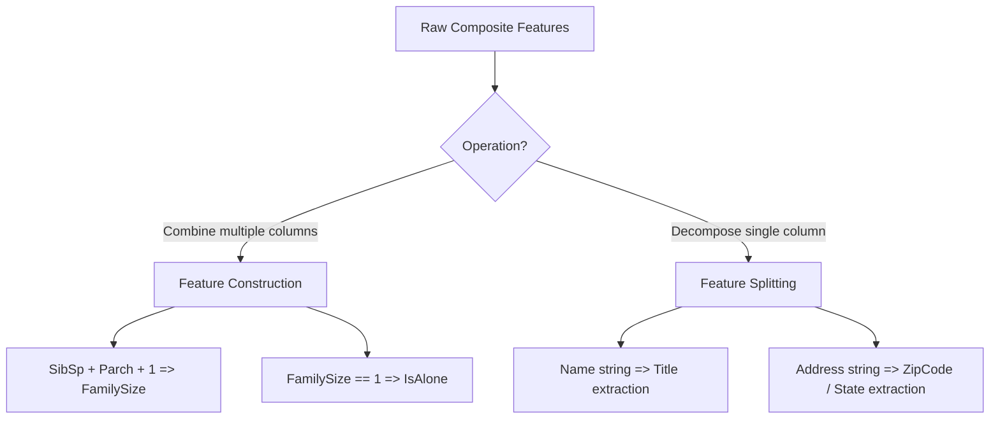

# Feature Construction & Feature Splitting

Raw datasets often contain features that are highly predictive in their composite state but require structural modification to be fully utilized by machine learning models. **Feature Construction** combines multiple features to create more meaningful indicators, while **Feature Splitting** breaks down a single composite variable into its constituent elements to isolate distinct signals.

---

## 1. Feature Construction

Feature Construction is the process of building new inputs from one or more existing columns. The goal is to capture non-linear relationships or domain-specific interactions that models (especially linear ones) cannot easily infer.

### Common Formulations

1. **Additive Composites**:
    In the Titanic dataset, combining sibling/spouse count (`SibSp`) and parent/child count (`Parch`) to construct the total family size:
    $$\text{FamilySize} = \text{SibSp} + \text{Parch} + 1$$
2. **Binary Indicator Generation**:
    Deriving binary flags based on threshold conditions:
    $$\text{IsAlone} = \begin{cases} 1 & \text{if } \text{FamilySize} = 1 \\ 0 & \text{otherwise} \end{cases}$$
3. **Interaction Terms**:
    Multiplying columns to capture structural joint effects (e.g., $\text{Area} = \text{Width} \times \text{Length}$).

---

## 2. Feature Splitting

Feature Splitting is the process of breaking down a compound variable into multiple features. This is critical for strings, serial codes, or alphanumeric IDs that pack different metrics into a single block of text.

### Common Formulations

1. **Regex Extraction**:
    Extracting titles (e.g., `"Mr."`, `"Mrs."`, `"Miss."`) from full names:
    $$\text{"Smith, Mr. John"} \xrightarrow{\text{Split}} \text{"Smith"} \text{ (LastName), } \text{"Mr."} \text{ (Title), } \text{"John"} \text{ (FirstName)}$$
2. **Date/Time Decomposition**:
    Splitting a timestamp into Year, Month, Day, and Hour (detailed in [Day 34: Date & Time Variables](file:///Users/prime/Developer/ml/034_handling_date_and_time_variables.md)).
3. **Coordinate Splitting**:
    Splitting a geolocation string `"40.7128,-74.0060"` into `Latitude` and `Longitude` numerical floats.



---

## 3. Implementation Code

Below is a complete, runnable script using a custom, scikit-learn-compatible `TitanicFeatureEngineer` class to construct and split features on mock Titanic data.

```python
import re
import numpy as np
import pandas as pd
from sklearn.base import BaseEstimator, TransformerMixin
from sklearn.model_selection import train_test_split
from sklearn.ensemble import RandomForestClassifier

# 1. Custom Feature Engineer Class
class TitanicFeatureEngineer(BaseEstimator, TransformerMixin):
    def __init__(self):
        pass

    def fit(self, X, y=None):
        return self

    def transform(self, X):
        # Prevent mutating the original DataFrame
        X_df = pd.DataFrame(X).copy()

        # --- A. FEATURE CONSTRUCTION ---
        # Construct FamilySize: Siblings + Parents + Self
        if 'SibSp' in X_df.columns and 'Parch' in X_df.columns:
            X_df['FamilySize'] = X_df['SibSp'] + X_df['Parch'] + 1
            # Construct IsAlone indicator
            X_df['IsAlone'] = (X_df['FamilySize'] == 1).astype(int)

        # --- B. FEATURE SPLITTING ---
        # Split Name to extract passenger title (e.g. Mr, Mrs, Miss, Master, Dr)
        if 'Name' in X_df.columns:
            # RegEx looking for words ending with a period (like Mr., Dr., etc.)
            X_df['Title'] = X_df['Name'].apply(self._extract_title)
            # Drop the raw Name column since it has high cardinality
            X_df = X_df.drop(columns=['Name'])

        return X_df

    def _extract_title(self, name):
        match = re.search(r' ([A-Za-z]+)\.', name)
        if match:
            title = match.group(1)
            # Consolidate rare titles
            if title in ['Mr', 'Mrs', 'Miss', 'Master']:
                return title
            elif title in ['Mlle', 'Ms']:
                return 'Miss'
            elif title == 'Mme':
                return 'Mrs'
            else:
                return 'Rare'
        return 'Unknown'

# 2. Create Mock Titanic Dataset
np.random.seed(42)
n_samples = 300

names = [
    "Braund, Mr. Owen Harris", "Cumings, Mrs. John Bradley", "Heikkinen, Miss. Laina",
    "Futrelle, Mrs. Jacques Heath", "Allen, Mr. William Henry", "Moran, Mr. James",
    "McCarthy, Mr. Timothy J", "Palsson, Master. Gosta Leonard", "Johnson, Mrs. Oscar W",
    "Nasser, Mrs. Nicholas", "Sandstrom, Miss. Marguerite Rut", "Bonnell, Miss. Elizabeth"
] * 25

sibsp = np.random.choice([0, 1, 2, 3], p=[0.7, 0.2, 0.07, 0.03], size=n_samples)
parch = np.random.choice([0, 1, 2], p=[0.8, 0.15, 0.05], size=n_samples)
y = np.random.choice([0, 1], size=n_samples)

df = pd.DataFrame({
    'Name': names[:n_samples],
    'SibSp': sibsp,
    'Parch': parch
})

# Split data
X_train, X_test, y_train, y_test = train_test_split(df, y, test_size=0.2, random_state=42)

print("Original Training Features (Head):")
print(X_train.head(4))

# 3. Apply Feature Engineering Transformer
engineer = TitanicFeatureEngineer()
X_train_engineered = engineer.fit_transform(X_train)
X_test_engineered = engineer.transform(X_test)

print("\nEngineered Training Features (Head):")
print(X_train_engineered.head(4))

# Verify Feature Construction
print("\nUnique values in newly constructed FamilySize feature:")
print(X_train_engineered['FamilySize'].value_counts())

# Verify Feature Splitting
print("\nUnique values in newly split Title feature:")
print(X_train_engineered['Title'].value_counts())
```

---

## 4. Key Highlights & Guidelines

1. **Preventing Multicollinearity**: Creating columns like `FamilySize` while keeping `SibSp` and `Parch` in the feature matrix introduces perfect multicollinearity ($\text{FamilySize} = \text{SibSp} + \text{Parch} + 1$). While tree models handle this seamlessly, linear regression models can produce highly unstable coefficients. Consider dropping the original columns if multicollinearity degrades linear model convergence.
2. **High Cardinality Suppression**: When splitting strings (like names or addresses), isolate high-cardinality components. Extracting titles yields 5-10 categories, which are easy to encode. Keeping the raw name string leads to overfitting and sparse matrices.
3. **Integration inside Pipelines**: Implement feature engineering as custom scikit-learn transformers using `BaseEstimator` and `TransformerMixin`. This guarantees that the transformations are applied identically to training, test, and production prediction servers without code replication.
