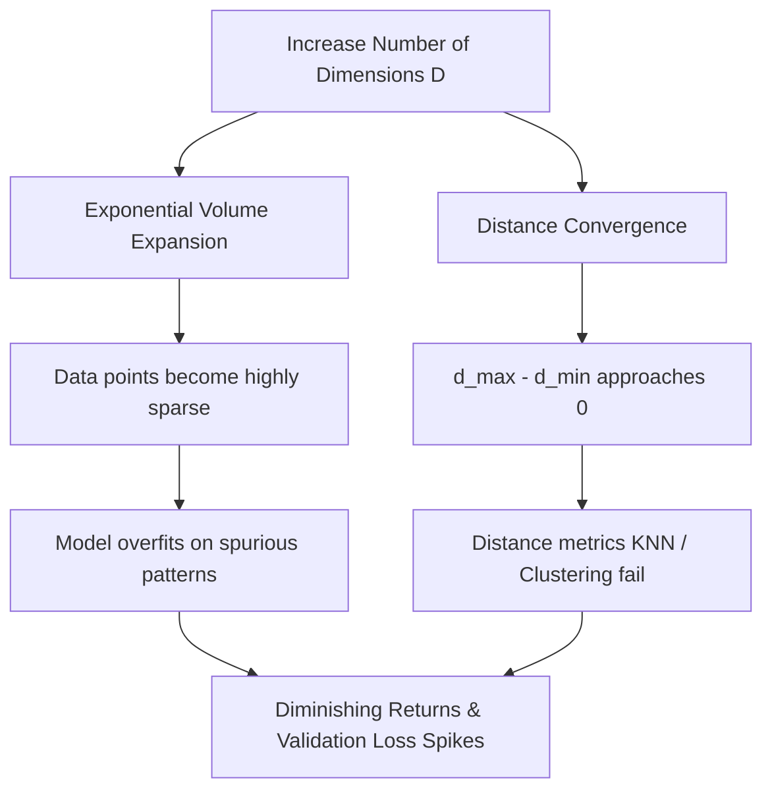

# The Curse of Dimensionality

In machine learning, "dimensionality" refers to the number of features (columns) in a dataset. While it is tempting to think that adding more features will always improve model performance, the opposite is often true. The **Curse of Dimensionality** describes the exponential growth of data sparsity and the mathematical collapse of distance metrics as the number of features increases.

---

## 1. Core Mathematical Consequences

### A. Exponential Data Sparsity

As the dimension $D$ increases, the volume of the feature space increases exponentially. If we require $10$ points to dense-sample a 1D unit line ($[0, 1]$), we need:

- $10^1 = 10$ points in 1D.
- $10^2 = 100$ points in 2D.
- $10^{10} = 10,000,000,000$ points in 10D.

Without an exponential increase in sample size $N$, data points become isolated, and the model cannot generalize.

### B. Distance Metric Collapse

In high-dimensional spaces, the distance between any two points converges. Specifically, the relative difference between the distance to the nearest neighbor ($d_{\min}$) and the distance to the furthest neighbor ($d_{\max}$) approaches zero:

$$\lim_{D \to \infty} \frac{d_{\max} - d_{\min}}{d_{\min}} = 0$$

This renders distance-based algorithms like **K-Nearest Neighbors (KNN)**, **K-Means Clustering**, and **Support Vector Machines (SVM)** with RBF kernels highly ineffective.



---

## 2. Theoretical Solutions

To combat the curse of dimensionality, we employ two primary workflows:

1. **Feature Selection**: Select a subset of highly predictive features and drop the rest (e.g. using ANOVA, Mutual Information, or L1 Regularization).
2. **Dimensionality Reduction**: Project the high-dimensional feature space onto a lower-dimensional manifold (e.g. using Principal Component Analysis - PCA, or t-SNE).

---

## 3. Implementation Code

Below is a complete, runnable Python script that simulates the mathematical collapse of distance metrics. It generates random points inside a unit hypercube and computes the ratio of distance spread as the dimensionality increases from $1$ to $1000$.

```python
import numpy as np
import pandas as pd
from scipy.spatial.distance import pdist

# 1. Distance Simulation function
def simulate_dimensions(n_samples=100, dimensions=[1, 2, 5, 10, 50, 100, 500, 1000]):
    results = []

    for d in dimensions:
        # Generate random uniform points in unit hypercube [0, 1]^d
        np.random.seed(42)
        X = np.random.uniform(low=0.0, high=1.0, size=(n_samples, d))

        # Calculate pairwise Euclidean distances between all samples
        distances = pdist(X, metric='euclidean')

        d_min = np.min(distances)
        d_max = np.max(distances)
        d_mean = np.mean(distances)

        # Relative difference ratio
        ratio = (d_max - d_min) / d_min if d_min > 0 else 0

        results.append({
            'Dimension': d,
            'MinDist': d_min,
            'MaxDist': d_max,
            'MeanDist': d_mean,
            'Ratio_Max_Min_Diff': ratio
        })

    return pd.DataFrame(results)

# 2. Run simulation
print("Running High-Dimensional Distance Simulation...")
sim_df = simulate_dimensions()

# Print formatted summary table
print("\nSimulation Results:")
print(sim_df.to_string(index=False, formatters={
    'MinDist': '{:.4f}'.format,
    'MaxDist': '{:.4f}'.format,
    'MeanDist': '{:.4f}'.format,
    'Ratio_Max_Min_Diff': '{:.4f}'.format
}))

# 3. Analyze results
print("\nAnalysis:")
print("- Notice that as dimensions grow from 1 to 1000, the Mean Distance between points increases.")
print("- Crucially, the ratio (MaxDist - MinDist) / MinDist drops from 28.5 to 0.22.")
print("- This means the nearest point is almost as far away as the furthest point, causing distance metrics to collapse.")
```

---

## 4. Key Takeaways

1. **Feature Inflation**: Adding features without a corresponding increase in sample size degrades linear models and tree performance due to model complexity expansion.
2. **Distance Metrics Collapse**: Distance metric collapse is highly visible in algorithms using Minkowski or Euclidean distances. If you must use KNN or K-Means in high-dimensional spaces ($D > 100$), always perform dimensionality reduction (e.g. [PCA](file:///Users/prime/Developer/ml/047_principle_component_analysis_pca.md)) first.
