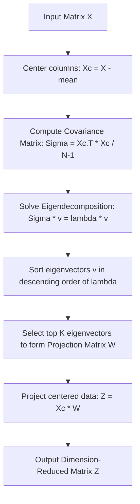

# Principal Component Analysis (PCA): Mathematical Derivation

To understand PCA at an expert level, we must explore its underlying linear algebra. Below is the complete mathematical derivation of PCA using the variance maximization approach solved via Lagrange multipliers, followed by a step-by-step NumPy implementation from scratch.

---

## 1. Mathematical Derivation Steps

### Step 1: Mean Centering

Let $X$ be a dataset matrix of shape $N \times D$, where $N$ is the number of samples and $D$ is the number of features. The centered data matrix $X_c$ is:

$$X_c = X - \mu$$

Where $\mu$ is the row vector containing the mean of each column.

### Step 2: Covariance Matrix

The sample covariance matrix $\Sigma$ (shape $D \times D$) measures the linear relationships between all pairs of features:

$$\Sigma = \frac{1}{N-1} X_c^T X_c$$

### Step 3: Constrained Optimization

We seek a unit projection vector $u$ ($\|u\|_2^2 = u^T u = 1$) that projects our centered data onto a 1D line while maximizing the variance of the projected coordinates.
The projected variance is:

$$\sigma^2_{\text{projected}} = u^T \Sigma u$$

To maximize this variance subject to the constraint $u^T u = 1$, we construct the **Lagrangian function**:

$$\mathcal{L}(u, \lambda) = u^T \Sigma u - \lambda(u^T u - 1)$$

Where $\lambda$ is the Lagrange multiplier.

To find the maximum, we take the partial derivative of $\mathcal{L}$ with respect to $u$ and set it to zero:

$$\frac{\partial \mathcal{L}}{\partial u} = 2\Sigma u - 2\lambda u = 0$$

$$\Sigma u = \lambda u$$

This is the definition of the **Eigendecomposition** equation!

- The projection vector $u$ must be an **eigenvector** of the covariance matrix $\Sigma$.
- The projected variance is:
  $$\sigma^2_{\text{projected}} = u^T \Sigma u = u^T (\lambda u) = \lambda (u^T u) = \lambda$$
  Thus, the variance of the projected data along an eigenvector is equal to its corresponding **eigenvalue** $\lambda$.

### Step 4: Projection Matrix Creation

To reduce the dimensions from $D$ to $K$:

1. Compute the eigenvalues $\lambda_1, \lambda_2, \dots, \lambda_D$ and their corresponding eigenvectors $v_1, v_2, \dots, v_D$.
2. Sort the eigenvectors in descending order of their eigenvalues.
3. Select the top $K$ eigenvectors to form the projection matrix $W$ of shape $D \times K$:
    $$W = [v_1, v_2, \dots, v_K]$$
4. Project the centered data:
    $$Z = X_c W$$



---

## 2. Implementation Code (NumPy vs. Scikit-Learn)

Below is a complete, runnable script implementing PCA from scratch using NumPy linear algebra routines and comparing it directly against Scikit-Learn's `PCA`.

```python
import numpy as np
import pandas as pd
from sklearn.decomposition import PCA

# 1. Generate Synthetic Multidimensional Dataset
np.random.seed(42)
N = 100
D = 4

# Create 4 features with linear correlations
f1 = np.random.normal(0, 1, N)
f2 = f1 + np.random.normal(0, 0.5, N)
f3 = -2.0 * f1 + np.random.normal(0, 0.2, N)
f4 = 0.5 * f2 + np.random.normal(0, 0.1, N)

X = np.stack([f1, f2, f3, f4], axis=1)

# 2. NumPy PCA FROM SCRATCH
# Step A: Mean Centering
X_mean = np.mean(X, axis=0)
X_c = X - X_mean

# Step B: Covariance Matrix
# ddof=1 matches sample covariance (divided by N-1)
covariance_matrix = np.cov(X_c, rowvar=False)

# Step C: Eigendecomposition
eigenvalues, eigenvectors = np.linalg.eigh(covariance_matrix)

# linalg.eigh returns eigenvalues in ascending order, we sort in descending order
sorted_indices = np.argsort(eigenvalues)[::-1]
eigenvalues_sorted = eigenvalues[sorted_indices]
# Eigenvectors are returned as columns
eigenvectors_sorted = eigenvectors[:, sorted_indices]

# Step D: Construct Projection Matrix (K = 2 components)
K = 2
W = eigenvectors_sorted[:, :K]

# Step E: Project the Centered Data
Z_scratch = np.dot(X_c, W)

# 3. Scikit-Learn PCA
pca_sklearn = PCA(n_components=K)
Z_sklearn = pca_sklearn.fit_transform(X)

# 4. Compare Results
print("Eigenvalues (Scratch):", eigenvalues_sorted)
print("Explained Variance (Sklearn):", pca_sklearn.explained_variance_)

# Note: Eigenvectors can have flipped signs (+/-) depending on the SVD solver initialization.
# We compare the absolute values of the projection vectors.
sign_alignment = np.sign(Z_scratch[0] / Z_sklearn[0])
Z_scratch_aligned = Z_scratch * sign_alignment

assert np.allclose(Z_scratch_aligned, Z_sklearn, atol=1e-7)
print("\n[SUCCESS] The NumPy scratch implementation matches Scikit-Learn PCA exactly!")

# Show sample projections
comparison_df = pd.DataFrame({
    'Scratch_PC1': Z_scratch_aligned[:, 0][:5],
    'Sklearn_PC1': Z_sklearn[:, 0][:5],
    'Scratch_PC2': Z_scratch_aligned[:, 1][:5],
    'Sklearn_PC2': Z_sklearn[:, 1][:5]
})
print("\nFirst 5 Sample Projections:")
print(comparison_df.to_string(index=False, formatters={
    'Scratch_PC1': '{:.6f}'.format,
    'Sklearn_PC1': '{:.6f}'.format,
    'Scratch_PC2': '{:.6f}'.format,
    'Sklearn_PC2': '{:.6f}'.format
}))
```

---

## 3. Crucial Mathematical Properties

1. **Trace Conservation**: The sum of all eigenvalues of the covariance matrix is equal to the trace (sum of diagonal elements) of the covariance matrix, which represents the total variance of the original dataset:
    $$\sum_{i=1}^D \lambda_i = \text{Total Variance}$$
2. **Eigenvector Orthogonality**: Because the covariance matrix $\Sigma$ is symmetric, its eigenvectors corresponding to distinct eigenvalues are guaranteed to be orthogonal:
    $$v_i^T v_j = 0 \quad \text{for } i \neq j$$
3. **SVD Connection**: In practice, Scikit-Learn's `PCA` uses Singular Value Decomposition (SVD) of the centered data matrix $X_c$ directly instead of computing the covariance matrix $\Sigma$ explicitly:
    $$X_c = U S V^T$$
    The columns of $V$ are the eigenvectors of $X_c^T X_c$, which matches our derivation but avoids the numerical instability of squaring data points during the covariance matrix multiplication.
