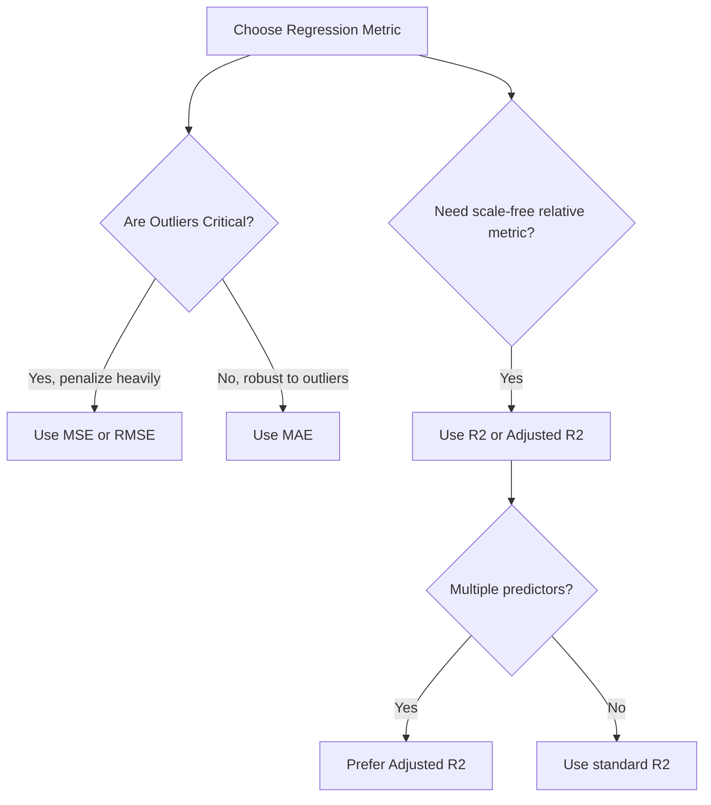

# Regression Evaluation Metrics: Mathematical Derivations & Code Demo

Evaluating the performance of a regression model requires measuring the error between observed target values $y$ and predicted values $\hat{y}$. This study guide details the five primary evaluation metrics used in regression analysis, their mathematical formulation, geometric meaning, outlier sensitivity, and standard Python implementations.

---

## 1. Metric Breakdowns and Mathematical Formulations

### Mean Absolute Error (MAE)

MAE measures the average magnitude of absolute errors in a set of predictions, without considering their direction.
$$\text{MAE} = \frac{1}{N} \sum_{i=1}^N |y_i - \hat{y}_i|$$

- **Units**: Same as the target variable $y$.
- **Outlier Sensitivity**: Low (linear scaling of errors; does not penalize large errors disproportionately).
- **Optimization Target**: Minimizing MAE corresponds to finding the **conditional median** of the target.

### Mean Squared Error (MSE)

MSE measures the average of the squares of the errors. It heavily penalizes larger errors due to squaring.
$$\text{MSE} = \frac{1}{N} \sum_{i=1}^N (y_i - \hat{y}_i)^2$$

- **Units**: Squared units of the target variable $y$ (making direct interpretation difficult).
- **Outlier Sensitivity**: Extremely High (quadratic scaling of errors).
- **Optimization Target**: Minimizing MSE corresponds to finding the **conditional mean** of the target.

### Root Mean Squared Error (RMSE)

RMSE is the square root of the MSE, bringing the error metric back to the original units of the target variable.
$$\text{RMSE} = \sqrt{\frac{1}{N} \sum_{i=1}^N (y_i - \hat{y}_i)^2}$$

- **Units**: Same as the target variable $y$.
- **Outlier Sensitivity**: High (retains the outlier penalization characteristics of MSE).

### R-Squared ($R^2$ - Coefficient of Determination)

$R^2$ measures the proportion of variance in the dependent variable that is predictable from the independent variables. It compares the model's predictions to a simple baseline model that predicts the mean ($\bar{y}$).
$$R^2 = 1 - \frac{\text{SS}_{\text{res}}}{\text{SS}_{\text{tot}}} = 1 - \frac{\sum_{i=1}^N (y_i - \hat{y}_i)^2}{\sum_{i=1}^N (y_i - \bar{y})^2}$$

Where:

- $\text{SS}_{\text{res}}$ is the Sum of Squared Residuals (unexplained variation).
- $\text{SS}_{\text{tot}}$ is the Total Sum of Squares (total variation in the target).
- **Range**: $(-\infty, 1]$. An $R^2$ of $1.0$ indicates perfect predictions. An $R^2$ of $0$ indicates performance equivalent to predicting the mean. A negative $R^2$ indicates the model performs worse than a simple horizontal mean baseline.

### Adjusted R-Squared ($R^2_{\text{adj}}$)

$R^2$ will always increase or remain constant as new features are added to the model, even if those features contain pure noise. Adjusted $R^2$ penalizes the addition of non-informative features by incorporating the degrees of freedom:
$$R^2_{\text{adj}} = 1 - \left[\frac{(1 - R^2)(N - 1)}{N - p - 1}\right]$$

Where:

- $N$ is the total number of observations (sample size).
- $p$ is the number of independent predictor variables in the model.



---

## 2. Python Implementation (From Scratch vs Scikit-Learn)

Below is a complete, runnable script implementing all five metrics from scratch using NumPy, followed by verification against Scikit-Learn.

```python
import numpy as np
from sklearn.metrics import mean_absolute_error, mean_squared_error, r2_score

# 1. Custom Metrics Implementations
def custom_mean_absolute_error(y_true, y_pred):
    return np.mean(np.abs(y_true - y_pred))

def custom_mean_squared_error(y_true, y_pred):
    return np.mean((y_true - y_pred) ** 2)

def custom_root_mean_squared_error(y_true, y_pred):
    return np.sqrt(custom_mean_squared_error(y_true, y_pred))

def custom_r2_score(y_true, y_pred):
    ss_res = np.sum((y_true - y_pred) ** 2)
    ss_tot = np.sum((y_true - np.mean(y_true)) ** 2)
    if ss_tot == 0.0:
        return 1.0 if ss_res == 0.0 else 0.0
    return 1.0 - (ss_res / ss_tot)

def custom_adjusted_r2_score(y_true, y_pred, n_features):
    n_samples = len(y_true)
    r2 = custom_r2_score(y_true, y_pred)
    denominator = n_samples - n_features - 1
    if denominator <= 0:
        raise ValueError("Degrees of freedom is less than or equal to zero. Increase sample size N or reduce features p.")
    return 1.0 - ((1.0 - r2) * (n_samples - 1) / denominator)

# 2. Setup Dummy Test Datasets
np.random.seed(42)
y_actual = np.array([2.5, 3.0, 4.0, 6.5, 8.0, 10.2, 12.0])
# Predictions with some noise
y_predict = np.array([2.3, 3.2, 3.8, 7.0, 7.5, 10.9, 11.5])
n_predictors = 2

# 3. Evaluate Metrics Using Custom Implementation
mae_scratch = custom_mean_absolute_error(y_actual, y_predict)
mse_scratch = custom_mean_squared_error(y_actual, y_predict)
rmse_scratch = custom_root_mean_squared_error(y_actual, y_predict)
r2_scratch = custom_r2_score(y_actual, y_predict)
adj_r2_scratch = custom_adjusted_r2_score(y_actual, y_predict, n_predictors)

# 4. Evaluate Metrics Using Scikit-Learn
mae_sklearn = mean_absolute_error(y_actual, y_predict)
mse_sklearn = mean_squared_error(y_actual, y_predict)
# RMSE in sklearn is calculated by setting squared=False (or using root_mean_squared_error in newer versions)
rmse_sklearn = np.sqrt(mean_squared_error(y_actual, y_predict))
r2_sklearn = r2_score(y_actual, y_predict)

# Compute Adjusted R2 for Sklearn
n_samples = len(y_actual)
adj_r2_sklearn = 1.0 - ((1.0 - r2_sklearn) * (n_samples - 1) / (n_samples - n_predictors - 1))

# 5. Display Comparisons and Assert Correctness
print("=== Metric Comparison: Scratch vs Scikit-Learn ===")
print(f"MAE:       Scratch = {mae_scratch:.6f} | Sklearn = {mae_sklearn:.6f}")
print(f"MSE:       Scratch = {mse_scratch:.6f} | Sklearn = {mse_sklearn:.6f}")
print(f"RMSE:      Scratch = {rmse_scratch:.6f} | Sklearn = {rmse_sklearn:.6f}")
print(f"R-squared: Scratch = {r2_scratch:.6f} | Sklearn = {r2_sklearn:.6f}")
print(f"Adj R2:    Scratch = {adj_r2_scratch:.6f} | Sklearn = {adj_r2_sklearn:.6f}")

assert np.isclose(mae_scratch, mae_sklearn)
assert np.isclose(mse_scratch, mse_sklearn)
assert np.isclose(rmse_scratch, rmse_sklearn)
assert np.isclose(r2_scratch, r2_sklearn)
assert np.isclose(adj_r2_scratch, adj_r2_sklearn)

print("\n[SUCCESS] Custom mathematical implementations match Scikit-Learn metrics to floating-point precision!")
```

---

## 3. Comparison of Error Metrics

| Metric    | Penalty Curve     | Dimensional Units     | Sensitivity to Outliers | Primary Use Case                        |
| :-------- | :---------------- | :-------------------- | :---------------------- | :-------------------------------------- | ------------ | ----------------------------------- |
| **MAE**   | Linear ($         | e                     | $)                      | Original units ($y$)                    | Robust / Low | Business reports, financial targets |
| **MSE**   | Quadratic ($e^2$) | Squared units ($y^2$) | Very High               | Math-friendly loss optimization         |
| **RMSE**  | Quadratic ($e^2$) | Original units ($y$)  | High                    | Model validation with outlier awareness |
| **$R^2$** | Relative          | Dimensionless         | Dependent on residuals  | High-level comparison across models     |

---

- **Next Topic**: [053_multiple_linear_regression.md](file:///Users/prime/Developer/ml/053_multiple_linear_regression.md) - Transitioning to multiple features: geometric plane intuition and Scikit-Learn code.
