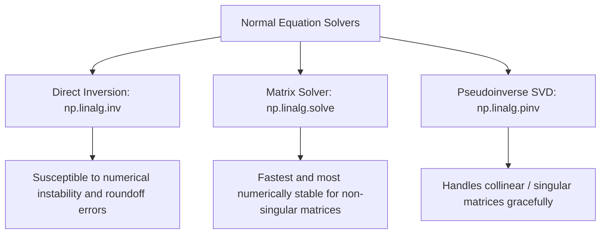

# Multiple Linear Regression: Coding the Normal Equation from Scratch

This guide implements a custom Multiple Linear Regression estimator in Python using the closed-form Normal Equation derived in [054_multiple_linear_regression.md](file:///Users/prime/Developer/ml/054_multiple_linear_regression.md). It compares multiple linear algebra solving strategies (`inv`, `solve`, and `pinv`) for numeric stability and validates the results against Scikit-Learn.

---

## 1. Linear Algebra Solvers in NumPy

When implementing the Normal Equation $\beta = (X^T X)^{-1} X^T Y$, we must compute the inverse of the matrix $X^T X$. There are three primary ways to handle this in NumPy:

1. **Direct Inversion (`np.linalg.inv`)**:
    - **Method**: Explicitly calculates the inverse matrix $(X^T X)^{-1}$ and multiplies it by $X^T Y$.
    - **Drawback**: Numerically unstable and computationally expensive ($O(p^3)$). Highly susceptible to floating-point roundoff errors when features are near-collinear.
2. **LU/Cholesky Solver (`np.linalg.solve`)**:
    - **Method**: Solves the system of linear equations $(X^T X)\beta = X^T Y$ directly using matrix factorization (LU decomposition or Cholesky for positive-definite matrices) without explicitly calculating the inverse.
    - **Advantage**: Significantly faster and more numerically stable than `inv`.
3. **Singular Value Decomposition Pseudoinverse (`np.linalg.pinv`)**:
    - **Method**: Computes the Moore-Penrose pseudo-inverse using Singular Value Decomposition (SVD).
    - **Advantage**: Handles rank-deficient or singular matrices. If $X^T X$ is not invertible (e.g. perfect multicollinearity or $N < p$), `pinv` will still return a stable minimum-norm solution. (This is what Scikit-Learn's `LinearRegression` uses under the hood via LAPACK).



---

## 2. From-Scratch Python Implementation

Below is a complete, production-grade custom Python class implementing all three solver configurations, tested on a synthetic dataset against Scikit-Learn.

```python
import numpy as np
from sklearn.linear_model import LinearRegression

class MultipleLinearRegressorOLS:
    """
    A custom Multiple Linear Regression estimator utilizing the closed-form Normal Equation.
    """
    def __init__(self, method='solve'):
        if method not in ['inv', 'solve', 'pinv']:
            raise ValueError("Method must be one of: 'inv', 'solve', 'pinv'")
        self.method = method
        self.coef_ = None
        self.intercept_ = None
        self.beta_ = None

    def fit(self, X, y):
        """
        Fit the multiple linear regression model.

        Parameters:
        -----------
        X : array-like of shape (n_samples, n_features)
            Feature matrix.
        y : array-like of shape (n_samples,)
            Target vector.
        """
        # Convert inputs to standard numpy float64 arrays
        X_arr = np.asarray(X, dtype=np.float64)
        y_arr = np.asarray(y, dtype=np.float64).reshape(-1, 1)

        n_samples, n_features = X_arr.shape

        if n_samples < n_features + 1:
            if self.method != 'pinv':
                raise ValueError("Underdetermined system (N < p + 1). Use 'pinv' solver to find minimum-norm solution.")

        # Construct Design Matrix X_design by prepending column of ones (for intercept)
        ones_col = np.ones((n_samples, 1))
        X_design = np.hstack([ones_col, X_arr])

        # Compute X^T * X and X^T * Y
        XTX = np.dot(X_design.T, X_design)
        XTY = np.dot(X_design.T, y_arr)

        # Solve for beta depending on method
        if self.method == 'inv':
            try:
                XTX_inv = np.linalg.inv(XTX)
                self.beta_ = np.dot(XTX_inv, XTY)
            except np.linalg.LinAlgError:
                raise np.linalg.LinAlgError("Matrix XTX is singular. Cannot compute explicit inverse. Try 'pinv' solver.")

        elif self.method == 'solve':
            try:
                # Solve (XTX) * beta = XTY directly
                self.beta_ = np.linalg.solve(XTX, XTY)
            except np.linalg.LinAlgError:
                raise np.linalg.LinAlgError("Matrix XTX is singular. Cannot solve system. Try 'pinv' solver.")

        elif self.method == 'pinv':
            # Compute pseudo-inverse via SVD
            XTX_pinv = np.linalg.pinv(XTX)
            self.beta_ = np.dot(XTX_pinv, XTY)

        # Extract parameters
        # beta_ is vector of shape (p + 1, 1)
        self.intercept_ = float(self.beta_[0, 0])
        self.coef_ = self.beta_[1:].flatten()

        return self

    def predict(self, X):
        """
        Predict target values using the fitted coefficients and intercept.
        """
        if self.beta_ is None:
            raise ValueError("This estimator is not fitted yet. Call 'fit' before predicting.")

        X_arr = np.asarray(X, dtype=np.float64)
        return np.dot(X_arr, self.coef_) + self.intercept_

# 3. Validation and Benchmarking
np.random.seed(42)
n_samples = 300
n_features = 5

# Generate features
X_data = np.random.uniform(-10.0, 10.0, size=(n_samples, n_features))
# Ground truth beta parameters: intercept=12.5, coeffs=[3.4, -1.2, 0.5, -4.2, 2.1]
true_coef = np.array([3.4, -1.2, 0.5, -4.2, 2.1])
true_intercept = 12.5
y_data = np.dot(X_data, true_coef) + true_intercept + np.random.normal(0, 2.5, size=n_samples)

# Initialize models
model_inv = MultipleLinearRegressorOLS(method='inv')
model_solve = MultipleLinearRegressorOLS(method='solve')
model_pinv = MultipleLinearRegressorOLS(method='pinv')
model_sklearn = LinearRegression()

# Fit models
model_inv.fit(X_data, y_data)
model_solve.fit(X_data, y_data)
model_pinv.fit(X_data, y_data)
model_sklearn.fit(X_data, y_data)

# Print and verify parameter alignment
print("=== Fitting Parameter Results ===")
print(f"Sklearn Intercept: {model_sklearn.intercept_:.6f}")
print(f"Scratch Inv Intercept: {model_inv.intercept_:.6f}")
print(f"Scratch Solve Intercept: {model_solve.intercept_:.6f}")
print(f"Scratch Pinv Intercept: {model_pinv.intercept_:.6f}")

print(f"\nSklearn Coefs:       {model_sklearn.coef_}")
print(f"Scratch Inv Coefs:   {model_inv.coef_}")
print(f"Scratch Solve Coefs: {model_solve.coef_}")
print(f"Scratch Pinv Coefs:  {model_pinv.coef_}")

# Verification Asserts
assert np.isclose(model_inv.intercept_, model_sklearn.intercept_)
assert np.isclose(model_solve.intercept_, model_sklearn.intercept_)
assert np.isclose(model_pinv.intercept_, model_sklearn.intercept_)

assert np.allclose(model_inv.coef_, model_sklearn.coef_)
assert np.allclose(model_solve.coef_, model_sklearn.coef_)
assert np.allclose(model_pinv.coef_, model_sklearn.coef_)

# Assert prediction equivalence
test_samples = np.random.uniform(-5.0, 5.0, size=(10, n_features))
preds_sklearn = model_sklearn.predict(test_samples)
preds_scratch = model_solve.predict(test_samples)

assert np.allclose(preds_sklearn, preds_scratch)
print("\n[SUCCESS] Custom estimator successfully replicated Scikit-Learn results using all three solvers!")
```

---

- **Next Topic**: [056_what_are_the_main_assumptions_of.md](file:///Users/prime/Developer/ml/056_what_are_the_main_assumptions_of.md) - Deep dive into validating the linear regression assumptions.
