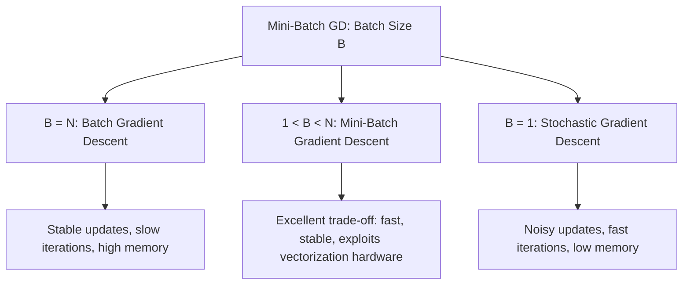

# Mini-Batch Gradient Descent

Gradient descent algorithms can be categorized by the amount of data used to compute the gradients at each step. **Mini-Batch Gradient Descent** represents the industry-standard middle ground, combining the vectorization advantages of Batch GD with the rapid iteration properties of Stochastic GD.

---

## 1. The Unified Gradient Descent Framework

Mini-Batch Gradient Descent divides the training dataset into small subsets called **mini-batches** of size $B$. By adjusting the batch size parameter $B$, it serves as a unified framework that encompasses both other variants:



### Why Mini-Batch GD is the Industry Standard

1. **Hardware Efficiency**: Modern CPU/GPU architectures use vectorized instructions (SIMD) to perform matrix calculations. Processing a small matrix ($B$ samples) is often just as fast as processing a single sample ($B=1$), meaning we get the benefit of multiple observations without a corresponding linear increase in calculation time.
2. **Reduced Gradient Noise**: Averaging the gradient over $B$ samples reduces update variance compared to single-sample updates, allowing smoother convergence to the minimum.

---

## 2. Mathematical Formulation & Update Rule

Let a single mini-batch $k$ of size $B$ be represented by the feature slice $X_k \in \mathbb{R}^{B \times (p+1)}$ and the target slice $Y_k \in \mathbb{R}^{B \times 1}$ from the design matrix. The Mean Squared Error loss evaluated over this batch is:
$$J_k(\theta) = \frac{1}{B} (Y_k - X_k \theta)^T (Y_k - X_k \theta)$$

Taking the gradient with respect to parameter weights $\theta$:
$$\nabla_\theta J_k(\theta) = \frac{2}{B} X_k^T (X_k \theta - Y_k) = -\frac{2}{B} X_k^T (Y_k - \hat{Y}_k)$$

### Parameter Update Equation

The parameter vector is updated after each mini-batch step:
$$\theta \leftarrow \theta - \alpha \nabla_\theta J_k(\theta) = \theta - \frac{2\alpha}{B} X_k^T (X_k \theta - Y_k)$$

---

## 3. From-Scratch Python Implementation (Unified Model)

Below is a complete, runnable Python script implementing a single, unified class `UnifiedGDRegressor`. By setting the parameter `batch_size`, we instantiate it as **Batch GD**, **SGD**, or **Mini-Batch GD** and compare their final coefficients and convergence rates on the same dataset.

```python
import numpy as np
from sklearn.linear_model import LinearRegression
from sklearn.metrics import mean_squared_error

class UnifiedGDRegressor:
    """
    A unified Gradient Descent regressor supporting Batch GD, SGD, and Mini-Batch GD.
    """
    def __init__(self, learning_rate=0.01, epochs=100, batch_size=32):
        self.learning_rate = learning_rate
        self.epochs = epochs
        self.batch_size = batch_size
        self.theta = None
        self.coef_ = None
        self.intercept_ = None
        self.cost_history_ = []

    def fit(self, X, y):
        X_arr = np.asarray(X, dtype=np.float64)
        y_arr = np.asarray(y, dtype=np.float64).reshape(-1, 1)

        n_samples, n_features = X_arr.shape

        # Prepend column of ones for intercept
        X_design = np.hstack([np.ones((n_samples, 1)), X_arr])

        # Initialize parameter weights
        self.theta = np.zeros((n_features + 1, 1))

        # Determine actual batch size boundary
        b_size = min(self.batch_size, n_samples)

        for epoch in range(self.epochs):
            # Shuffle indices at the start of each epoch
            shuffled_indices = np.random.permutation(n_samples)
            X_shuffled = X_design[shuffled_indices]
            y_shuffled = y_arr[shuffled_indices]

            # Loop over data in batch chunks of size b_size
            for i in range(0, n_samples, b_size):
                X_batch = X_shuffled[i : i + b_size]
                y_batch = y_shuffled[i : i + b_size]

                # Dynamic batch adjustment for the final chunk
                actual_batch_len = len(y_batch)

                # Compute predictions for the current batch
                y_pred = np.dot(X_batch, self.theta)

                # Compute gradient over current batch
                residuals = y_pred - y_batch
                gradient = (2.0 / actual_batch_len) * np.dot(X_batch.T, residuals)

                # Update parameters
                self.theta -= self.learning_rate * gradient

            # Log epoch cost over the entire dataset
            y_epoch_pred = np.dot(X_design, self.theta)
            epoch_cost = np.mean((y_arr - y_epoch_pred) ** 2)
            self.cost_history_.append(epoch_cost)

        self.intercept_ = float(self.theta[0, 0])
        self.coef_ = self.theta[1:].flatten()
        return self

    def predict(self, X):
        if self.theta is None:
            raise ValueError("Model is not fitted yet.")
        X_arr = np.asarray(X, dtype=np.float64)
        return np.dot(X_arr, self.coef_) + self.intercept_

# 1. Generate Synthetic Regression Dataset
np.random.seed(42)
n_samples = 300
n_features = 3

X_raw = np.random.uniform(-5.0, 5.0, size=(n_samples, n_features))
# Ground truth parameters: intercept=10.0, coefs=[3.5, -2.0, 1.2]
true_coefs = np.array([3.5, -2.0, 1.2])
true_intercept = 10.0
y_raw = np.dot(X_raw, true_coefs) + true_intercept + np.random.normal(0, 1.5, size=n_samples)

# Standardize features
X_mean = np.mean(X_raw, axis=0)
X_std = np.std(X_raw, axis=0)
X_scaled = (X_raw - X_mean) / X_std

# 2. Fit and Compare Configurations
# Fit Batch GD (batch_size = N)
bgd_model = UnifiedGDRegressor(learning_rate=0.05, epochs=100, batch_size=n_samples)
bgd_model.fit(X_scaled, y_raw)

# Fit Stochastic GD (batch_size = 1)
sgd_model = UnifiedGDRegressor(learning_rate=0.005, epochs=100, batch_size=1)
sgd_model.fit(X_scaled, y_raw)

# Fit Mini-Batch GD (batch_size = 32)
mbgd_model = UnifiedGDRegressor(learning_rate=0.05, epochs=100, batch_size=32)
mbgd_model.fit(X_scaled, y_raw)

# Fit standard Scikit-Learn Closed-Form LinearRegression
sklearn_model = LinearRegression()
sklearn_model.fit(X_scaled, y_raw)

# 3. Parameter Alignment Printout
print("=== Parameter Verification ===")
print(f"OLS Intercept:      {sklearn_model.intercept_:.6f}")
print(f"Batch GD Intercept: {bgd_model.intercept_:.6f}")
print(f"SGD Intercept:      {sgd_model.intercept_:.6f}")
print(f"Mini-Batch GD Intercept: {mbgd_model.intercept_:.6f}")

print(f"\nOLS Coefs:       {sklearn_model.coef_}")
print(f"Batch GD Coefs: {bgd_model.coef_}")
print(f"SGD Coefs:      {sgd_model.coef_}")
print(f"Mini-Batch GD Coefs: {mbgd_model.coef_}")

# Verification Asserts (Check that Mini-Batch has successfully converged near optimal values)
assert np.isclose(mbgd_model.intercept_, sklearn_model.intercept_, rtol=1e-2)
assert np.allclose(mbgd_model.coef_, sklearn_model.coef_, rtol=1e-2)

print("\n[SUCCESS] Custom Mini-Batch GD estimator converged successfully to match OLS outputs!")
```

---

- **Next Topic**: [061_polynomial_regression.md](file:///Users/prime/Developer/ml/061_polynomial_regression.md) - Transitioning to non-linear polynomial modeling.
