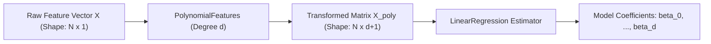

# Polynomial Regression: Mathematical Formulation & Pipeline Implementation

Polynomial Regression is a form of linear regression in which the relationship between the independent variable $x$ and the dependent variable $y$ is modeled as a $d$-th degree polynomial. Although it models non-linear relationships in the feature space, it is mathematically a **linear regression** model because it is linear in the parameter coefficients $\beta_j$.

---

## 1. Mathematical Formulation

When the relationship between feature $x$ and target $y$ is curved, a simple straight line underfits the data. We can extend simple linear regression by introducing higher-order terms:
$$y_i = \beta_0 + \beta_1 x_i + \beta_2 x_i^2 + \beta_3 x_i^3 + \ldots + \beta_d x_i^d + \epsilon_i$$

Where:

- $d$ is the degree of the polynomial.
- $\beta_0, \beta_1, \ldots, \beta_d$ are the coefficients to be estimated.
- $\epsilon_i$ represents the residual error.

### Feature Space Transformation

We can represent this non-linear model as a standard linear model by applying a non-linear feature mapping function $\phi(x)$:
$$\phi(x) = \begin{bmatrix} 1 & x & x^2 & x^3 & \cdots & x^d \end{bmatrix}$$

For a dataset of $N$ samples, the design matrix $X_{\text{poly}}$ becomes:
$$X_{\text{poly}} = \begin{bmatrix} \phi(x_1) \\ \phi(x_2) \\ \vdots \\ \phi(x_N) \end{bmatrix} = \begin{bmatrix} 1 & x_1 & x_1^2 & \cdots & x_1^d \\ 1 & x_2 & x_2^2 & \cdots & x_2^d \\ \vdots & \vdots & \vdots & \ddots & \vdots \\ 1 & x_N & x_N^2 & \cdots & x_N^d \end{bmatrix}$$

Once $X$ is transformed into $X_{\text{poly}}$, the model coefficients $\beta$ are solved using the standard Ordinary Least Squares (OLS) Normal Equation derived in [054_multiple_linear_regression.md](file:///Users/prime/Developer/ml/054_multiple_linear_regression.md):
$$\beta = (X_{\text{poly}}^T X_{\text{poly}})^{-1} X_{\text{poly}}^T Y$$

---

## 2. Polynomial Pipeline Architecture

In machine learning pipelines, we transform the raw feature $X$ using a transformer and feed it to a linear estimator.



- **Dimensionality Expansion**: For a single feature, the number of transformed features is $d+1$ (including bias). For $p$ features, the number of interaction terms grows combinatorially as $O(p^d)$, which can quickly lead to the curse of dimensionality.

---

## 3. Python Implementation (Pipeline Demo)

The following runnable Python script generates a synthetic non-linear dataset (sine wave with noise), constructs a polynomial pipeline using Scikit-Learn, fits the model, and extracts the coefficients.

```python
import numpy as np
import pandas as pd
from sklearn.pipeline import Pipeline
from sklearn.preprocessing import PolynomialFeatures
from sklearn.linear_model import LinearRegression
from sklearn.metrics import mean_squared_error, r2_score

# 1. Generate Non-Linear Synthetic Data (Sine Wave Curve)
np.random.seed(42)
n_samples = 150
X_raw = np.random.uniform(-3.0, 3.0, size=n_samples)
y_raw = np.sin(X_raw) * 5.0 + np.random.normal(loc=0.0, scale=0.8, size=n_samples)

# Reshape raw feature to (N, 1) as required by Scikit-Learn transformers
X_input = X_raw.reshape(-1, 1)

# 2. Define a Polynomial Pipeline (Degree = 3)
poly_degree = 3
pipeline = Pipeline([
    ('poly_features', PolynomialFeatures(degree=poly_degree, include_bias=False)),
    ('linear_regression', LinearRegression())
])

# 3. Fit the Pipeline
pipeline.fit(X_input, y_raw)

# 4. Extract and Inspect Parameters
# The linear regression step has its coefficients and intercept stored
lin_reg = pipeline.named_steps['linear_regression']
intercept = lin_reg.intercept_
coefficients = lin_reg.coef_

print("=== Polynomial Regression Pipeline Parameters ===")
print(f"Intercept (beta_0): {intercept:.6f}")
print(f"Coefficients (beta_1, beta_2, beta_3): {coefficients}")

# The model equation is: y_pred = intercept + coef[0]*x + coef[1]*x^2 + coef[2]*x^3

# 5. Evaluate Performance
y_pred = pipeline.predict(X_input)
mse = mean_squared_error(y_raw, y_pred)
r2 = r2_score(y_raw, y_pred)

print(f"\n=== Model Performance ===")
print(f"Mean Squared Error:              {mse:.6f}")
print(f"R-squared (Coefficient of Det.): {r2:.6f}")

# 6. Manual Prediction Verification
# We manually transform X and compute the polynomial dot product to assert correct pipeline execution
X_poly_manual = np.hstack([
    X_input,
    X_input ** 2,
    X_input ** 3
])
y_manual = np.dot(X_poly_manual, coefficients) + intercept

assert np.allclose(y_pred, y_manual, rtol=1e-12)
print("\n[SUCCESS] Pipeline predictions match manual polynomial dot product calculations!")
```

---

- **Next Topic**: [062_bias_variance_trade-off.md](file:///Users/prime/Developer/ml/062_bias_variance_trade-off.md) - Understanding model complexity and the Bias-Variance Trade-off.
