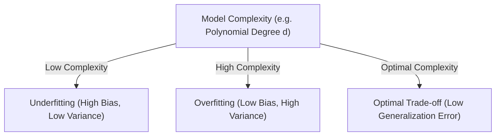

# The Bias-Variance Trade-off: Mathematical Decomposition & Simulation

When training a supervised machine learning model, our goal is to minimize generalization error on unseen data. The generalization error can be decomposed into three mathematically distinct terms: **Bias**, **Variance**, and **Irreducible Error**. Understanding this decomposition allows us to diagnose models that underfit or overfit and apply appropriate regularization.

---

## 1. Mathematical Formulation

Let us assume the true underlying data-generating process is represented by:
$$y = f(x) + \epsilon$$

Where:

- $f(x)$ is the true deterministic function.
- $\epsilon$ is a random noise variable with zero mean and variance $\sigma^2$ (i.e., $\mathbb{E}[\epsilon] = 0$ and $\text{Var}(\epsilon) = \sigma^2$). The noise $\epsilon$ is independent of the input features $x$.

Now, let $\hat{f}(x; D)$ represent our estimated model trained on a specific dataset $D$. We want to analyze the expected prediction error at a query point $x$:
$$\text{MSE}(x) = \mathbb{E}_{D, \epsilon} \left[ \left( y - \hat{f}(x; D) \right)^2 \right]$$

The expectation is taken over both the random training datasets $D$ drawn from the population and the random noise $\epsilon$ in the target $y$.

### The Derivation

To simplify notation, let $f = f(x)$, $\hat{f} = \hat{f}(x; D)$, and $\mathbb{E}[\hat{f}]$ be the expected model prediction over all possible training sets $D$.

We expand the expectation:
$$\mathbb{E} \left[ (y - \hat{f})^2 \right] = \mathbb{E} \left[ (f + \epsilon - \hat{f})^2 \right]$$

Since $f$ is deterministic and $\mathbb{E}[\epsilon] = 0$, and because $\epsilon$ is independent of our training data $D$ (and thus independent of $\hat{f}$), the cross term $2 \mathbb{E}[\epsilon (f - \hat{f})]$ is zero:
$$\mathbb{E} \left[ (f - \hat{f} + \epsilon)^2 \right] = \mathbb{E} \left[ (f - \hat{f})^2 \right] + 2\mathbb{E}[\epsilon(f - \hat{f})] + \mathbb{E}[\epsilon^2]$$
$$\mathbb{E} \left[ (y - \hat{f})^2 \right] = \mathbb{E} \left[ (f - \hat{f})^2 \right] + \sigma^2$$

Now, we add and subtract $\mathbb{E}[\hat{f}]$ inside the first term:
$$\mathbb{E} \left[ (f - \hat{f})^2 \right] = \mathbb{E} \left[ \left( (f - \mathbb{E}[\hat{f}]) + (\mathbb{E}[\hat{f}] - \hat{f}) \right)^2 \right]$$
$$= \mathbb{E} \left[ (f - \mathbb{E}[\hat{f}])^2 \right] + 2 \mathbb{E} \left[ (f - \mathbb{E}[\hat{f}])(\mathbb{E}[\hat{f}] - \hat{f}) \right] + \mathbb{E} \left[ (\mathbb{E}[\hat{f}] - \hat{f})^2 \right]$$

Let us analyze the terms individually:

1. **Bias Term squared**: $(f - \mathbb{E}[\hat{f}])^2$ is deterministic because $f$ and $\mathbb{E}[\hat{f}]$ are constant relative to any specific dataset. Thus, its expectation is itself:
    $$\mathbb{E} \left[ (f - \mathbb{E}[\hat{f}])^2 \right] = (f - \mathbb{E}[\hat{f}])^2 = \text{Bias}[\hat{f}]^2$$
2. **Cross Term**: Note that $f - \mathbb{E}[\hat{f}]$ is constant. When taking the expectation, we get:
    $$2 (f - \mathbb{E}[\hat{f}]) \cdot \mathbb{E}[\mathbb{E}[\hat{f}] - \hat{f}] = 2 (f - \mathbb{E}[\hat{f}]) \cdot (\mathbb{E}[\hat{f}] - \mathbb{E}[\hat{f}]) = 0$$
3. **Variance Term**: The third term matches the definition of variance:
    $$\mathbb{E} \left[ (\hat{f} - \mathbb{E}[\hat{f}])^2 \right] = \text{Var}[\hat{f}]$$

Combining these yields the complete decomposition:
$$\mathbb{E}\left[(y - \hat{f})^2\right] = \underbrace{\left(\mathbb{E}[\hat{f}] - f\right)^2}_{\text{Bias}^2} + \underbrace{\mathbb{E}\left[(\hat{f} - \mathbb{E}[\hat{f}])^2\right]}_{\text{Variance}} + \underbrace{\sigma^2}_{\text{Irreducible Error}}$$

---

## 2. Underfitting vs. Overfitting (Geometric Representation)

The components of error behave predictably as model complexity changes:



- **Bias**: Measures how much the average model prediction over different datasets differs from the true value. High Bias results from simplistic assumptions (underfitting).
- **Variance**: Measures how much the model predictions change across different training datasets. High Variance results from models fitting the random noise of a specific training set (overfitting).
- **Irreducible Error**: The noise floor $\sigma^2$ inherent to the environment that no model can overcome.

---

## 3. Python Demonstration: Empirical Decomposition

The following runnable Python script empirically computes the exact Bias, Variance, and Irreducible Error components at a query point by running Monte Carlo simulations across different polynomial complexities.

```python
import numpy as np
from sklearn.pipeline import Pipeline
from sklearn.preprocessing import PolynomialFeatures
from sklearn.linear_model import LinearRegression

# 1. Configuration & True Data-Generating Function
np.random.seed(42)
n_simulations = 500  # Number of training datasets (Monte Carlo trials)
n_samples = 40       # Size of each training dataset
noise_std = 0.4      # Standard deviation of noise (sigma)
true_noise_var = noise_std ** 2

# True function: f(x) = sin(1.5 * pi * x)
def true_function(x):
    return np.sin(1.5 * np.pi * x)

# Test query point
x_query = 0.5
y_true_query = true_function(x_query)

# We evaluate 3 different polynomial model complexities
degrees = [1, 3, 12]  # Underfitting, Balanced, Overfitting

print("=== Theoretical vs. Empirical Bias-Variance Decomposition ===")
print(f"Query Point x:      {x_query:.2f}")
print(f"True Value f(x):    {y_true_query:.6f}")
print(f"True Noise Var (σ²): {true_noise_var:.6f}\n")

for degree in degrees:
    predictions = []
    test_errors = []

    for sim in range(n_simulations):
        # Generate random training set
        X_train = np.random.uniform(-1.0, 1.0, size=n_samples)
        y_train = true_function(X_train) + np.random.normal(0, noise_std, size=n_samples)

        # Fit polynomial pipeline
        model = Pipeline([
            ('poly', PolynomialFeatures(degree=degree, include_bias=False)),
            ('linear', LinearRegression())
        ])
        model.fit(X_train.reshape(-1, 1), y_train)

        # Predict at our query point
        y_pred_query = model.predict(np.array([[x_query]]))[0]
        predictions.append(y_pred_query)

        # Generate target value with new independent noise to compute expected test error
        y_test_noisy = y_true_query + np.random.normal(0, noise_std)
        test_errors.append((y_test_noisy - y_pred_query) ** 2)

    predictions = np.array(predictions)
    test_errors = np.array(test_errors)

    # Compute Bias^2, Variance, and MSE
    mean_prediction = np.mean(predictions)
    empirical_bias_sq = (mean_prediction - y_true_query) ** 2
    empirical_variance = np.var(predictions, ddof=1)
    empirical_mse = np.mean(test_errors)

    # Sum of decomposed components
    sum_components = empirical_bias_sq + empirical_variance + true_noise_var

    print(f"--- Polynomial Degree: {degree} ---")
    print(f"  Average Model Pred E[f^(x)]: {mean_prediction:.6f}")
    print(f"  Empirical Bias²:             {empirical_bias_sq:.6f}")
    print(f"  Empirical Variance:          {empirical_variance:.6f}")
    print(f"  Irreducible Error (Noise):   {true_noise_var:.6f}")
    print(f"  Sum of Components:           {sum_components:.6f}")
    print(f"  Total Expected MSE (Test):   {empirical_mse:.6f}")
    print(f"  Decomposition Discrepancy:   {abs(empirical_mse - sum_components):.6f}\n")
```

---

- **Next Topic**: [063_ridge_regression_part_1.md](file:///Users/prime/Developer/ml/063_ridge_regression_part_1.md) - Ridge Regression: Understanding coefficient shrinkage and L2 regularization.
