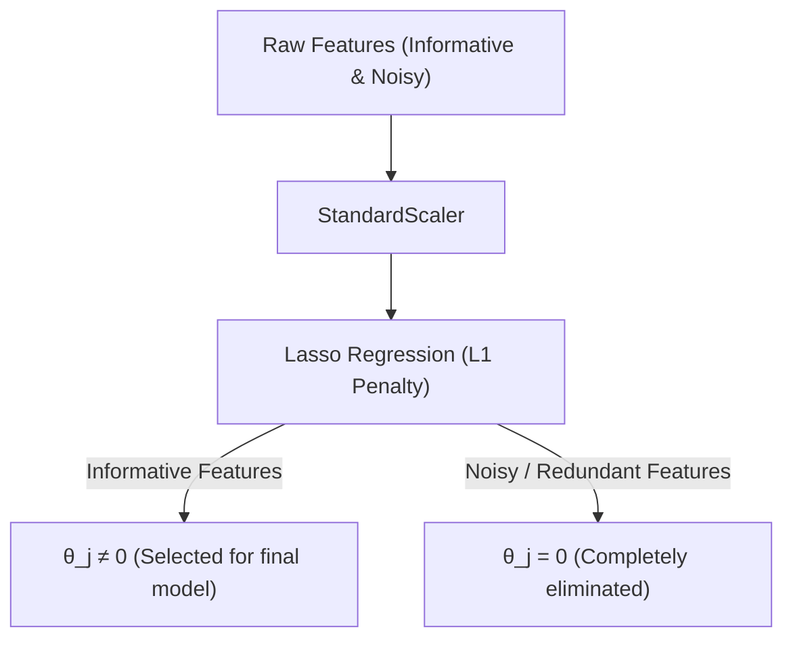

# Lasso Regression (L1 Regularization): Cost Function & Feature Selection

Ordinary Least Squares (OLS) regression models every feature in the dataset, which can lead to complex, uninterpretable models when dealing with high-dimensional feature spaces. **Lasso Regression** (Least Absolute Shrinkage and Selection Operator) resolves this by using an L1 regularization penalty. Unlike Ridge regression, Lasso has the unique ability to drive coefficients exactly to zero, performing automatic **feature selection**.

---

## 1. Mathematical Formulation

Lasso Regression modifies the OLS objective function by adding a penalty term proportional to the sum of the absolute values of the coefficients (excluding the intercept):

$$J(\theta) = \frac{1}{N} \sum_{i=1}^N \left( y_i - \left(\theta_0 + \sum_{j=1}^p \theta_j x_{ij}\right) \right)^2 + \lambda \sum_{j=1}^p |\theta_j|$$

Where:

- $N$ is the number of samples.
- $p$ is the number of features.
- $\theta_0$ is the intercept (unpenalized).
- $\theta_1, \ldots, \theta_p$ are the feature weights.
- $\lambda \ge 0$ is the regularization strength (represented as `alpha` in Scikit-Learn).

### Non-Differentiability

Because the absolute value function $|x|$ has a sharp corner at $x = 0$, the L1 penalty is not differentiable at zero. This mathematical property means we cannot use standard gradient descent or the closed-form normal equation to solve Lasso. Instead, optimization algorithms like **Coordinate Descent** or subgradient methods are required.

---

## 2. Feature Selection Workflow

Lasso acts as a filter that screens out uninformative features, creating sparse models.



- **L2 (Ridge)**: Shrinks coefficients asymptotically close to zero, but never sets them exactly to zero. All features remain in the model.
- **L1 (Lasso)**: Forces coefficients of less important or redundant features to become exactly zero. The model is **sparse**, making it simpler, faster, and highly interpretable.

---

## 3. Python Demonstration: Automatic Feature Selection

The following runnable Python script generates a dataset with 10 features, where only 3 features are informative and the other 7 are random noise. We fit Scikit-Learn's `Lasso` model and verify that the 7 noisy features are completely zeroed out, leaving only the correct 3 active features.

```python
import numpy as np
from sklearn.linear_model import Lasso
from sklearn.preprocessing import StandardScaler

# 1. Generate Synthetic Dataset
np.random.seed(42)
n_samples = 100
n_features = 10

# Generate random features
X = np.random.normal(loc=0.0, scale=1.0, size=(n_samples, n_features))

# Only features 0, 3, and 7 are predictive
# y = 3.5 * x0 - 2.0 * x3 + 4.0 * x7 + noise
y = 3.5 * X[:, 0] - 2.0 * X[:, 3] + 4.0 * X[:, 7] + np.random.normal(0, 0.5, size=n_samples)

# 2. Standardize Features
scaler = StandardScaler()
X_scaled = scaler.fit_transform(X)

# 3. Fit Lasso Regression (Tuning alpha to induce sparsity)
alpha_val = 0.4
lasso = Lasso(alpha=alpha_val, fit_intercept=True)
lasso.fit(X_scaled, y)

coefficients = lasso.coef_

# 4. Display Results and Feature Selection Analysis
print("=== Lasso Feature Selection Output ===")
print("True active feature indices: [0, 3, 7]\n")

for idx, coef in enumerate(coefficients):
    status = "RETAINED" if coef != 0.0 else "ELIMINATED (Set to 0)"
    print(f"Feature {idx:<2}: Coefficient = {coef:<10.5f} | Status: {status}")

# Find indices of non-zero coefficients
active_indices = np.where(coefficients != 0.0)[0]
print(f"\nModel-selected active feature indices: {active_indices.tolist()}")

# 5. Assert Correctness
# Verify that all noisy features (1, 2, 4, 5, 6, 8, 9) have coefficients exactly equal to 0.0
for idx in [1, 2, 4, 5, 6, 8, 9]:
    assert coefficients[idx] == 0.0, f"Error: Noisy Feature {idx} was not eliminated! Coef: {coefficients[idx]}"

# Verify that the active features are exactly the true ones
assert set(active_indices) == {0, 3, 7}, f"Error: Selected features {active_indices} did not match target set!"

print("\n[SUCCESS] Lasso successfully performed automatic feature selection and zeroed out all 7 noisy features!")
```

---

- **Next Topic**: [068_why_lasso_regression_creates_sparsity.md](file:///Users/prime/Developer/ml/068_why_lasso_regression_creates_sparsity.md) - Lasso Sparsity: Mathematical proof and coordinate descent from scratch.
