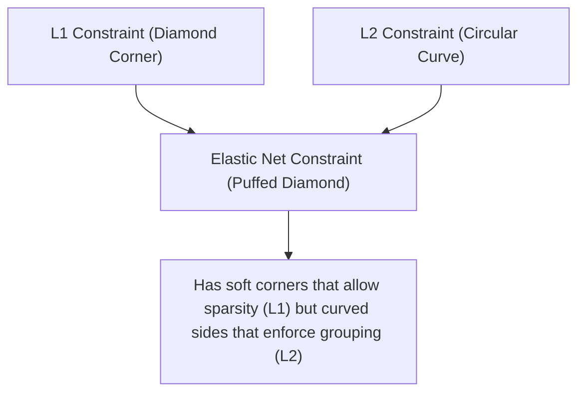

# Elastic Net Regression: Combining L1 and L2 Regularizations

While Ridge regression preserves all features and Lasso regression performs feature selection by driving some coefficients to zero, both have practical limitations. **Elastic Net Regression** combines L1 and L2 regularization to exploit the benefits of both worlds, particularly in the presence of highly correlated features.

---

## 1. Limitations of Lasso & Ridge

- **Lasso Limitations**:
  1. **Arbitrary Group Selection**: If there is a group of highly correlated features, Lasso typically selects only one feature from the group arbitrarily and sets the rest to exactly zero.
  2. **Sample Size Constraint**: If the number of features $p$ is larger than the number of samples $N$ ($p > N$), Lasso can select at most $N$ features before becoming saturated.
- **Ridge Limitations**:
  1. **No Sparsity**: Ridge shrinks all coefficients toward zero, but never sets any to exactly zero. If you have thousands of features, you still must keep all of them in the model, hurting model interpretability.

---

## 2. Mathematical Formulation

Elastic Net solves these issues by minimizing a loss function containing both penalties:

$$J(\theta) = \frac{1}{2N} \sum_{i=1}^N \left( y_i - x_i^T\theta \right)^2 + \lambda_1 \sum_{j=1}^p |\theta_j| + \lambda_2 \sum_{j=1}^p \theta_j^2$$

### Scikit-Learn Parameterization

To simplify hyperparameter tuning, Scikit-Learn parameterizes the penalties using a global regularizer strength $\alpha$ and a mixing parameter $r$ called `l1_ratio`:

$$\text{Penalty} = \alpha \cdot r \cdot \|\theta\|_1 + \frac{\alpha (1 - r)}{2} \|\theta\|_2^2$$

Where:

- $\alpha \ge 0$ controls the overall penalty strength.
- $r \in [0, 1]$ (`l1_ratio`) controls the mix between L1 and L2:
  - $r = 1$: Pure Lasso Regression.
  - $r = 0$: Pure Ridge Regression (scaled by $0.5$).
  - $0 < r < 1$: Elastic Net combination.

---

## 3. Geometric Boundary & The Grouping Effect

Geometrically, the constraint region of Elastic Net is a compromise between the circular L2 boundary and the diamond L1 boundary:



### The Grouping Effect

The L2 penalty term encourages coefficients of highly correlated features to shrink toward each other. The L1 penalty term encourages sparsity. Together, Elastic Net is able to select groups of highly correlated features together, keeping them all in the model (with similar coefficients) or removing them all together.

---

## 4. Python Demonstration: Grouping vs. Arbitrary Selection

The following runnable Python script generates a dataset with 6 features. Features 0, 1, and 2 are highly correlated (forming a group of predictive features), while features 3, 4, and 5 are pure noise. We fit Lasso, Ridge, and Elastic Net, and verify their behavior.

```python
import numpy as np
from sklearn.linear_model import Lasso, Ridge, ElasticNet
from sklearn.preprocessing import StandardScaler

# 1. Generate Synthetic Collinear Dataset
np.random.seed(42)
N = 50

# Base predictive feature
x_base = np.random.normal(0, 1.0, size=N)
# Group of 3 highly correlated features
x0 = x_base + np.random.normal(0, 0.05, size=N)
x1 = x_base + np.random.normal(0, 0.05, size=N)
x2 = x_base + np.random.normal(0, 0.05, size=N)

# 3 Noise features
x3 = np.random.normal(0, 1.0, size=N)
x4 = np.random.normal(0, 1.0, size=N)
x5 = np.random.normal(0, 1.0, size=N)

X = np.vstack([x0, x1, x2, x3, x4, x5]).T
# Target depends on the group of correlated features
y = 3.0 * x_base + np.random.normal(0, 0.5, size=N)

# Standardize features
scaler = StandardScaler()
X_scaled = scaler.fit_transform(X)

# Center target to fit without intercept
y_centered = y - np.mean(y)

# 2. Fit Lasso, Ridge, and Elastic Net
lasso = Lasso(alpha=0.5, fit_intercept=False)
lasso.fit(X_scaled, y_centered)

ridge = Ridge(alpha=10.0, fit_intercept=False)
ridge.fit(X_scaled, y_centered)

enet = ElasticNet(alpha=0.4, l1_ratio=0.5, fit_intercept=False)
enet.fit(X_scaled, y_centered)

# 3. Compare Coefficient Distributions
print("=== Regularizer Comparison under Multicollinearity ===")
print(f"{'Feature Index':<15} | {'True Role':<12} | {'Lasso Coef':<12} | {'Ridge Coef':<12} | {'ElasticNet Coef':<15}")
print("-" * 75)
roles = ["Predictive (G)", "Predictive (G)", "Predictive (G)", "Noise", "Noise", "Noise"]
for idx in range(6):
    print(f"Feature {idx:<7} | {roles[idx]:<12} | {lasso.coef_[idx]:<12.4f} | {ridge.coef_[idx]:<12.4f} | {enet.coef_[idx]:<15.4f}")

# 4. Assertions to verify the mathematical behavior:
# A) Lasso exhibits arbitrary selection: at least one of the predictive group features (0, 1, 2) is zeroed out
lasso_zeros = np.sum(lasso.coef_[:3] == 0.0)
print(f"\nNumber of zeroed predictive features in Lasso: {lasso_zeros}")
assert lasso_zeros >= 1, "Lasso did not zero out any predictive features in the collinear group!"

# B) Elastic Net preserves the group: all three predictive features are non-zero
enet_zeros = np.sum(enet.coef_[:3] == 0.0)
print(f"Number of zeroed predictive features in ElasticNet: {enet_zeros}")
assert enet_zeros == 0, "ElasticNet zeroed out features inside the collinear predictive group!"

# C) Elastic Net performs sparsity: noise features (3, 4, 5) are exactly zeroed out
enet_noise_sum = np.sum(enet.coef_[3:] != 0.0)
print(f"Number of active noise features in ElasticNet: {enet_noise_sum}")
assert enet_noise_sum == 0, "ElasticNet did not eliminate all noise features!"

# D) Ridge does not perform sparsity: noise features are non-zero
ridge_noise_sum = np.sum(ridge.coef_[3:] == 0.0)
print(f"Number of zeroed noise features in Ridge: {ridge_noise_sum}")
assert ridge_noise_sum == 0, "Ridge set some features exactly to zero!"

print("\n[SUCCESS] Verification complete: ElasticNet successfully combined L1 sparsity (dropped noise) and L2 grouping (retained the collinear predictive group)!")
```

---

- **Next Topic**: [070_logistic_regression_part_1.md](file:///Users/prime/Developer/ml/070_logistic_regression_part_1.md) - Logistic Regression Part 1: Odds, Log-Odds, and the Sigmoid function.
