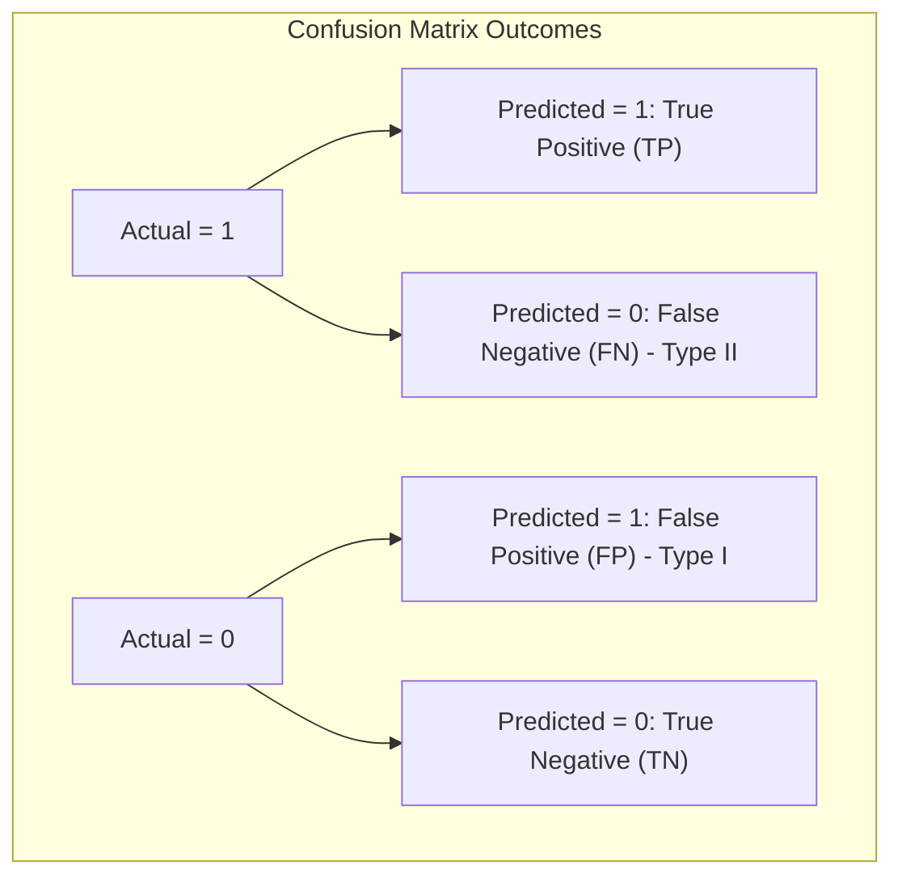

# Model Evaluation: Accuracy & The Confusion Matrix

Training a classification model is only the first step. To evaluate its real-world viability, we need appropriate metrics. The baseline tool for binary evaluation is the **Confusion Matrix**, which tabulates prediction outcomes against actual ground truth labels, exposing **Type I** and **Type II** errors.

---

## 1. The Confusion Matrix Structure

A confusion matrix is a $2 \times 2$ grid (for binary classification) structured as follows:

|                               | Predicted Negative ($\hat{y} = 0$)      | Predicted Positive ($\hat{y} = 1$)     |
| ----------------------------- | --------------------------------------- | -------------------------------------- |
| **Actual Negative ($y = 0$)** | **True Negative (TN)**                  | **False Positive (FP)** (Type I Error) |
| **Actual Positive ($y = 1$)** | **False Negative (FN)** (Type II Error) | **True Positive (TP)**                 |

### Classification Outcomes

1. **True Positive (TP)**: The model predicted a positive class, and the ground truth was positive. (e.g., patient has a disease, model detects it).
2. **True Negative (TN)**: The model predicted a negative class, and the ground truth was negative. (e.g., healthy patient, model predicts healthy).
3. **False Positive (FP) / Type I Error**: The model predicted a positive class, but the ground truth was negative. (e.g., healthy patient gets a false alarm).
4. **False Negative (FN) / Type II Error**: The model predicted a negative class, but the ground truth was positive. (e.g., sick patient is missed).



---

## 2. Accuracy Definition

**Accuracy** is the proportion of total correct predictions (both positive and negative) relative to the total number of evaluated samples:
$$\text{Accuracy} = \frac{TP + TN}{TP + TN + FP + FN}$$

### Limitations of Accuracy

Accuracy is highly intuitive, but it is **deceptive when dealing with class-imbalanced datasets**.

- _Example_: If a dataset contains 99% normal transactions and 1% fraudulent ones, a dummy classifier that predicts "normal" for every transaction achieves **99% accuracy**, despite failing to detect a single fraud case.

---

## 3. Python Implementation from Scratch

The following runnable Python script implements both the Confusion Matrix and Accuracy calculation from scratch using NumPy. It compares the custom outputs to Scikit-Learn's metrics to guarantee correctness.

```python
import numpy as np
from sklearn.metrics import confusion_matrix, accuracy_score

# 1. Custom Metrics Implementation from Scratch
def compute_confusion_matrix_scratch(y_true, y_pred):
    # Initialize counts
    tp = 0
    fp = 0
    tn = 0
    fn = 0

    for t, p in zip(y_true, y_pred):
        if t == 1 and p == 1:
            tp += 1
        elif t == 0 and p == 1:
            fp += 1
        elif t == 0 and p == 0:
            tn += 1
        elif t == 1 and p == 0:
            fn += 1

    # Format into standard 2x2 matrix: [[TN, FP], [FN, TP]]
    matrix = np.array([
        [tn, fp],
        [fn, tp]
    ])
    return matrix, tp, fp, tn, fn

def compute_accuracy_scratch(tp, fp, tn, fn):
    total = tp + fp + tn + fn
    if total == 0:
        return 0.0
    return (tp + tn) / total

# 2. Setup Synthetic Evaluation Labels
# Let 1 be "positive" and 0 be "negative"
y_true = np.array([1, 0, 1, 1, 0, 1, 0, 0, 1, 0, 1, 0, 1])
y_pred = np.array([1, 0, 0, 1, 0, 0, 1, 0, 1, 0, 1, 1, 1])

# 3. Calculate metrics using scratch implementation
custom_matrix, tp, fp, tn, fn = compute_confusion_matrix_scratch(y_true, y_pred)
custom_accuracy = compute_accuracy_scratch(tp, fp, tn, fn)

# 4. Calculate metrics using Scikit-Learn
sklearn_matrix = confusion_matrix(y_true, y_pred)
sklearn_accuracy = accuracy_score(y_true, y_pred)

# 5. Display results and assert match
print("=== Confusion Matrix Comparison ===")
print("Custom Scratch Confusion Matrix:")
print(custom_matrix)
print("\nScikit-Learn Confusion Matrix:")
print(sklearn_matrix)

print("\n=== Performance Metrics ===")
print(f"True Positives (TP):  {tp}")
print(f"False Positives (FP): {fp} (Type I Error)")
print(f"True Negatives (TN):  {tn}")
print(f"False Negatives (FN): {fn} (Type II Error)")
print(f"Custom Accuracy:      {custom_accuracy:.6f}")
print(f"Sklearn Accuracy:     {sklearn_accuracy:.6f}")

# Assert matching results
assert np.array_equal(custom_matrix, sklearn_matrix), "Confusion matrices do not match"
assert np.isclose(custom_accuracy, sklearn_accuracy), "Accuracies do not match"
print("\n[SUCCESS] Custom confusion matrix and accuracy match Scikit-Learn outputs exactly!")
```

---

- **Next Topic**: [077_precision_recall_and_f1_score.md](file:///Users/prime/Developer/ml/077_precision_recall_and_f1_score.md) - Class Imbalance Metrics: Precision, Recall, and F1-Score.
