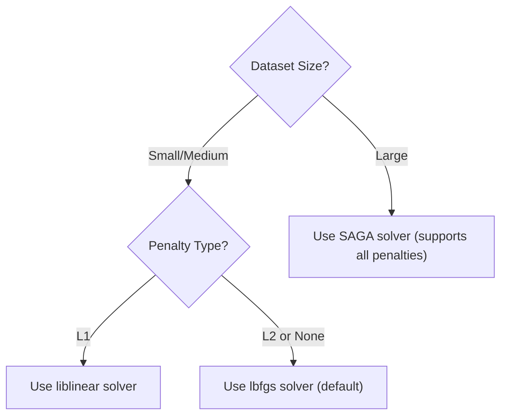

# Logistic Regression Hyperparameters: Regularization & Solvers

To prevent overfitting and ensure numerical stability, Logistic Regression models incorporate regularization. Hyperparameter tuning involves selecting the penalty type (L1, L2, or Elastic Net), the regularization strength $C$, and the optimization solver.

---

## 1. Regularization Formulations

Regularization penalizes large weight coefficients. In Scikit-Learn, the regularization strength is controlled by $C$, which is defined as the **inverse of the regularization multiplier $\lambda$**:
$$C = \frac{1}{\lambda}$$

Thus:

- **Large $C$ (Small $\lambda$)**: Weak regularization (allows weights to grow, model may overfit).
- **Small $C$ (Large $\lambda$)**: Strong regularization (forces weights closer to zero, model may underfit).

### L2 Regularization (Ridge Penalty)

Adds a penalty proportional to the sum of squared weights:
$$J(w) = \text{BCE}(w) + \frac{1}{2C} \sum_{j=1}^M w_j^2$$

L2 shrinks weights evenly but never forces them to exactly zero.

### L1 Regularization (Lasso Penalty)

Adds a penalty proportional to the sum of absolute weights:
$$J(w) = \text{BCE}(w) + \frac{1}{C} \sum_{j=1}^M |w_j|$$

L1 drives weights of non-essential features to exactly zero, performing automatic feature selection (sparsity).

### Elastic Net Regularization

Combines both L1 and L2 penalties using a mixing parameter $l_1\text{-ratio} \in [0, 1]$:
$$J(w) = \text{BCE}(w) + \frac{1}{C} \left[ r \sum_{j=1}^M |w_j| + \frac{1-r}{2} \sum_{j=1}^M w_j^2 \right]$$
where $r$ is the $l_1\text{-ratio}$.

---

## 2. Solver Options in Scikit-Learn

Different optimization solvers are suited to different types of regularization and dataset sizes:

| Solver          | Supported Penalties      | Strengths & Characteristics                                                                                                                                  |
| --------------- | ------------------------ | ------------------------------------------------------------------------------------------------------------------------------------------------------------ |
| **`lbfgs`**     | L2, None                 | Limited-memory BFGS. Quasi-Newton method. Default solver, fast and stable for small/medium datasets.                                                         |
| **`liblinear`** | L1, L2                   | Coordinate descent algorithm. Excellent for small datasets, but slow on large ones. Does not support multinomial classification directly (uses One-vs-Rest). |
| **`saga`**      | L1, L2, ElasticNet, None | Stochastic Average Gradient descent. Optimized variant of SAG. Excellent for very large datasets and supports all penalty types.                             |
| **`newton-cg`** | L2, None                 | Newton-Conjugate Gradient. Computes Hessian matrix. Best for multiclass problems on small/medium datasets.                                                   |



---

## 3. Python Implementation: Grid Search Hyperparameter Tuning

The following runnable Python script performs a grid search sweep over $C$, penalty types (`l1`, `l2`), and solvers (`liblinear`, `saga`) to identify the optimal configuration for a synthetic classification dataset.

```python
import numpy as np
from sklearn.datasets import make_classification
from sklearn.linear_model import LogisticRegression
from sklearn.model_selection import GridSearchCV
from sklearn.preprocessing import StandardScaler

# 1. Generate synthetic classification dataset
X, y = make_classification(n_samples=250, n_features=10, n_informative=5, n_redundant=5, random_state=42)

# Standard scaling is critical for regularization since penalties are scale-dependent
scaler = StandardScaler()
X_scaled = scaler.fit_transform(X)

# 2. Setup GridSearchCV Parameters
# Note: Not all solvers support all penalties!
param_grid = [
    {
        'solver': ['liblinear'],
        'penalty': ['l1', 'l2'],
        'C': [0.01, 0.1, 1.0, 10.0]
    },
    {
        'solver': ['saga'],
        'penalty': ['l1', 'l2', 'none'],
        'C': [0.01, 0.1, 1.0, 10.0]
    }
]

# 3. Perform Grid Search
grid_search = GridSearchCV(
    estimator=LogisticRegression(max_iter=5000, tol=1e-5),
    param_grid=param_grid,
    scoring='accuracy',
    cv=5,
    n_jobs=-1
)
grid_search.fit(X_scaled, y)

# 4. Display Results & Programmatic Verification
print("=== Grid Search Optimization Summary ===")
print(f"Best Accuracy Score: {grid_search.best_score_ * 100.0:.2f}%")
print("Best Hyperparameters:")
for param, val in grid_search.best_params_.items():
    print(f"  - {param}: {val}")

# Validate best estimator performance
best_model = grid_search.best_estimator_
y_pred = best_model.predict(X_scaled)
acc = np.mean(y_pred == y)
print(f"\nFinal Train Set Accuracy of Best Model: {acc * 100.0:.2f}%")

# Assert grid search successfully found an estimator
assert best_model is not None, "GridSearchCV failed to optimize logistic regression parameters"
print("\n[SUCCESS] Hyperparameter grid search successfully executed and verified standard logistic parameters!")
```

---

- **Next Topic**: [082_naive_bayes_classifier.md](file:///Users/prime/Developer/ml/082_naive_bayes_classifier.md) - Naive Bayes Classifier Part 1: Conditional Probability.
