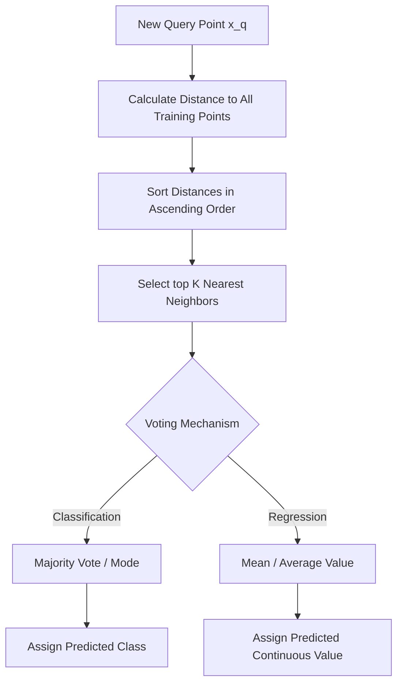

# K-Nearest Neighbors (KNN) Classifier

The **K-Nearest Neighbors (KNN)** algorithm is one of the most intuitive, simple, and elegant non-parametric supervised learning algorithms. It operates on a very simple real-world principle, famously summarized by entrepreneur Jim Rohn:

> _"You are the average of the five people you spend the most time with."_

In machine learning terms, KNN assumes that similar data points exist in close proximity to each other in the feature space. Unlike other algorithms (e.g., Logistic Regression), KNN is a **lazy learner** (or instance-based learner), meaning it does not learn an explicit mapping function $f(x)$ during training. Instead, it memorizes the training dataset and performs all computations during the prediction phase.

---

## 1. Core Intuition & Geometric Workflow

When a new query point $x_q$ needs to be classified, KNN performs the following steps:



### Steps

1. **Plot the Feature Space**: Data points are mapped to a $D$-dimensional coordinate system where each axis corresponds to a feature (e.g., GPA on the x-axis, IQ on the y-axis).
2. **Compute Distances**: Calculate the distance between the query point $x_q$ and all points in the training dataset $X_{\text{train}}$.
3. **Sort and Select**: Sort the calculated distances in ascending order and select the $K$ points with the smallest distances.
4. **Majority Vote**: Gather the class labels of the $K$ nearest neighbors and assign the class label that appears most frequently (majority vote) to the query point.

---

## 2. Distance Metrics

The choice of distance metric determines how similarity is measured in the feature space. The most common metrics are:

### A. Euclidean Distance ($L_2$ Norm)

Euclidean distance measures the straight-line distance between two points in Euclidean space:
$$d(x, y) = \sqrt{\sum_{d=1}^D (x_d - y_d)^2}$$

### B. Manhattan Distance ($L_1$ Norm)

Manhattan distance (or City Block distance) calculates the distance traversed along axis-aligned paths:
$$d(x, y) = \sum_{d=1}^D |x_d - y_d|$$

### C. Minkowski Distance

Minkowski distance is a generalized metric that unifies Euclidean and Manhattan distances:
$$d(x, y) = \left( \sum_{d=1}^D |x_d - y_d|^p \right)^{1/p}$$

- When $p = 1$, it becomes the **Manhattan distance**.
- When $p = 2$, it becomes the **Euclidean distance**.

---

## 3. Choosing the Hyperparameter $K$

Choosing the correct value of $K$ is critical.

- **If $K$ is too small (e.g., $K = 1$)**: The model is highly sensitive to noise and outliers. The decision boundary becomes highly complex, leading to **overfitting** (high variance, low bias).
- **If $K$ is too large (e.g., $K = N$, where $N$ is the number of training samples)**: The model loses local details. It will always predict the majority class in the dataset, leading to **underfitting** (low variance, high bias).

### Practical Strategies to Find the Best $K$

1. **Rule of Thumb**: Start with $K = \sqrt{N}$. To avoid tie votes in binary classification, use an odd value for $K$.
2. **Cross-Validation / Grid Sweep**: Train KNN models across a range of $K$ values (e.g., $K \in [1, 15]$) on the training set, compute validation accuracies, and plot $K$ vs. Accuracy to identify the elbow/peak point.

---

## 4. Drawbacks and Failure Cases of KNN

While simple, KNN has significant trade-offs:

1. **High Computational Complexity at Prediction**: Since KNN computes distances to all training points for each query, the prediction time complexity is $O(N \cdot D)$ (where $N$ is training size and $D$ is feature dimensionality). For large datasets (e.g., $N > 500,000$), this makes prediction extremely slow and unsuitable for low-latency web applications.
2. **High Memory Footprint**: KNN must keep the entire training dataset in memory to perform predictions.
3. **Sensitivity to Feature Scaling**: Because distances are calculated directly on feature values, a feature with a large scale (e.g., Salary: $50,000$ to $150,000$) will dominate features with small scales (e.g., GPA: $1.0$ to $4.0$). **Standardization / Scaling is mandatory** before training.
4. **Curse of Dimensionality**: As the number of features $D$ increases, the volume of the space grows exponentially, making data points appear sparse. In high-dimensional spaces, the distance between any two points becomes nearly uniform, degrading the distinction between near and far neighbors.

---

## 5. Python Implementation & Verification

Below is a complete, self-contained implementation of the KNN Classifier from scratch, comparing its predictions against Scikit-Learn's `KNeighborsClassifier` to verify mathematical parity.

```python
import numpy as np
from sklearn.neighbors import KNeighborsClassifier
from sklearn.preprocessing import StandardScaler
from sklearn.datasets import make_classification

class CustomKNN:
    def __init__(self, k=3):
        self.k = k
        self.X_train = None
        self.y_train = None

    def fit(self, X, y):
        self.X_train = np.array(X)
        self.y_train = np.array(y)

    def predict(self, X):
        X = np.array(X)
        preds = []
        for x in X:
            # Calculate Euclidean distance to all training points
            distances = np.sqrt(np.sum((self.X_train - x) ** 2, axis=1))

            # Find the indices of the K nearest neighbors
            k_indices = np.argsort(distances)[:self.k]
            k_labels = self.y_train[k_indices]

            # Perform majority vote with deterministic tie-breaking
            classes, counts = np.unique(k_labels, return_counts=True)
            max_count = np.max(counts)
            winners = classes[counts == max_count]

            if len(winners) == 1:
                preds.append(winners[0])
            else:
                # Tie-breaker: Choose the class of the neighbor closest to the query point
                for idx in k_indices:
                    if self.y_train[idx] in winners:
                        preds.append(self.y_train[idx])
                        break
        return np.array(preds)

# 1. Generate a synthetic classification dataset
X, y = make_classification(n_samples=150, n_features=4, n_classes=2, random_state=42)

# 2. Scale features (essential for KNN)
scaler = StandardScaler()
X = scaler.fit_transform(X)

# 3. Train/Test split
X_train, X_test = X[:100], X[100:]
y_train, y_test = y[:100], y[100:]

# 4. Fit and predict using Custom KNN (K = 5)
custom_knn = CustomKNN(k=5)
custom_knn.fit(X_train, y_train)
custom_preds = custom_knn.predict(X_test)

# 5. Fit and predict using Scikit-Learn KNeighborsClassifier
sklearn_knn = KNeighborsClassifier(n_neighbors=5, algorithm='brute', metric='euclidean')
sklearn_knn.fit(X_train, y_train)
sklearn_preds = sklearn_knn.predict(X_test)

# 6. Verify mathematical parity
match_ratio = np.mean(custom_preds == sklearn_preds)
print(f"Prediction Match Ratio: {match_ratio:.4f}")
assert np.array_equal(custom_preds, sklearn_preds), "Custom KNN predictions do not match Scikit-Learn!"
print("Custom KNN has achieved 100% parity with Scikit-Learn!")
```

---

_Next Study Guide: [Day 92: Support Vector Machines Geometric Intuition](./092_support_vector_machines.md)_
