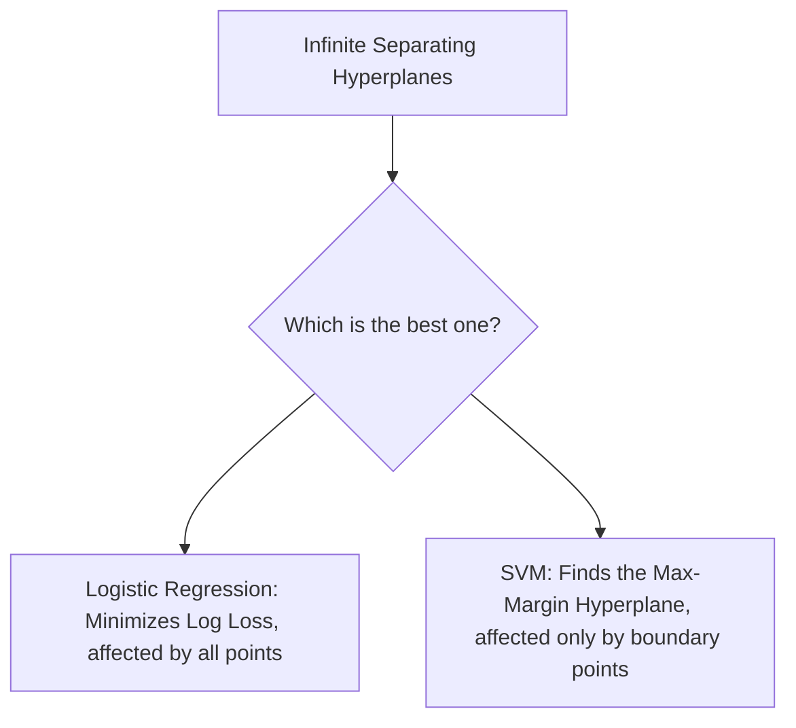
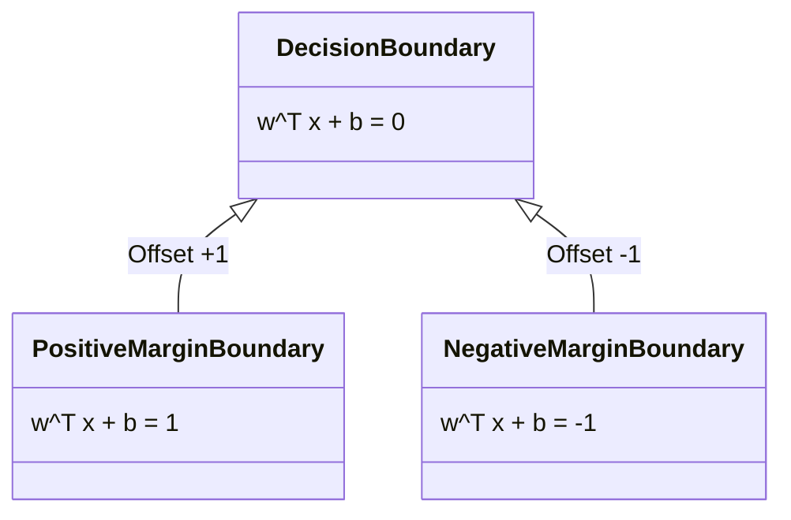

# Support Vector Machines (Geometric Intuition)

A **Support Vector Machine (SVM)** is a powerful and versatile supervised learning algorithm capable of performing linear or non-linear classification, regression, and outlier detection. It is particularly well-suited for classification of complex, small-to-medium-sized datasets.

Unlike probabilistic classifiers like Logistic Regression, which calculate the log-odds of a point belonging to a class and are influenced by all training instances, SVMs are **geometric classifiers**. They focus entirely on finding the decision boundary that is as far away from the training data points of both classes as possible.

---

## 1. The Core SVM Intuition

Suppose we have a binary classification dataset that is linearly separable. There are infinite possible lines (or hyperplanes in higher dimensions) that can separate the two classes:



To achieve maximum generalization on unseen data, we want to choose the hyperplane that leaves the largest possible gap (margin) between the classes. This is why SVM is often referred to as a **Maximum Margin Classifier**.

---

## 2. Geometric Definitions & The Hyperplane

In a $D$-dimensional space, a hyperplane is a subspace of dimension $D - 1$. For example, in a 2D space, a hyperplane is a 1D line; in a 3D space, it is a 2D plane.

The decision boundary (hyperplane) is defined by:
$$w^T x + b = 0$$
where:

- $w$ is the weight vector perpendicular to the hyperplane (normal vector).
- $b$ is the bias (offset from the origin).
- $x$ is the input feature vector.

### Margin Boundaries

SVM defines two parallel boundaries on either side of the decision hyperplane:

- **Positive Margin Hyperplane**: $w^T x + b = 1$
- **Negative Margin Hyperplane**: $w^T x + b = -1$



The region between these two boundaries is the **Margin**, and its width is mathematically derived as $\frac{2}{\|w\|}$.

---

## 3. What are Support Vectors?

The training points that lie exactly on the margin boundaries ($w^T x + b = 1$ and $w^T x + b = -1$) are called **Support Vectors**.

- They are the hardest points to classify and are located closest to the decision boundary.
- If you remove or move any point that is _not_ a support vector, the decision boundary remains completely unchanged.
- If you move even one support vector, the margin changes, and the decision boundary shifts. Hence, they "support" the decision boundary.

### Hard Margin SVM Constraints

In a **Hard Margin SVM**, we assume the data is perfectly linearly separable and enforce that no data point can violate the margin boundaries. We define the labels as $y_i \in \{-1, +1\}$. The constraint for every training sample $(x_i, y_i)$ is:
$$y_i (w^T x_i + b) \ge 1 \quad \forall i \in \{1, 2, \dots, N\}$$

- If $y_i = +1$, then $w^T x_i + b \ge 1$
- If $y_i = -1$, then $w^T x_i + b \le -1$

---

## 4. Python Implementation & Geometric Verification

We will train a linear SVM classifier using Scikit-Learn's `SVC(kernel='linear')` on synthetic, perfectly separable data. We will extract the learned weight vector $w$ and bias $b$, identify the support vectors, and programmatically assert that the constraint $y_i(w^T x_i + b) \approx 1$ holds true for all support vectors.

```python
import numpy as np
from sklearn.svm import SVC
from sklearn.datasets import make_blobs

# 1. Generate perfectly linearly separable synthetic data
X, y = make_blobs(n_samples=50, centers=2, random_state=42, cluster_std=0.60)

# Convert labels from {0, 1} to {-1, 1} to align with SVM math
y = np.where(y == 0, -1, 1)

# 2. Fit a Linear SVM with a large penalty parameter C (Hard Margin approximation)
clf = SVC(kernel='linear', C=1e5)
clf.fit(X, y)

# 3. Extract the weight vector (w) and bias (b)
w = clf.coef_[0]
b = clf.intercept_[0]

# 4. Identify the indices and features of the support vectors
sv_indices = clf.support_
sv_X = X[sv_indices]
sv_y = y[sv_indices]

# 5. Verify the margin constraint equation for each support vector: y_i * (w^T x_i + b) = 1
margin_values = sv_y * (np.dot(sv_X, w) + b)

print(f"Learned Weight Vector w: {w}")
print(f"Learned Bias b: {b}")
print(f"Number of Support Vectors: {len(sv_indices)}")
print(f"Margin values of Support Vectors: {margin_values}")

# Assert that all support vectors lie exactly on the margin boundaries (within numeric tolerance)
assert np.allclose(margin_values, 1.0, atol=1e-3), "Support vectors do not lie on the margin boundaries!"
print("Geometric verification successful! All support vectors satisfy the boundary condition y_i * (w^T x_i + b) = 1.")
```

---

_Next Study Guide: [Day 93: Mathematics of SVM - Primal Formulation](./093_mathematics_of_svm.md)_
