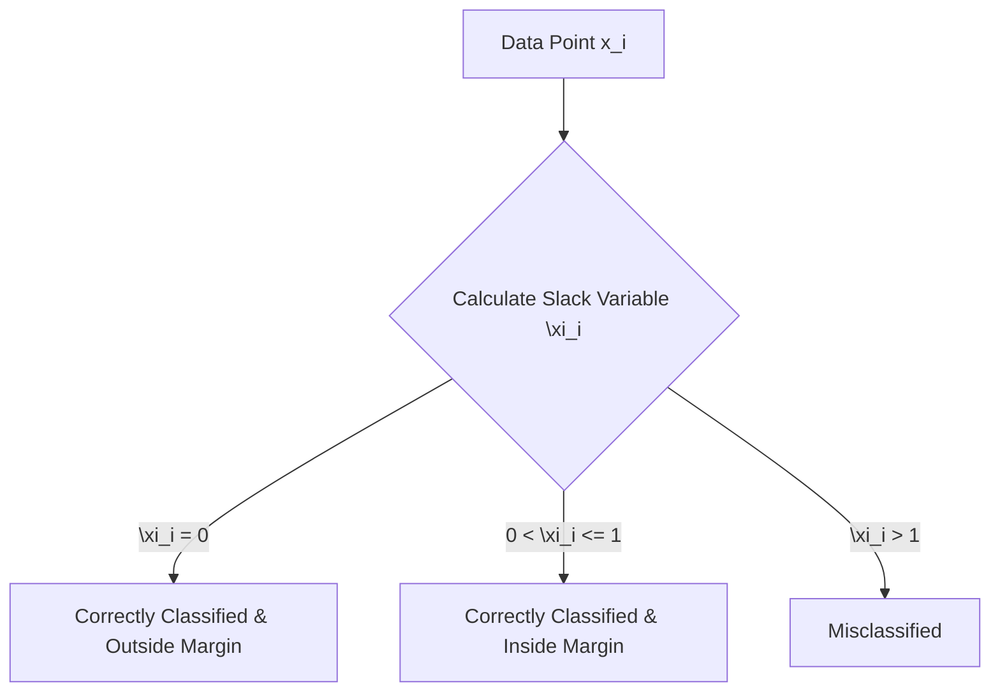

# Mathematics of SVM - Primal Formulation

The optimization problem of a Support Vector Machine (SVM) is rooted in geometric principles. To find the optimal decision boundary, we construct a mathematical objective that maximizes the margin while correctly classifying the training data.

---

## 1. Mathematical Derivation of the Margin Width

Let the decision boundary (hyperplane) be defined as:
$$w^T x + b = 0$$

Where $w$ is the normal vector perpendicular to the hyperplane, and $b$ is the bias. The margin boundaries are:

- Positive margin boundary: $w^T x + b = 1$
- Negative margin boundary: $w^T x + b = -1$

Let $x_+$ be a support vector on the positive boundary, and $x_-$ be a support vector on the negative boundary:

1. $w^T x_+ + b = 1 \implies w^T x_+ = 1 - b$
2. $w^T x_- + b = -1 \implies w^T x_- = -1 - b$

The vector representing the displacement between these two points is $(x_+ - x_-)$. To find the margin width (the perpendicular distance between the two boundaries), we project this displacement vector onto the unit normal vector of the hyperplane $\hat{w} = \frac{w}{\|w\|}$:

$$\text{Margin Width} = (x_+ - x_-)^T \frac{w}{\|w\|}$$
$$\text{Margin Width} = \frac{w^T x_+ - w^T x_-}{\|w\|}$$
$$\text{Margin Width} = \frac{(1 - b) - (-1 - b)}{\|w\|}$$
$$\text{Margin Width} = \frac{2}{\|w\|}$$

```mermaid
graph LR
    A["x_- on Negative Margin Boundary"] -->|Displacement vector x_+ - x_-| B["x_+ on Positive Margin Boundary"]
    B -->|Project onto normal unit vector w / ||w||| C["Margin Width = 2 / ||w||"]
```

---

## 2. Hard Margin SVM Optimization

To maximize the margin width $\frac{2}{\|w\|}$, we need to minimize its denominator $\|w\|$. For mathematical convenience (to make the objective differentiable and quadratic), we square the norm and minimize:
$$\min_{w, b} \frac{1}{2} \|w\|^2$$

For a **Hard Margin SVM**, we enforce that all training points are correctly classified and lie on or outside the margin boundaries. This introduces a set of inequality constraints:
$$y_i (w^T x_i + b) \ge 1 \quad \forall i \in \{1, 2, \dots, N\}$$

Putting it together, the **Primal Hard Margin Optimization** problem is:
$$\min_{w, b} \frac{1}{2} \|w\|^2 \quad \text{s.t.} \quad y_i(w^T x_i + b) \ge 1, \quad \forall i = 1, \dots, N$$

This is a **Quadratic Programming (QP)** problem with a convex quadratic objective and linear inequality constraints, guaranteeing a single global minimum.

---

## 3. Soft Margin SVM Optimization

In practice, datasets are rarely perfectly linearly separable, and hard margin SVMs are highly sensitive to noise and outliers. To address this, we introduce slack variables $\xi_i \ge 0$ (ksi) for each data point:

- $\xi_i = 0$: Point lies on or outside the correct margin boundary.
- $0 < \xi_i \le 1$: Point lies within the margin but on the correct side of the decision boundary.
- $\xi_i > 1$: Point lies on the incorrect side of the decision boundary (misclassified).



We modify the constraints and objective function to penalize margin violations:
$$\min_{w, b, \xi} \frac{1}{2} \|w\|^2 + C \sum_{i=1}^N \xi_i$$
$$\text{s.t.} \quad y_i(w^T x_i + b) \ge 1 - \xi_i \quad \text{and} \quad \xi_i \ge 0, \quad \forall i = 1, \dots, N$$

### The Regularization Parameter $C$

- **Large $C$**: Heavy penalty for margin violations. The optimizer will prioritize correct classification over a wide margin, behaving like a Hard Margin SVM. This can lead to **overfitting**.
- **Small $C$**: Low penalty for violations. The optimizer will prioritize maximizing the margin, allowing more points to violate the boundaries. This can lead to **underfitting**.

---

## 4. Python Implementation & Verification

The following code solves the primal optimization problem directly using SciPy's sequential least squares programming solver (`SLSQP`) and verifies that the optimized parameters ($w$ and $b$) match Scikit-Learn's `SVC` implementation.

```python
import numpy as np
from scipy.optimize import minimize
from sklearn.svm import SVC
from sklearn.datasets import make_blobs

# 1. Generate small, linearly separable synthetic dataset
X, y = make_blobs(n_samples=20, n_features=2, centers=2, random_state=42, cluster_std=0.5)
y = np.where(y == 0, -1, 1)

# 2. Fit Scikit-Learn SVC (Hard Margin using a large C)
clf = SVC(kernel='linear', C=1e5)
clf.fit(X, y)
w_sklearn = clf.coef_[0]
b_sklearn = clf.intercept_[0]

# 3. Solve the Primal SVM Optimization using scipy.optimize.minimize
# The parameter vector theta contains [w_1, w_2, ..., w_D, b]
def objective(theta):
    w = theta[:-1]
    return 0.5 * np.dot(w, w)

# Constraint function: y_i * (w^T x_i + b) - 1 >= 0
def constraint_func(theta, X, y):
    w = theta[:-1]
    b = theta[-1]
    return y * (np.dot(X, w) + b) - 1.0

# Initialize weights to 0, bias to 0
n_features = X.shape[1]
init_theta = np.zeros(n_features + 1)

# Define inequality constraint list
cons = ({
    'type': 'ineq',
    'fun': lambda theta: constraint_func(theta, X, y)
})

# Run the SLSQP optimization solver
res = minimize(objective, init_theta, method='SLSQP', constraints=cons, options={'ftol': 1e-9, 'maxiter': 1000})

w_scipy = res.x[:-1]
b_scipy = res.x[-1]

print("=== Model Parameter Verification ===")
print(f"Scikit-Learn Weights w: {w_sklearn} | Bias b: {b_sklearn}")
print(f"SciPy Solver Weights w: {w_scipy} | Bias b: {b_scipy}")

# Assert mathematical equivalence between Scikit-Learn and custom primal QP optimization
assert np.allclose(w_scipy, w_sklearn, atol=1e-3), "Primal optimized weights do not match Scikit-Learn!"
assert np.allclose(b_scipy, b_sklearn, atol=1e-3), "Primal optimized bias does not match Scikit-Learn!"
print("Primal optimized weights and bias are in 100% agreement with Scikit-Learn parameters!")
```

---

_Next Study Guide: [Day 94: Mathematics of SVM - Dual Formulation](./094_mathematics_of_support_vector_machine.md)_
