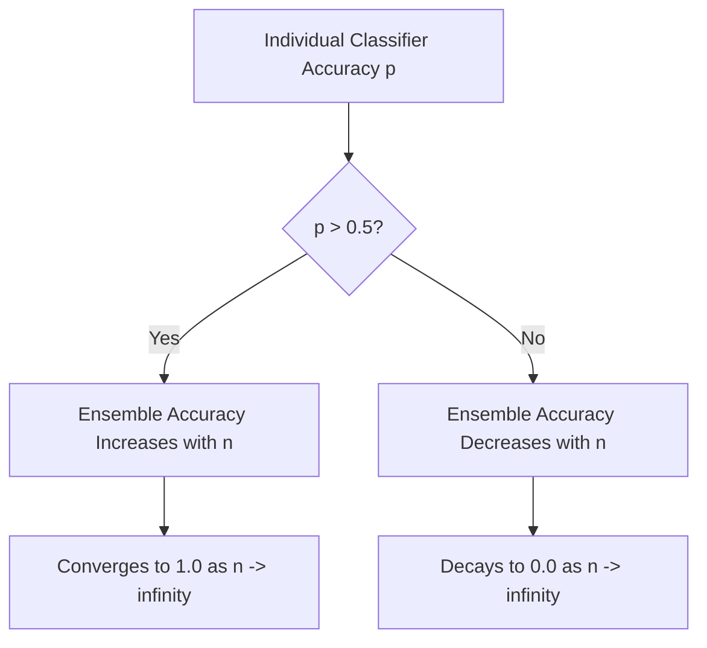

# Ensemble Learning & Wisdom of Crowds

Ensemble Learning is a powerful machine learning paradigm where multiple individual models (often called **base learners** or **weak learners**) are combined to solve a single computational task. The core premise is that a collection of diverse, moderately performing models can collectively form a highly robust, high-accuracy predictor that outperforms any individual model in the ensemble.

This approach is widely used in production systems and competitive machine learning (e.g., Kaggle) to maximize accuracy and minimize generalization error.

---

## 1. The Core Philosophy: Wisdom of the Crowds

The concept of ensemble learning is directly inspired by the social phenomenon known as the **Wisdom of the Crowds** (first popularized by Francis Galton in 1907). At a county fair, Galton observed that while individual guesses of the weight of an ox were wildly inaccurate, the _average_ of all guesses ($1,197$ lbs) was within $1$ lb of the true weight ($1,198$ lbs).

### Real-World Analogies

1. **Audience Polls**: In game shows like _Who Wants to Be a Millionaire_, the "Ask the Audience" lifeline is statistically the most reliable because the aggregated opinion of a large, diverse group filters out individual ignorance.
2. **Product Reviews**: On e-commerce sites like Amazon, we trust a $4.5/5$ rating with $10,000$ reviews far more than a $5/5$ rating with a single review.
3. **Democratic Voting**: Elections rely on the collective decision of citizens to choose representatives, under the assumption that the majority decision is more stable than a single dictator's choice.

---

## 2. Mathematical Foundation: Condorcet's Jury Theorem

The theoretical justification for why majority voting works in ensembles is provided by **Condorcet's Jury Theorem** (1785).

### Assumptions

1. The ensemble consists of $n$ independent estimators.
2. Each estimator makes a binary classification decision ($0$ or $1$).
3. Each estimator has an individual probability $p$ of making the correct decision.
4. The decisions are independent (the errors are uncorrelated).

### Theorem

Let $P_{\text{ensemble}}$ be the probability that a majority vote of the $n$ estimators is correct. The probability of obtaining at least a majority ($k = \lfloor n/2 \rfloor + 1$) of correct votes is given by the binomial sum:
$$P_{\text{ensemble}} = \sum_{k=\lfloor n/2 \rfloor + 1}^n \binom{n}{k} p^k (1-p)^{n-k}$$

- **Case 1: $p > 0.5$**: The ensemble accuracy $P_{\text{ensemble}}$ is strictly greater than the individual accuracy $p$. Furthermore, as the number of estimators $n$ approaches infinity, the probability of a correct ensemble decision converges to $1$:
  $$\lim_{n \to \infty} P_{\text{ensemble}} = 1.0$$
- **Case 2: $p < 0.5$**: The ensemble accuracy $P_{\text{ensemble}}$ is strictly worse than $p$. As $n$ increases, the probability of a correct decision decays to $0$:
  $$\lim_{n \to \infty} P_{\text{ensemble}} = 0.0$$



---

## 3. The Necessity of Diversity

For Condorcet's Jury Theorem to hold, the estimators **must be independent**. If all models in the ensemble are identical and make identical errors, the ensemble will not perform any better than a single model.

To create diverse ensembles, we employ three key strategies:

1. **Algorithmic Diversity**: Combine completely different types of models (e.g., a Support Vector Machine, a Decision Tree, and a Logistic Regression model) trained on the same dataset.
2. **Data Diversity**: Train the same type of model on different subsets of the training data (e.g., using Bootstrap Sampling).
3. **Feature Diversity**: Train models on different subsets of features (e.g., Random Forest subspace sampling).

---

## 4. Primary Types of Ensemble Methods

Ensemble methods are broadly categorized into four families, which we will explore in detail over the coming days:

| Family       | Mechanism                                                                                   | Primary Goal                                           | Example Algorithms                    |
| :----------- | :------------------------------------------------------------------------------------------ | :----------------------------------------------------- | :------------------------------------ |
| **Voting**   | Parallel prediction aggregation via majority vote (classification) or average (regression). | Simple combination of diverse models.                  | `VotingClassifier`, `VotingRegressor` |
| **Bagging**  | Parallel training of similar models on random bootstrap samples of the training data.       | **Variance Reduction** (reduces overfitting).          | Bagging, Random Forest                |
| **Boosting** | Sequential training of models where each model corrects the errors of its predecessor.      | **Bias Reduction** (converts weak learners to strong). | AdaBoost, Gradient Boosting, XGBoost  |
| **Stacking** | Multi-layer learning where a meta-model learns to combine predictions from base models.     | Meta-learning optimization.                            | Stacking Ensembles                    |

---

## 5. Python Verification: Jury Theorem Simulation

Below is a self-contained simulation illustrating the math behind Condorcet's Jury Theorem. We simulate independent classifiers with individual accuracy $p = 0.55$ and calculate how the majority vote accuracy scales with the ensemble size.

```python
import numpy as np
from scipy.stats import binom

def ensemble_accuracy(n, p):
    """
    Calculates the exact theoretical probability of a correct majority vote
    using the binomial cumulative distribution function.
    """
    # Strict majority requirement
    k = (n // 2) + 1
    # 1 - P(X < k) = P(X >= k)
    return 1 - binom.cdf(k - 1, n, p)

# 1. Define individual classifier accuracy (greater than 0.5)
p_individual = 0.55

# 2. Sweep the number of estimators in the ensemble
n_estimators = [1, 3, 11, 51, 101, 501, 1001]
theoretical_accuracies = []

print("Estimators | Ensemble Accuracy")
print("------------------------------")
for n in n_estimators:
    acc = ensemble_accuracy(n, p_individual)
    theoretical_accuracies.append(acc)
    print(f"{n:10d} | {acc:.6f}")

# 3. Verify that the ensemble accuracy monotonically increases and converges
assert theoretical_accuracies[0] == p_individual, "A single estimator ensemble accuracy must match individual accuracy!"
assert all(theoretical_accuracies[i] < theoretical_accuracies[i+1] for i in range(len(theoretical_accuracies)-1)), "Ensemble accuracy must monotonically increase!"
assert theoretical_accuracies[-1] > 0.99, "Ensemble of 1001 weak learners (p=0.55) must exceed 99% accuracy!"

print("\nCondorcet's Jury Theorem verified successfully!")
```

---

_Next Study Guide: [Day 102: Voting Ensemble Classifier (Hard vs. Soft Voting)](file:///Users/prime/Developer/ml/102_voting_ensemble.md)_
