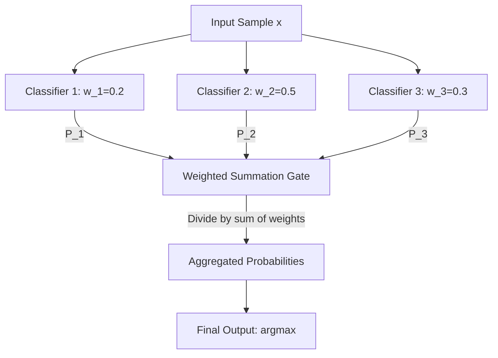

# Voting Ensemble Code Demo & Custom Aggregation

In standard soft voting, every base classifier is given equal importance (weight = 1). However, in practice, some classifiers are significantly more reliable or accurate than others. **Weighted Soft Voting** allows us to assign a specific weight to each classifier, reflecting its confidence or baseline accuracy.

---

## 1. Mathematical Formulation

Let $w_k$ be the weight assigned to classifier $k$ (where $w_k \ge 0$). Let $P_k(y = c \mid x)$ be the probability predicted by classifier $k$ that sample $x$ belongs to class $c$.

The ensemble's aggregated probability for class $c$, denoted as $P(y = c \mid x)$, is computed as a weighted average:
$$P(y = c \mid x) = \frac{\sum_{k=1}^K w_k P_k(y = c \mid x)}{\sum_{k=1}^K w_k}$$

The final ensemble prediction $\hat{y}$ is the class that maximizes this weighted probability:
$$\hat{y} = \arg\max_{c} P(y = c \mid x)$$



---

## 2. Choosing and Tuning Weights

How do we determine the best values for $w_k$?

1. **Heuristic / Accuracy-based**: Set $w_k$ proportional to the classifier's individual validation accuracy or F1-score.
2. **Grid Sweep / Search**: Define a search space of weights (e.g., $w_k \in [0.1, 0.9]$) and evaluate the validation accuracy of the ensemble across all combinations.
3. **Meta-Learning**: Use a meta-classifier (Stacking) to learn the optimal way to combine predictions, which dynamically handles non-linear relationships rather than relying on fixed linear weights.

---

## 3. Python Implementation & Verification

Below is a self-contained implementation of a custom weighted soft voting classifier. It implements the exact weighted probability averaging logic of Scikit-Learn and checks for prediction and probability parity.

```python
import numpy as np
from sklearn.linear_model import LogisticRegression
from sklearn.tree import DecisionTreeClassifier
from sklearn.svm import SVC
from sklearn.ensemble import VotingClassifier
from sklearn.datasets import make_classification

class CustomWeightedVotingClassifier:
    def __init__(self, estimators, voting='soft', weights=None):
        from sklearn.base import clone
        # Clone estimators to avoid side-effects during fit
        self.estimators = [(name, clone(clf)) for name, clf in estimators]
        self.voting = voting
        self.weights = weights

    def fit(self, X, y):
        self.classes_ = np.unique(y)
        for name, clf in self.estimators:
            clf.fit(X, y)
        return self

    def predict(self, X):
        if self.voting == 'soft':
            probas = self.predict_proba(X)
            return np.argmax(probas, axis=1)
        else:
            raise NotImplementedError("Only soft voting is implemented in this custom class.")

    def predict_proba(self, X):
        if self.voting != 'soft':
            raise AttributeError("predict_proba is only available when voting='soft'")

        # 1. Gather predicted probabilities from all base estimators
        # Shape: (n_estimators, n_samples, n_classes)
        estimator_probas = np.array([clf.predict_proba(X) for name, clf in self.estimators])

        # 2. If weights are provided, compute the weighted average
        if self.weights is not None:
            w = np.array(self.weights)
            # Reshape weights to shape (n_estimators, 1, 1) for proper broadcasting
            w = w[:, np.newaxis, np.newaxis]

            # Compute weighted sum along estimators axis and divide by sum of weights
            weighted_probas = np.sum(estimator_probas * w, axis=0) / np.sum(self.weights)
            return weighted_probas
        else:
            # Simple average if no weights are provided
            return np.mean(estimator_probas, axis=0)

# 1. Generate synthetic classification dataset
X, y = make_classification(n_samples=150, n_features=6, n_classes=2, random_state=42)

# 2. Define base estimators
base_estimators = [
    ('lr', LogisticRegression(random_state=42)),
    ('dt', DecisionTreeClassifier(random_state=42)),
    ('svc', SVC(probability=True, random_state=42))
]

# 3. Define custom weights (estimators: lr=0.2, dt=0.5, svc=0.3)
custom_weights = [0.2, 0.5, 0.3]

# 4. Train Scikit-Learn VotingClassifier with weights
sk_weighted = VotingClassifier(estimators=base_estimators, voting='soft', weights=custom_weights)
sk_weighted.fit(X, y)
sk_weighted_preds = sk_weighted.predict(X)
sk_weighted_proba = sk_weighted.predict_proba(X)

# 5. Train Custom Weighted Voting Classifier
cust_weighted = CustomWeightedVotingClassifier(estimators=base_estimators, voting='soft', weights=custom_weights)
cust_weighted.fit(X, y)
cust_weighted_preds = cust_weighted.predict(X)
cust_weighted_proba = cust_weighted.predict_proba(X)

# 6. Verify absolute mathematical parity
assert np.array_equal(sk_weighted_preds, cust_weighted_preds), "Weighted soft voting predictions do not match!"
assert np.allclose(sk_weighted_proba, cust_weighted_proba), "Weighted soft voting probabilities do not match!"
print("Weighted Soft Voting achieves 100% mathematical parity with Scikit-Learn!")
```

---

_Previous Study Guide: [Day 102: Voting Ensemble Classifier (Hard vs. Soft Voting)](file:///Users/prime/Developer/ml/102_voting_ensemble.md)_

_Next Study Guide: [Day 104: Voting Regressor](file:///Users/prime/Developer/ml/104_voting_ensemble.md)_
