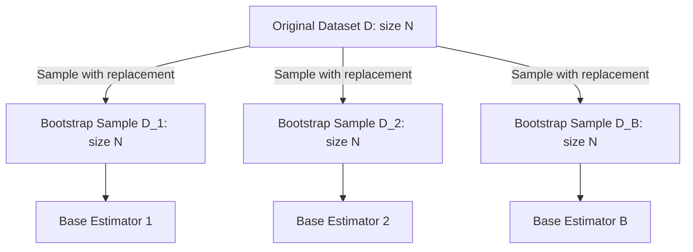

# Bagging (Bootstrap Aggregation) Intuition

**Bagging**, which stands for **Bootstrap Aggregating**, is an ensemble meta-algorithm designed to improve the stability and accuracy of machine learning algorithms. It is specifically used to reduce **variance** (prevent overfitting) without significantly increasing **bias**.

Bagging is most effective when applied to high-variance, unstable base learners—models whose decision boundaries change drastically with minor alterations to the training data (e.g., unpruned Decision Trees).

---

## 1. What is Bootstrap Sampling?

The "Bootstrap" in Bagging refers to the statistical method of **Bootstrap Sampling**.
Given a training dataset $D$ of size $N$, a bootstrap sample $D_b$ is created by randomly selecting $N$ samples from $D$ **with replacement** (meaning the same sample can be selected multiple times).



Because samples are drawn with replacement:

- Some instances from $D$ will appear multiple times in a single bootstrap sample $D_b$.
- Some instances will not appear at all in $D_b$. These are called **Out-of-Bag (OOB)** samples.

---

## 2. Mathematical Derivation of OOB Probability

What is the probability that a specific training sample $x_i$ is excluded from a bootstrap sample of size $N$?

1. The probability of _not_ selecting sample $x_i$ in a single random draw is:
    $$P(\text{not selected in 1 draw}) = 1 - \frac{1}{N}$$
2. Since we make $N$ independent draws with replacement, the probability that $x_i$ is _never_ selected in all $N$ draws is:
    $$P(\text{excluded}) = \left(1 - \frac{1}{N}\right)^N$$
3. To find this probability for large datasets, we take the limit as $N$ approaches infinity:
    $$\lim_{N \to \infty} \left(1 - \frac{1}{N}\right)^N$$
    Recall the calculus definition of the exponential constant $e^x$:
    $$\lim_{N \to \infty} \left(1 + \frac{x}{N}\right)^N = e^x$$
    Setting $x = -1$, we get:
    $$\lim_{N \to \infty} \left(1 - \frac{1}{N}\right)^N = e^{-1} = \frac{1}{e} \approx 0.367879 \approx 36.8\%$$

### Conclusion

For a sufficiently large dataset:

- Approximately **$36.8\%$** of the unique training samples are left out of any given bootstrap sample (these are the **Out-of-Bag** samples).
- Approximately **$63.2\%$** of the unique training samples are included in the bootstrap sample ($1 - e^{-1} \approx 63.2\%$).

---

## 3. Why Bagging Reduces Variance

In machine learning, the variance of an estimator reflects how much its predictions vary across different training sets.
If we train $B$ independent models, each with variance $\sigma^2$, and average their predictions, the variance of the average prediction is:
$$\text{Var}\left(\frac{1}{B} \sum_{i=1}^B M_i(x)\right) = \frac{\sigma^2}{B}$$

By training base models on different bootstrap samples, we approximate training on independent datasets. Although the bootstrap samples are not completely independent (since they are drawn from the same underlying dataset), averaging their predictions still leads to a substantial reduction in variance.

---

## 4. Python Verification: Bootstrap Simulation

Below is a self-contained Monte Carlo simulation that verifies the theoretical asymptotic limit of $36.8\%$ exclusion probability.

```python
import numpy as np

def run_bootstrap_simulation(n, num_trials=1000):
    """
    Simulates bootstrap sampling on a dataset of size n for multiple trials
    and calculates the average ratio of unique samples excluded.
    """
    indices = np.arange(n)
    excluded_ratios = []

    for _ in range(num_trials):
        # Draw n samples with replacement
        bootstrap_sample = np.random.choice(indices, size=n, replace=True)
        # Calculate unique samples selected
        unique_samples = len(np.unique(bootstrap_sample))
        # Excluded samples count
        excluded = n - unique_samples
        excluded_ratios.append(excluded / n)

    return np.mean(excluded_ratios)

# 1. Simulate on a large dataset (N = 10,000) over 100 trials
n_samples = 10000
num_trials = 100
mean_excluded_ratio = run_bootstrap_simulation(n_samples, num_trials)

print(f"Dataset Size: {n_samples}")
print(f"Theoretical Out-of-Bag Ratio (1/e): {np.exp(-1):.6f}")
print(f"Empirical Out-of-Bag Ratio:         {mean_excluded_ratio:.6f}")

# 2. Assert that the empirical result is within 1% of the theoretical limit
assert np.isclose(mean_excluded_ratio, np.exp(-1), atol=0.01), "Simulation does not match theoretical 1/e limit!"
print("Bootstrap probability simulation verified successfully!")
```

---

_Previous Study Guide: [Day 104: Voting Regressor](file:///Users/prime/Developer/ml/104_voting_ensemble.md)_

_Next Study Guide: [Day 106: Bagging Classifier Code Demo](file:///Users/prime/Developer/ml/106_bagging_ensemble.md)_
