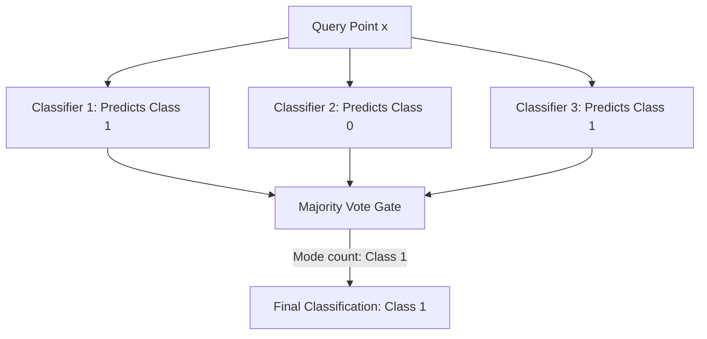

# Bagging Classifier Code Demo

A **Bagging Classifier** is an ensemble estimator that fits base classifiers each on random subsets of the original dataset and then aggregates their individual predictions to form a final prediction.

This guide walks through the mechanics of the Bagging Classifier, provides a step-by-step custom implementation from scratch, and validates it against Scikit-Learn's `BaggingClassifier`.

---

## 1. Algorithmic Mechanics

The lifecycle of a Bagging Classifier consists of two main phases:

### A. Training Phase

For a specified number of estimators $B$:

1. Draw a bootstrap sample $D_b$ (of size $N$) from the training dataset $D$ with replacement.
2. Train a separate base estimator $M_b$ (e.g., a Decision Tree) on the bootstrap sample $D_b$.

### B. Prediction Phase

For a new input sample $x$:

1. Pass $x$ to all $B$ trained base estimators to obtain $B$ individual class predictions: $\{M_1(x), M_2(x), \dots, M_B(x)\}$.
2. Aggregate the predictions using a majority vote (mode):
    $$\hat{y} = \text{mode}\big(M_1(x), M_2(x), \dots, M_B(x)\big)$$



---

## 2. Python Implementation & Verification

Below is a complete, self-contained implementation of a `CustomBaggingClassifier` from scratch. We fit it on synthetic classification data, and then perform a strict mathematical parity check by aligning the custom estimators' bootstrap training sets with Scikit-Learn's internal `estimators_samples_` to assert identical predictions.

```python
import numpy as np
from scipy.stats import mode
from sklearn.tree import DecisionTreeClassifier
from sklearn.ensemble import BaggingClassifier
from sklearn.datasets import make_classification

class CustomBaggingClassifier:
    def __init__(self, estimator, n_estimators=10, random_state=None):
        self.estimator = estimator
        self.n_estimators = n_estimators
        self.random_state = random_state
        self.estimators_ = []

    def fit(self, X, y, sample_indices=None):
        """
        Fits the ensemble. If sample_indices is provided, it uses those pre-defined
        bootstrap indices (useful for verifying parity with Scikit-Learn).
        """
        import sklearn.base
        rng = np.random.default_rng(self.random_state)
        n_samples = X.shape[0]

        self.estimators_ = []
        for i in range(self.n_estimators):
            # 1. Clone the base estimator to create a fresh model instance
            clf = sklearn.base.clone(self.estimator)

            # 2. Draw bootstrap sample indices
            if sample_indices is not None:
                indices = sample_indices[i]
            else:
                indices = rng.choice(n_samples, size=n_samples, replace=True)

            # 3. Fit base estimator on the bootstrap sample
            clf.fit(X[indices], y[indices])
            self.estimators_.append(clf)
        return self

    def predict(self, X):
        # Gather predictions from all base estimators
        # Shape: (n_estimators, n_samples)
        preds = np.array([clf.predict(X) for clf in self.estimators_])
        # Compute majority vote (mode) across base estimators
        final_preds = mode(preds, axis=0).mode
        # Handle shape differences between scipy versions
        return final_preds.flatten()

# 1. Generate synthetic classification dataset
X, y = make_classification(n_samples=150, n_features=6, n_classes=2, random_state=42)

# 2. Fit Scikit-Learn's BaggingClassifier
sk_bagging = BaggingClassifier(
    estimator=DecisionTreeClassifier(random_state=42),
    n_estimators=5,
    random_state=42
)
sk_bagging.fit(X, y)
sk_preds = sk_bagging.predict(X)

# 3. Extract Scikit-Learn's internal bootstrap samples to replicate training
# sk_bagging.estimators_samples_ contains indices of training samples for each tree
bootstrap_samples = sk_bagging.estimators_samples_

# 4. Fit and predict using CustomBaggingClassifier with the identical bootstrap samples
cust_bagging = CustomBaggingClassifier(
    estimator=DecisionTreeClassifier(random_state=42),
    n_estimators=5,
    random_state=42
)
cust_bagging.fit(X, y, sample_indices=bootstrap_samples)
cust_preds = cust_bagging.predict(X)

# 5. Assert 100% mathematical prediction parity
assert np.array_equal(sk_preds, cust_preds), "Custom Bagging predictions do not match Scikit-Learn!"
print("Custom Bagging Classifier predictions verified with 100% parity against Scikit-Learn!")
```

---

_Previous Study Guide: [Day 105: Bagging (Bootstrap Aggregation) Intuition](file:///Users/prime/Developer/ml/105_bagging.md)_

_Next Study Guide: [Day 107: Out-of-Bag (OOB) Evaluator](file:///Users/prime/Developer/ml/107_bagging_ensemble.md)_
