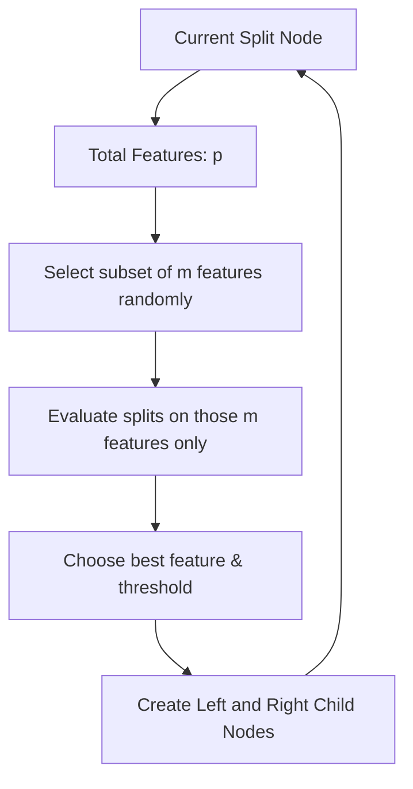

# Random Forest Subspace Feature Sampling

Random Forest is one of the most powerful, versatile, and widely used machine learning algorithms. Developed by Leo Breiman and Adele Cutler, it builds an ensemble of Decision Trees. The "Random" in Random Forest comes from two sources of randomness: **Bootstrap Row Sampling** (from Bagging) and **Feature Subspace Sampling** (at the split node level).

---

## 1. Node-Level Feature Subspace Sampling

While standard Bagging (Bootstrap Aggregation) trains base estimators (like Decision Trees) on random subsets of rows, Random Forest introduces feature randomness at the node split level.

### Tree-Level Feature Sampling (Random Subspace Method)

In standard feature-bagging, a subset of features is selected _before_ training a tree. The tree is then grown using only this subset of features for all of its splits.

### Node-Level Feature Sampling (Random Forest Method)

In a Random Forest, at **every individual node** of the decision tree during the split selection process, we:

1. Select a random subset of $m$ features out of the $p$ total features.
2. Search only within this subset of $m$ features for the best split (according to Gini Impurity or Information Gain).
3. Grow the tree recursively, repeating this random selection at every child node.



### Mathematical Rule of Thumb for $m$

Let $p$ be the total number of features in the dataset. The size of the random feature subset $m$ is typically chosen as:

- **Classification**: $m = \lfloor \sqrt{p} \rfloor$
- **Regression**: $m = \lfloor p / 3 \rfloor$

---

## 2. Row vs. Column Sampling Methods

To train a robust Random Forest, three types of sampling are used:

| Method                                | Description                                          | Purpose                                                 |
| :------------------------------------ | :--------------------------------------------------- | :------------------------------------------------------ |
| **Row Sampling (Bootstrap)**          | Sampling $N$ samples from $N$ rows with replacement. | Introduces data diversity; reduces model variance.      |
| **Column Sampling (Random Subspace)** | Sampling a subset of features for each tree.         | Prevents dominant features from taking over every tree. |
| **Combined Sampling**                 | Simultaneously sampling both rows and columns.       | Maximum tree decorrelation.                             |

---

## 3. Why Node-Level Feature Sampling is Superior

If a few features are highly predictive of the target, they will be selected at the root node of almost all trees in standard Bagging. This makes the individual trees highly correlated. By restricting the features available at each split, Random Forest forces some trees to split on less dominant features, generating a more diverse forest and reducing the ensemble variance significantly.

---

## 4. Python Implementation: Simulating Row & Column Subspaces

Below is a self-contained Python demonstration showing how row sampling, column sampling, and combined sampling are performed, and verifying the training of estimators on these subsets.

```python
import numpy as np
from sklearn.tree import DecisionTreeClassifier
from sklearn.datasets import make_classification

# 1. Generate synthetic classification dataset
X, y = make_classification(n_samples=100, n_features=6, n_informative=4, n_classes=2, random_state=42)

def sample_rows(X, y, sample_ratio=0.8):
    """Samples rows with replacement (Bootstrap sampling)."""
    n_samples = X.shape[0]
    sample_size = int(n_samples * sample_ratio)
    indices = np.random.choice(n_samples, size=sample_size, replace=True)
    return X[indices], y[indices]

def sample_features(X, feature_ratio=0.5):
    """Samples a subset of columns without replacement at tree-level."""
    n_features = X.shape[1]
    sample_size = int(n_features * feature_ratio)
    feature_indices = np.random.choice(n_features, size=sample_size, replace=False)
    return X[:, feature_indices], feature_indices

# Test sampling functions
np.random.seed(42)
X_row, y_row = sample_rows(X, y, sample_ratio=0.7)
X_feat, feat_idx = sample_features(X, feature_ratio=0.5)

assert X_row.shape[0] == 70, "Row sampling size mismatch!"
assert X_feat.shape[1] == 3, "Feature sampling size mismatch!"
assert len(feat_idx) == 3, "Feature index tracker mismatch!"

# 2. Simulate training a tree on a combined sampled dataset (row + column)
X_sampled, y_sampled = sample_rows(X, y, sample_ratio=0.8)
X_final, selected_features = sample_features(X_sampled, feature_ratio=0.66)

# Verify dimensions
assert X_final.shape[0] == 80
assert X_final.shape[1] == 3

# Fit a decision tree on this subset
clf = DecisionTreeClassifier(random_state=42)
clf.fit(X_final, y_sampled)
predictions = clf.predict(X_final)

assert predictions.shape[0] == 80
print("Sample shapes verified successfully!")
print(f"Selected feature indices: {selected_features}")
```

---

_Previous Study Guide: [Day 107: Out-of-Bag (OOB) Evaluator](file:///Users/prime/Developer/ml/107_bagging_ensemble.md)_

_Next Study Guide: [Day 109: Variance Reduction & Tree Decorrelation](file:///Users/prime/Developer/ml/109_how_random_forest_performs_so_well.md)_
