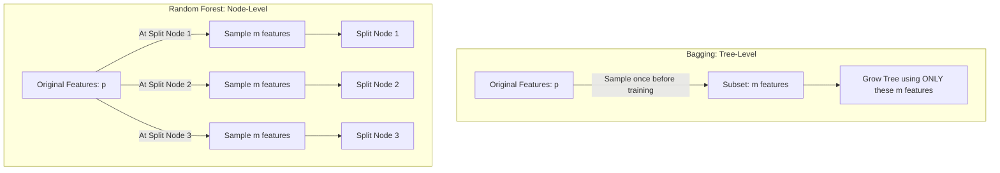

# Random Forest vs Bagging & Gini MDI

While Random Forest is fundamentally built upon the Bagging framework, there are critical differences in how they sample features and structure their base estimators.

---

## 1. Key Differences: Bagging vs. Random Forest

Many beginners think that a Bagging ensemble using Decision Trees is identical to a Random Forest. This is incorrect. There are two primary differences:

### Difference 1: Base Estimator Flexibility

- **Bagging (Bootstrap Aggregation)**: A general-purpose meta-estimator. It can wrap any algorithm (e.g., Support Vector Machines, K-Nearest Neighbors, Linear Regression) as its base estimator.
- **Random Forest**: Restricted exclusively to Decision Trees.

### Difference 2: Level of Feature Subsampling (Tree-Level vs. Node-Level)

- **Bagging (Tree-Level / Global Subsampling)**: Feature subsampling is performed once at the root level before growing the tree. A random subset of columns is selected, and the tree is grown using _only_ those columns. No other columns can be chosen at any split node.
- **Random Forest (Node-Level / Local Subsampling)**: Feature subsampling is performed dynamically at **every single node** during tree growth. When splitting a node, a new random subset of features is drawn, and the best split is chosen from this subset. This allows a single tree to use all available features across different splits, introducing much greater diversity.



---

## 2. Feature Importance: Mean Decrease Impurity (Gini MDI)

Both models allow us to compute feature importances. The default method in scikit-learn is **Mean Decrease Impurity (MDI)**, also known as Gini Importance.

### Gini Impurity of a Node $t$

$$I(t) = 1 - \sum_{c=1}^C p_c^2$$
where $p_c$ is the fraction of samples belonging to class $c$ in node $t$.

### Impurity Reduction at a Split

When a node $t$ is split into left child $t_L$ and right child $t_R$, the decrease in impurity is:
$$\Delta I(t) = N_t \cdot I(t) - N_{t_L} \cdot I(t_L) - N_{t_R} \cdot I(t_R)$$
where $N_t$, $N_{t_L}$, and $N_{t_R}$ are the number of samples reaching node $t$, $t_L$, and $t_R$ respectively, normalized by the total number of samples $N$.

### Mean Decrease Impurity (MDI) of Feature $X_j$

$$\text{MDI}(X_j) = \frac{1}{B} \sum_{b=1}^B \sum_{t \in \text{splits on } X_j} \Delta I(t)$$
This sums the impurity reductions across all nodes split by feature $X_j$ in all $B$ trees, divided by the number of estimators.

---

## 3. Python Verification: Programmatically Proving Node-Level vs. Tree-Level Sampling

Below is a self-contained Python script that trains both ensembles and extracts the features used in their decision trees to prove the difference in feature sampling.

```python
import numpy as np
from sklearn.datasets import make_classification
from sklearn.ensemble import BaggingClassifier, RandomForestClassifier
from sklearn.tree import DecisionTreeClassifier

# 1. Generate a dataset with 5 features
X, y = make_classification(n_samples=200, n_features=5, n_informative=5, n_redundant=0, random_state=42)

# 2. Fit a Bagging Classifier with Tree-Level feature subsampling (max_features=2)
bagging_clf = BaggingClassifier(
    estimator=DecisionTreeClassifier(random_state=42),
    n_estimators=5,
    max_features=2,
    random_state=42
)
bagging_clf.fit(X, y)

# 3. Fit a Random Forest Classifier with Node-Level feature subsampling (max_features=2)
rf_clf = RandomForestClassifier(
    n_estimators=5,
    max_features=2,
    random_state=42
)
rf_clf.fit(X, y)

# 4. Analyze features used in each tree
def get_features_used_in_tree(dt_estimator):
    """Extracts unique feature indices used in tree nodes (ignoring leaf nodes)."""
    tree = dt_estimator.tree_
    # Features used at split nodes are stored in tree.feature (leaf nodes have feature = -2)
    features = set(tree.feature[tree.feature >= 0])
    return features

print("Bagging Classifier Tree-Level Feature Sets:")
bagging_max_features_used = 0
for i, estimator in enumerate(bagging_clf.estimators_):
    # Map back tree feature indices to the original sampled features
    # bagging_clf.estimators_features_ stores the column indices sampled for each tree
    original_features_used = bagging_clf.estimators_features_[i]
    print(f"  Tree {i+1}: Original features available = {original_features_used}")
    # Verify that the total number of features used is strictly <= max_features (2)
    assert len(original_features_used) <= 2, "Bagging tree used more features than max_features!"
    bagging_max_features_used = max(bagging_max_features_used, len(original_features_used))

print("\nRandom Forest Node-Level Feature Sets:")
rf_max_features_used = 0
for i, estimator in enumerate(rf_clf.estimators_):
    features_used = get_features_used_in_tree(estimator)
    print(f"  Tree {i+1}: Features used at split nodes = {features_used}")
    rf_max_features_used = max(rf_max_features_used, len(features_used))

# Assert that Random Forest trees can use more than 2 features per tree
assert rf_max_features_used > 2, "Random Forest trees did not utilize node-level feature sampling to use more features!"
print("\nParity verification complete! Tree-level vs node-level feature sampling confirmed.")
```

---

_Previous Study Guide: [Day 109: Variance Reduction & Tree Decorrelation](file:///Users/prime/Developer/ml/109_how_random_forest_performs_so_well.md)_

_Next Study Guide: [Day 111: Random Forest Hyperparameters](file:///Users/prime/Developer/ml/111_random_forest_hyper-parameters.md)_
