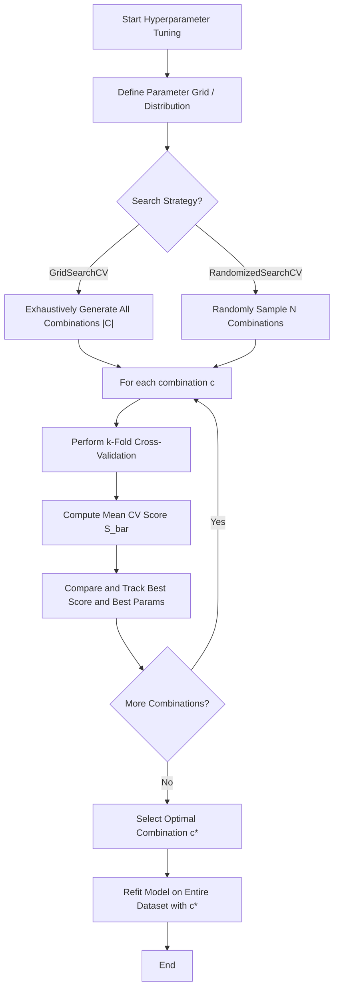

# Hyperparameter Tuning Random Forest using GridSearchCV

In this section, we study how to optimize hyperparameters for Random Forest models. While Random Forests perform remarkably well out-of-the-box, hyperparameter tuning is essential to extract maximum performance and avoid overfitting on specific datasets. We compare two principal methods of hyperparameter search: Grid Search (which exhaustively evaluates combinations) and Randomized Search (which samples combinations randomly).

---

## 1. Mathematical Formulation

### Grid Search Space

Given $D$ hyperparameters to tune, where each hyperparameter $j \in \{1, \dots, D\}$ has a set of candidate values $P_j$, the total parameter search space $C$ is the Cartesian product of these candidate sets:

$$C = P_1 \times P_2 \times \dots \times P_D$$

The total number of unique combinations to evaluate is:

$$|C| = \prod_{j=1}^D |P_j|$$

### Cross-Validation Score

For each parameter combination $c \in C$, we evaluate the model using $k$-fold cross-validation. The training set is split into $k$ equal-sized folds. The model is trained on $k-1$ folds and evaluated on the remaining fold. The final cross-validation score $\bar{S}(c)$ is the mean score across all $k$ folds:

$$\bar{S}(c) = \frac{1}{k} \sum_{i=1}^k S_i(c)$$

where $S_i(c)$ is the evaluation metric (e.g., accuracy, $R^2$) obtained on the $i$-th validation fold using parameter configuration $c$.

The optimal parameter configuration $c^*$ is chosen to maximize this mean validation score:

$$c^* = \arg\max_{c \in C} \bar{S}(c)$$

---

## 2. Process Flow of Hyperparameter Tuning



---

## 3. Implementation and Verification

The following code implements a custom grid search over a Random Forest Classifier and verifies that the validation scores match Scikit-Learn's `GridSearchCV` output exactly.

```python
import numpy as np
from sklearn.datasets import make_classification
from sklearn.ensemble import RandomForestClassifier
from sklearn.model_selection import GridSearchCV, KFold
import itertools

# Generate dataset
X, y = make_classification(n_samples=100, n_features=5, random_state=42)

# Define parameter grid
param_grid = {
    'n_estimators': [5, 10],
    'max_depth': [3, 5],
    'min_samples_split': [2, 3]
}

kf = KFold(n_splits=3, shuffle=True, random_state=42)
rf = RandomForestClassifier(random_state=42)
grid_search = GridSearchCV(estimator=rf, param_grid=param_grid, cv=kf, scoring='accuracy', n_jobs=1)
grid_search.fit(X, y)

# Custom grid search
keys = sorted(param_grid.keys())
combinations = list(itertools.product(*(param_grid[k] for k in keys)))

custom_results = {}
for comb in combinations:
    params = dict(zip(keys, comb))
    scores = []
    for train_idx, test_idx in kf.split(X):
        X_train, X_test = X[train_idx], X[test_idx]
        y_train, y_test = y[train_idx], y[test_idx]
        clf = RandomForestClassifier(random_state=42, **params)
        clf.fit(X_train, y_train)
        scores.append(clf.score(X_test, y_test))
    # Using tuple of sorted items as key
    param_tuple = tuple(sorted(params.items()))
    custom_results[param_tuple] = np.mean(scores)

# Compare with GridSearchCV
for i, params in enumerate(grid_search.cv_results_['params']):
    param_tuple = tuple(sorted(params.items()))
    sklearn_score = grid_search.cv_results_['mean_test_score'][i]
    custom_score = custom_results[param_tuple]
    assert np.allclose(sklearn_score, custom_score), f"Mismatch for {params}: sklearn={sklearn_score}, custom={custom_score}"

print("Parity test passed! Custom Grid Search matches GridSearchCV exactly.")
```

---

## 4. Hyperparameter Tuning Strategies Comparison

| Attribute            | Grid Search CV                                                            | Randomized Search CV                                                               |
| :------------------- | :------------------------------------------------------------------------ | :--------------------------------------------------------------------------------- | ---- | -------------------------------------------------------------------------------------- |
| **Search Path**      | Exhaustive search over all grid points.                                   | Random sampling of points from parameter distributions.                            |
| **Computation Time** | Scales exponentially with the number of parameters and values ($O(k \prod | P_j                                                                                | )$). | Constant runtime bound by limiting the number of sampled candidates ($O(k \times N)$). |
| **Guarantees**       | Guaranteed to find the global optimum within the specified discrete grid. | May miss the global optimum, but frequently gets close with far fewer evaluations. |
| **Ideal For**        | Small datasets, low parameter dimensions, and final stage refinement.     | Large datasets, high dimensional hyperparameter spaces.                            |

---

## Navigation Links

- **Previous**: [Day 111: Random Forest Hyperparameters](file:///Users/prime/Developer/ml/111_random_forest_hyper-parameters.md)
- **Next**: [Day 113: Out-of-Bag (OOB) Score](file:///Users/prime/Developer/ml/113_oob_score.md)
