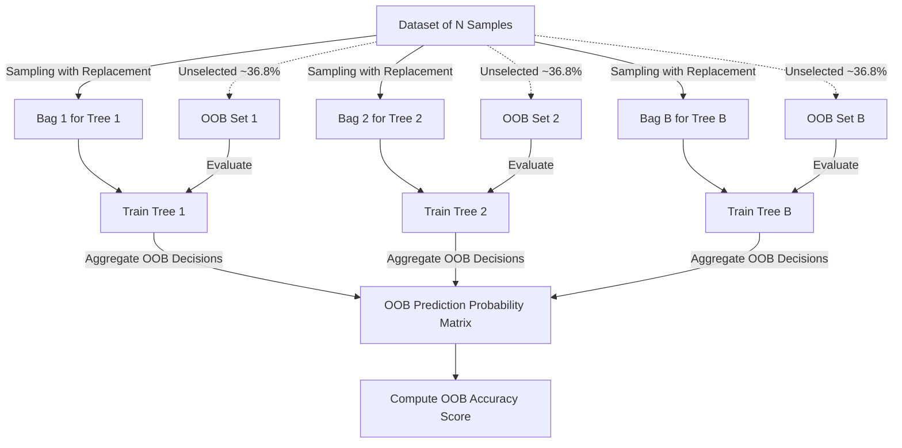

# Out-of-Bag (OOB) Score

In bootstrap aggregating (bagging) ensembles, such as Random Forest, each base estimator is trained on a bootstrap sample drawn with replacement from the training set. Because sampling is done with replacement, some instances are selected multiple times, while others are not selected at all. The unselected instances are called **Out-of-Bag (OOB)** samples. The OOB score offers a reliable validation mechanism without needing a separate validation set.

---

## 1. Mathematical Derivation of the OOB Probability

Let the training dataset contain $N$ unique samples. When constructing a bootstrap sample of size $N$ with replacement:

1. The probability of **not selecting** a specific sample $i$ in a single draw is:

   $$P(\text{not selected in 1 draw}) = 1 - \frac{1}{N}$$

2. Since each draw is independent, the probability of **never selecting** sample $i$ in all $N$ draws is:

   $$P(\text{not selected in } N \text{ draws}) = \left(1 - \frac{1}{N}\right)^N$$

3. Taking the limit as $N$ approaches infinity ($N \to \infty$), we use the standard definition of the exponential function:

   $$\lim_{N \to \infty} \left(1 - \frac{x}{N}\right)^N = e^{-x}$$

   Setting $x = 1$:

   $$\lim_{N \to \infty} \left(1 - \frac{1}{N}\right)^N = e^{-1} \approx 0.367879 \dots \approx 36.8\%$$

Thus, for large $N$, approximately **36.8%** of the training samples are excluded from the training bootstrap bag of any given tree. These samples form the Out-of-Bag set for that estimator.

---

## 2. OOB Prediction and Scoring

For each sample $x_i$, we aggregate predictions only from the subset of estimators $M_b$ that did not use $x_i$ during training.

### Classification Consensus

Let $\mathcal{B}_i = \{b \mid i \notin \text{bootstrap}_b\}$ be the set of tree indices for which sample $i$ is out-of-bag. The OOB probability distribution for class $k$ is computed as:

$$\hat{p}_k(x_i) = \frac{\sum_{b \in \mathcal{B}_i} \mathbb{I}(M_b(x_i) = k)}{|\mathcal{B}_i|}$$

where $\mathbb{I}$ is the indicator function. The final OOB prediction is:

$$\hat{y}_i^{\text{OOB}} = \arg\max_k \hat{p}_k(x_i)$$

The final OOB score is the classification accuracy on all samples that have at least one OOB prediction (usually all samples for reasonably sized forests):

$$\text{Score}_{\text{OOB}} = \frac{\sum_{i: |\mathcal{B}_i| > 0} \mathbb{I}(\hat{y}_i^{\text{OOB}} = y_i)}{\sum_{i: |\mathcal{B}_i| > 0} 1}$$

---

## 3. OOB Evaluation Architecture



---

## 4. Implementation and Verification

The following code manualizes the OOB extraction process, matching both the `oob_decision_function_` probabilities and final `oob_score_` of Scikit-Learn's `RandomForestClassifier` exactly.

```python
import numpy as np
from sklearn.datasets import make_classification
from sklearn.ensemble import RandomForestClassifier
from sklearn.ensemble._forest import _generate_unsampled_indices

# Generate dataset
X, y = make_classification(n_samples=100, n_features=5, n_classes=2, random_state=42)

# Fit RandomForestClassifier with oob_score=True
rf = RandomForestClassifier(n_estimators=10, oob_score=True, random_state=42)
rf.fit(X, y)

# Let's reconstruct the OOB predictions
n_samples = X.shape[0]
n_classes = len(np.unique(y))
oob_decision_function = np.zeros((n_samples, n_classes))

for estimator in rf.estimators_:
    # Generate unsampled indices for this tree
    unsampled_indices = _generate_unsampled_indices(estimator.random_state, n_samples, n_samples)

    # Get predictions for unsampled indices
    p = estimator.predict_proba(X[unsampled_indices])
    oob_decision_function[unsampled_indices] += p

# Normalize and compute predictions
sum_predictions = oob_decision_function.sum(axis=1, keepdims=True)
oob_probabilities = np.divide(oob_decision_function, sum_predictions, out=np.zeros_like(oob_decision_function), where=sum_predictions!=0)

# Compute final labels
oob_predictions = np.argmax(oob_probabilities, axis=1)

# Check rf.oob_decision_function_ directly
assert np.allclose(rf.oob_decision_function_, oob_probabilities), "OOB decision function mismatch!"

# Compute accuracy on samples that have at least one OOB prediction
has_oob = sum_predictions.ravel() > 0
custom_oob_score = np.mean(oob_predictions[has_oob] == y[has_oob])
assert np.allclose(rf.oob_score_, custom_oob_score), f"OOB score mismatch: sklearn={rf.oob_score_}, custom={custom_oob_score}"

print("OOB score parity test passed! Custom reconstruction matches Scikit-Learn exactly.")
```

---

## Navigation Links

- **Previous**: [Day 112: Hyperparameter Tuning Random Forest using GridSearchCV](file:///Users/prime/Developer/ml/112_hyperparameter_tuning_random_forest_using_gridsearchcv.md)
- **Next**: [Day 114: Feature Importance using Random Forest](file:///Users/prime/Developer/ml/114_feature_importance_using_random_forest_and.md)
