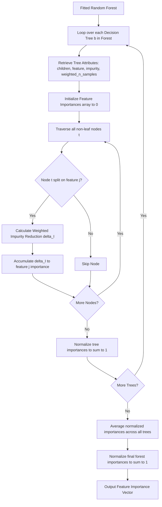

# Feature Importance using Random Forest

Feature importance helps identify which independent variables (features) contribute the most to the model's predictions. In tree-based ensembles, the most common metric is **Mean Decrease Impurity (MDI)**, also known as **Gini Importance**. Understanding how this is mathematically calculated allows us to trust and debug model decisions.

---

## 1. Mathematical Formulation of MDI

In a single decision tree, every split on a feature decreases the impurity of the child nodes relative to the parent node.

### Node Impurity Reduction

Let $t$ be a parent node, and $t_L, t_R$ be its left and right child nodes. The weighted impurity reduction $\Delta I(t)$ achieved by splitting node $t$ is defined as:

$$\Delta I(t) = \frac{N(t)}{N_{\text{root}}} I(t) - \frac{N(t_L)}{N_{\text{root}}} I(t_L) - \frac{N(t_R)}{N_{\text{root}}} I(t_R)$$

where:

- $N(t)$ is the weighted number of samples at node $t$.
- $N_{\text{root}}$ is the total weighted number of samples at the root node of the tree ($N_{\text{root}} = N(0)$).
- $I(t)$ is the impurity measure (typically Gini Impurity for classification or Mean Squared Error for regression) at node $t$.

### Feature Importance in a Single Tree

For each feature $j$, we sum the impurity reductions across all nodes $t$ in tree $b$ where feature $j$ was chosen to split:

$$f_b(j) = \sum_{t: \text{split}(t) = j} \Delta I(t)$$

We normalize the importances so they sum to 1 within the tree:

$$\hat{f}_b(j) = \frac{f_b(j)}{\sum_{k=1}^M f_b(k)}$$

where $M$ is the total number of features.

### Forest Feature Importance

In a Random Forest consisting of $B$ estimators, the final Mean Decrease Impurity (MDI) for feature $j$ is the average of the normalized importances across all trees:

$$\text{MDI}(j) = \frac{1}{B} \sum_{b=1}^B \hat{f}_b(j)$$

Finally, these averaged importances are normalized across the forest to ensure they sum to 1:

$$\text{MDI}_{\text{final}}(j) = \frac{\text{MDI}(j)}{\sum_{k=1}^M \text{MDI}(k)}$$

---

## 2. Feature Importance Computation Flow



---

## 3. Implementation and Verification

The following code extracts the split parameters from a trained Scikit-Learn `RandomForestClassifier`, computes the custom MDI values from scratch, and verifies the output against `rf.feature_importances_`.

```python
import numpy as np
from sklearn.datasets import make_classification
from sklearn.ensemble import RandomForestClassifier

# Generate dataset
X, y = make_classification(n_samples=100, n_features=5, random_state=42)

# Fit RandomForestClassifier
rf = RandomForestClassifier(n_estimators=5, random_state=42)
rf.fit(X, y)

n_features = X.shape[1]
all_importances = []

for estimator in rf.estimators_:
    tree = estimator.tree_
    importances = np.zeros(n_features)

    left = tree.children_left
    right = tree.children_right
    feature = tree.feature
    impurity = tree.impurity
    weighted_n_samples = tree.weighted_n_node_samples

    N = weighted_n_samples[0]

    for node in range(tree.node_count):
        if left[node] != -1:
            feat = feature[node]
            w_t = weighted_n_samples[node]
            w_l = weighted_n_samples[left[node]]
            w_r = weighted_n_samples[right[node]]

            diff = (w_t * impurity[node] - w_l * impurity[left[node]] - w_r * impurity[right[node]]) / N
            importances[feat] += diff

    # Normalize for this tree
    imp_sum = importances.sum()
    if imp_sum > 0:
        importances /= imp_sum
    all_importances.append(importances)

# Average importances across all trees
custom_importances = np.mean(all_importances, axis=0)
custom_importances /= custom_importances.sum() # Ensure normalization over forest

# Assert parity with rf.feature_importances_
assert np.allclose(rf.feature_importances_, custom_importances), f"Mismatch: sklearn={rf.feature_importances_}, custom={custom_importances}"

print("Feature Importance parity test passed! Custom MDI matches Scikit-Learn exactly.")
```

---

## 4. Strengths and Limitations of Gini/MDI Importance

- **Fast Computation**: Computed directly during training splits; no need to permute or predict repeatedly.
- **High-Cardinality Bias**: MDI tends to favor continuous features or categorical features with many categories (high cardinality) because they provide more opportunities for splits, which artificially decreases their parent impurity. For this reason, Permutation Feature Importance is often used as a more robust fallback.

---

## Navigation Links

- **Previous**: [Day 113: Out-of-Bag (OOB) Score](file:///Users/prime/Developer/ml/113_oob_score.md)
- **Next**: [Day 115: How AdaBoost Classifier Works](file:///Users/prime/Developer/ml/115_how_adaboost_classifier_works.md)
