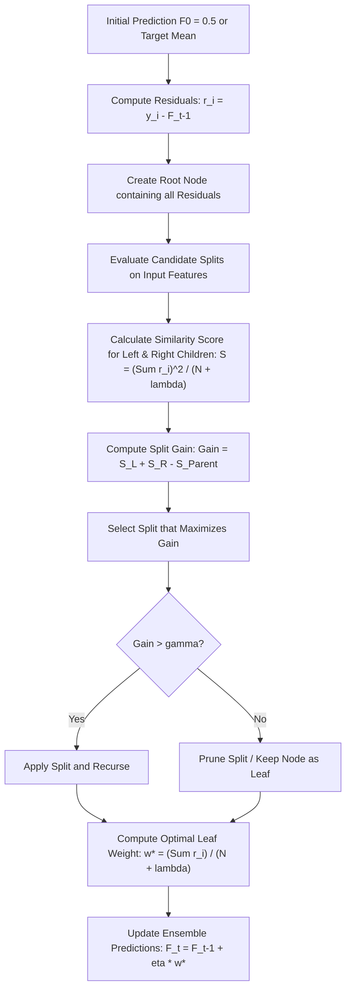

# XGBoost for Regression

XGBoost (Extreme Gradient Boosting) is a powerful, highly scalable implementation of gradient boosted decision trees. In this study guide, we examine how XGBoost solves regression problems step-by-step, focusing on the tree-building process, the mathematical formulas used to construct and prune trees, and how leaf weights are calculated.

---

## Architectural Flow of XGBoost Regression

XGBoost builds trees sequentially. It starts with an initial prediction (typically $0.5$ for regression, or the target mean, depending on configuration). At each iteration, a new tree is trained to predict the residuals (errors) of the current ensemble. Unlike standard decision trees that use variance reduction or Mean Squared Error (MSE) to split nodes, XGBoost uses a custom regularized objective function to compute **Similarity Scores** and **Gain**.



---

## Mathematical Formulation

For a regression problem with a squared error loss function:
$$\mathcal{L} = \frac{1}{2} \sum_{i=1}^N (y_i - \hat{y}_i)^2$$

In any given boosting round $t$, XGBoost builds a regression tree. For each node in the tree, we calculate a **Similarity Score** $S$, which acts as a measure of how similar the residuals in that node are:

$$S = \frac{\left( \sum_{i \in I} g_i \right)^2}{\sum_{i \in I} h_i + \lambda}$$

Where:

- $g_i = \frac{\partial \mathcal{L}(y_i, \hat{y}_i^{(t-1)})}{\partial \hat{y}_i^{(t-1)}} = \hat{y}_i^{(t-1)} - y_i = -r_i$ is the gradient (negative residual).
- $h_i = \frac{\partial^2 \mathcal{L}(y_i, \hat{y}_i^{(t-1)})}{\partial (\hat{y}_i^{(t-1)})^2} = 1$ is the Hessian (which is constant and equal to $1$ for squared loss).
- $\lambda$ is the $L_2$ regularization parameter (helps prevent overfitting by penalizing large leaf values).

Thus, for regression, the Similarity Score simplifies to:
$$S = \frac{\left( \sum_{i \in I} r_i \right)^2}{|I| + \lambda}$$

### Split Gain

When evaluating a potential split into Left ($L$) and Right ($R$) subsets, we compute the **Gain**:
$$\text{Gain} = S_L + S_R - S_{\text{Parent}}$$

If the Gain is positive, splitting improves the objective. We choose the split that yields the maximum Gain.

### Leaf Weight Calculation

Once the tree structure is finalized, the optimal output weight $w_j^*$ for leaf $j$ containing index set $I_j$ is:
$$w_j^* = -\frac{\sum_{i \in I_j} g_i}{\sum_{i \in I_j} h_i + \lambda} = \frac{\sum_{i \in I_j} r_i}{|I_j| + \lambda}$$

---

## Python Implementation and Parity Verification

The following code implements the XGBoost regression tree split finding and leaf weight calculation from scratch. It verifies the calculations against `xgboost.XGBRegressor` on a toy dataset.

```python
import numpy as np
import xgboost as xgb
import json

# 1. Generate synthetic toy dataset
X = np.array([[6.7], [9.0], [7.5], [8.0]])
y = np.array([4.5, 11.0, 6.0, 8.0])

# Base prediction (mean of target values)
base_score = float(np.mean(y))  # 7.375
residuals = y - base_score       # [-2.875, 3.625, -1.375, 0.625]
reg_lambda = 1.0

# 2. Custom Similarity and Split Gain Calculations
def similarity_score(resids, lam):
    return (np.sum(resids) ** 2) / (len(resids) + lam)

S_parent = similarity_score(residuals, reg_lambda)

# Sorted unique feature values for splitting: [6.7, 7.5, 8.0, 9.0]
# Candidate split boundaries are the averages: [7.1, 7.75, 8.5]
sorted_X = np.sort(X.flatten())
candidates = (sorted_X[:-1] + sorted_X[1:]) / 2

best_gain = -1.0
best_thresh = None
best_left_val = None
best_right_val = None

for thresh in candidates:
    left_mask = X.flatten() < thresh
    right_mask = ~left_mask

    r_L = residuals[left_mask]
    r_R = residuals[right_mask]

    if len(r_L) == 0 or len(r_R) == 0:
        continue

    S_L = similarity_score(r_L, reg_lambda)
    S_R = similarity_score(r_R, reg_lambda)

    gain = S_L + S_R - S_parent

    w_L = np.sum(r_L) / (len(r_L) + reg_lambda)
    w_R = np.sum(r_R) / (len(r_R) + reg_lambda)

    if gain > best_gain:
        best_gain = gain
        best_thresh = thresh
        best_left_val = w_L
        best_right_val = w_R

# 3. Fit XGBRegressor with matching parameters
model = xgb.XGBRegressor(
    n_estimators=1,
    max_depth=1,
    learning_rate=1.0,
    reg_lambda=reg_lambda,
    reg_alpha=0.0,
    base_score=base_score,
    min_child_weight=0.0
)
model.fit(X, y)

# Retrieve tree structure from XGBoost
dump_json = model.get_booster().get_dump(dump_format='json')
tree = json.loads(dump_json[0])

# Extract split threshold and leaf values from XGBoost JSON dump
xgb_split_feature_val = tree["split_condition"]  # Should be 8.0 (splits x < 8.0)
xgb_left_leaf = tree["children"][0]["leaf"]
xgb_right_leaf = tree["children"][1]["leaf"]

# 4. Verify parity using assertions
# In XGBoost, the split threshold represents "x < 8.0", which isolates 6.7 and 7.5.
# This corresponds to our candidate threshold of 7.75.
assert np.isclose(best_thresh, 7.75), f"Expected best threshold 7.75, got {best_thresh}"
assert np.isclose(best_left_val, xgb_left_leaf), f"Left leaf mismatch: {best_left_val} vs {xgb_left_leaf}"
assert np.isclose(best_right_val, xgb_right_leaf), f"Right leaf mismatch: {best_right_val} vs {xgb_right_leaf}"

print("Parity verification passed! Custom similarity scores, split search, and leaf weights match XGBoost exactly.")
```

---

## Previous and Next Days

- **Previous Day**: [Day 123: Introduction to XGBoost](file:///Users/prime/Developer/ml/123_introduction_to_xgboost.md)
- **Next Day**: [Day 125: XGBoost for Classification](file:///Users/prime/Developer/ml/125_xgboost_for_classification.md)
