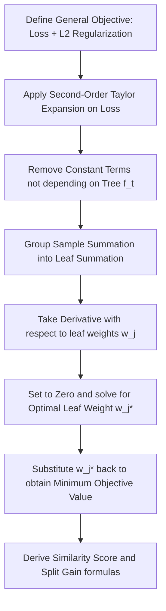

# The Maths Behind XGBoost

In this study guide, we dive deep into the mathematical foundations of XGBoost. Unlike traditional gradient boosting, which uses first-order gradients to guide tree construction, XGBoost uses a second-order Taylor expansion of the objective function. This allows it to work with arbitrary user-defined loss functions, naturally support regularization, and compute optimal leaf values analytically.

---

## The Mathematical Derivation Flow



---

## 1. The Objective Function

Let the objective function at step $t$ be:
$$\mathcal{O}^{(t)} = \sum_{i=1}^N l(y_i, \hat{y}_i^{(t-1)} + f_t(x_i)) + \Omega(f_t)$$

where:

- $l$ is a differentiable convex loss function that measures the distance between the target $y_i$ and the prediction $\hat{y}_i^{(t-1)} + f_t(x_i)$.
- $f_t(x_i)$ is the prediction of the new tree being trained at step $t$.
- $\Omega(f_t)$ is the complexity penalty (regularization) of the new tree, defined as:
  $$\Omega(f_t) = \gamma T + \frac{1}{2} \lambda \sum_{j=1}^T w_j^2$$
  where $T$ is the number of leaves in the tree and $w_j$ is the output weight of leaf $j$.

---

## 2. Second-Order Taylor Expansion

A second-order Taylor expansion of a function $f(x + \Delta x)$ around $x$ is:
$$f(x + \Delta x) \approx f(x) + f'(x)\Delta x + \frac{1}{2}f''(x)\Delta x^2$$

Applying this to our loss function $l(y_i, \hat{y}_i^{(t-1)} + f_t(x_i))$ by treating $\hat{y}_i^{(t-1)}$ as $x$ and $f_t(x_i)$ as $\Delta x$:
$$l(y_i, \hat{y}_i^{(t-1)} + f_t(x_i)) \approx l(y_i, \hat{y}_i^{(t-1)}) + g_i f_t(x_i) + \frac{1}{2} h_i f_t^2(x_i)$$

where the first-order gradient $g_i$ and second-order gradient (Hessian) $h_i$ are:
$$g_i = \left[ \frac{\partial l(y_i, \hat{y}_i)}{\partial \hat{y}_i} \right]_{\hat{y}_i = \hat{y}_i^{(t-1)}} \quad \text{and} \quad h_i = \left[ \frac{\partial^2 l(y_i, \hat{y}_i)}{\partial \hat{y}_i^2} \right]_{\hat{y}_i = \hat{y}_i^{(t-1)}}$$

Substituting this back into the objective function:
$$\mathcal{O}^{(t)} \approx \sum_{i=1}^N \left[ l(y_i, \hat{y}_i^{(t-1)}) + g_i f_t(x_i) + \frac{1}{2} h_i f_t^2(x_i) \right] + \gamma T + \frac{1}{2} \lambda \sum_{j=1}^T w_j^2$$

Since the term $l(y_i, \hat{y}_i^{(t-1)})$ depends only on previous steps, it is constant during the optimization of step $t$. We can drop it to define the simplified objective:
$$\tilde{\mathcal{O}}^{(t)} = \sum_{i=1}^N \left[ g_i f_t(x_i) + \frac{1}{2} h_i f_t^2(x_i) \right] + \gamma T + \frac{1}{2} \lambda \sum_{j=1}^T w_j^2$$

---

## 3. Summation by Leaves

We can rewrite the summation over training instances by grouping them according to the leaf they land in. Let $I_j = \{i \mid q(x_i) = j\}$ be the set of indices of instances mapped to leaf $j$. Since $f_t(x_i) = w_{q(x_i)}$, we can rewrite the objective function as:
$$\tilde{\mathcal{O}}^{(t)} = \sum_{j=1}^T \left[ \left( \sum_{i \in I_j} g_i \right) w_j + \frac{1}{2} \left( \sum_{i \in I_j} h_i + \lambda \right) w_j^2 \right] + \gamma T$$

---

## 4. Optimal Leaf Weights and Optimal Objective

For a fixed tree structure $q(x)$, the terms in the summation for each leaf $j$ are independent quadratic functions of $w_j$. To find the optimal weight $w_j^*$ for leaf $j$, we take the derivative of $\tilde{\mathcal{O}}^{(t)}$ with respect to $w_j$ and set it to zero:
$$\frac{\partial \tilde{\mathcal{O}}^{(t)}}{\partial w_j} = \left( \sum_{i \in I_j} g_i \right) + \left( \sum_{i \in I_j} h_i + \lambda \right) w_j = 0$$

Solving for $w_j^*$:
$$w_j^* = -\frac{\sum_{i \in I_j} g_i}{\sum_{i \in I_j} h_i + \lambda}$$

Substituting this optimal weight back into the simplified objective function:
$$\tilde{\mathcal{O}}^{(t)*} = -\frac{1}{2} \sum_{j=1}^T \frac{\left( \sum_{i \in I_j} g_i \right)^2}{\sum_{i \in I_j} h_i + \lambda} + \gamma T$$

This minimum value measures the "quality" of a tree structure. The term inside the summation is what we define as the **Similarity Score**:
$$S_j = \frac{\left( \sum_{i \in I_j} g_i \right)^2}{\sum_{i \in I_j} h_i + \lambda}$$

---

## Python Verification of Analytical Optimization

The following code defines a set of synthetic gradients and hessians, computes the regularized objective function numerically over a range of values, and asserts that the minimum is exactly located at the analytically derived optimal weight.

```python
import numpy as np
from scipy.optimize import minimize

# 1. Define synthetic gradients, hessians, and regularization parameters
np.random.seed(42)
n_samples = 10
# Arbitrary gradients and positive hessians (required for convexity)
g = np.random.uniform(-2.0, 2.0, size=n_samples)
h = np.random.uniform(0.1, 1.5, size=n_samples)
reg_lambda = 1.5
gamma = 0.5

# Sum of gradients and hessians for the leaf
sum_g = np.sum(g)
sum_h = np.sum(h)

# 2. Analytical formula for optimal weight and objective value
w_optimal_analytical = -sum_g / (sum_h + reg_lambda)
obj_optimal_analytical = -0.5 * (sum_g ** 2) / (sum_h + reg_lambda) + gamma

# 3. Numerical optimization function
def regularized_objective(w):
    # Sum_i [ g_i * w + 0.5 * h_i * w^2 ] + 0.5 * lambda * w^2 + gamma
    loss_term = np.sum(g * w + 0.5 * h * (w ** 2))
    reg_term = 0.5 * reg_lambda * (w ** 2)
    return loss_term + reg_term + gamma

# Perform numerical minimization starting from a random point
res = minimize(regularized_objective, x0=[0.0], method='BFGS')
w_optimal_numerical = res.x[0]
obj_optimal_numerical = res.fun

# 4. Parity checks using assertions
assert np.isclose(w_optimal_analytical, w_optimal_numerical, atol=1e-6), \
    f"Optimal weight mismatch: Analytical={w_optimal_analytical:.6f}, Numerical={w_optimal_numerical:.6f}"

assert np.isclose(obj_optimal_analytical, obj_optimal_numerical, atol=1e-6), \
    f"Optimal objective mismatch: Analytical={obj_optimal_analytical:.6f}, Numerical={obj_optimal_numerical:.6f}"

print("Parity verification passed!")
print(f"Optimal Leaf Weight: {w_optimal_analytical:.6f} (Analytical) vs {w_optimal_numerical:.6f} (Numerical)")
print(f"Optimal Leaf Objective Value: {obj_optimal_analytical:.6f} (Analytical) vs {obj_optimal_numerical:.6f} (Numerical)")
```

---

## Previous and Next Days

- **Previous Day**: [Day 125: XGBoost for Classification](file:///Users/prime/Developer/ml/125_xgboost_for_classification.md)
- **Next Day**: [Day 127: Stacking and Blending Ensembles](file:///Users/prime/Developer/ml/127_stacking_and_blending_ensembles.md)
