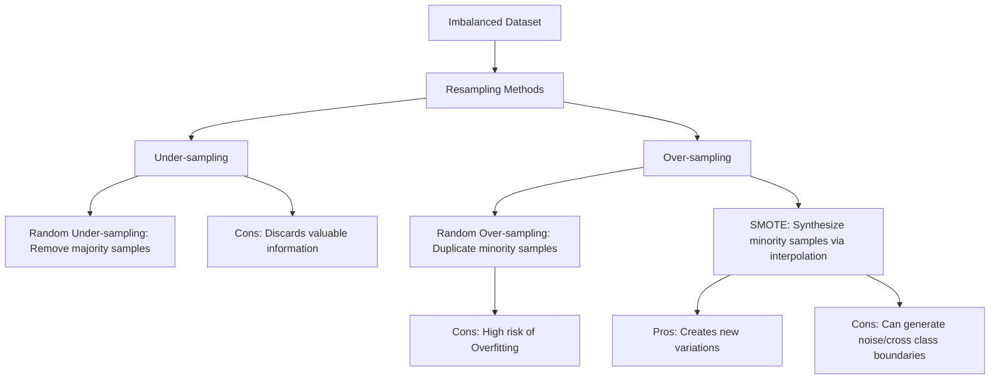
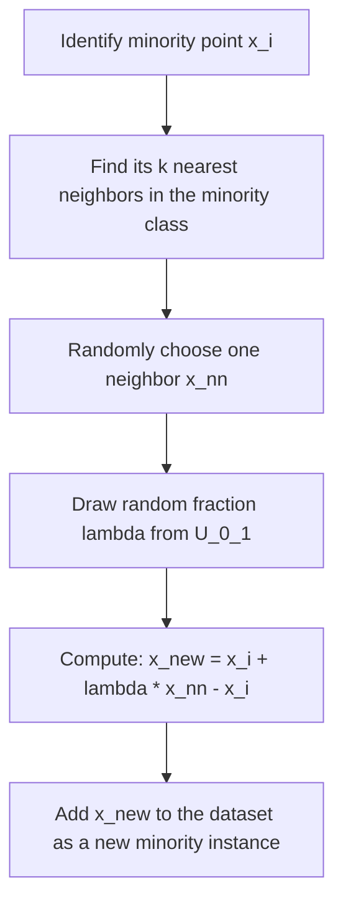

# Imbalanced Data in Machine Learning

Imbalanced data occurs in classification problems when the classes are not represented equally. Usually, there is a **majority class** (containing most of the instances) and a **minority class** (which is rare).

Handling imbalanced data is one of the most critical skills in real-world machine learning because real-world datasets are almost never perfectly balanced.

---

## The Dual Hazards of Imbalanced Data

1. **Model Bias**: Standard machine learning models minimize overall error. If $95\%$ of the data belongs to class A, the model can achieve $95\%$ accuracy by simply predicting class A for every instance, completely ignoring class B. The resulting model is heavily biased toward the majority class.
2. **Deceptive Metrics**: Accuracy becomes a useless metric. An accuracy of $99\%$ sounds excellent, but if the minority class represents $1\%$ of the data (e.g., in cancer detection) and the model fails to detect any positive cases, the model is dangerous and useless.

### Real-World Omnipresence

- **Finance**: Credit card fraud detection ($< 0.1\%$ fraud), credit default assessment.
- **Healthcare**: Rare disease identification, tumor detection.
- **Manufacturing**: Predictive maintenance (detecting rare machine failures before they occur).
- **E-Commerce**: Customer churn prediction.
- **Earth Sciences**: Earthquake or volcanic eruption forecasting.

---

## Overview of Resampling Techniques



---

## Mathematical Formulations

### 1. SMOTE (Synthetic Minority Over-sampling Technique)

Instead of duplicating existing minority points, SMOTE generates new, synthetic samples by interpolating between nearest neighbors of the minority class:

For each minority class sample $x_i$:

1. Compute its $k$-nearest neighbors within the minority class.
2. Choose one of these neighbors $x_{nn}$ at random.
3. Draw a random number $\lambda$ from a uniform distribution:
   $$\lambda \sim U(0, 1)$$
4. Compute the synthetic sample $x_{\text{new}}$:
   $$x_{\text{new}} = x_i + \lambda (x_{nn} - x_i)$$



### 2. Class Weights (Cost-Sensitive Learning)

Rather than resampling the dataset, we can modify the loss function to penalize misclassifications of the minority class more heavily. The balanced weight $w_c$ for class $c$ is:
$$w_c = \frac{N}{C \times n_c}$$
where:

- $N$ is the total number of samples in the dataset.
- $C$ is the total number of classes.
- $n_c$ is the number of samples belonging to class $c$.

---

## Python Implementation and Parity Verification

The following code implements the SMOTE algorithm from scratch and verifies that the output resampled distribution is perfectly balanced while synthetic samples lie strictly within the minority coordinate bounds.

```python
import numpy as np
from sklearn.neighbors import NearestNeighbors

class SimpleSMOTE:
    def __init__(self, k_neighbors=5, random_state=None):
        self.k_neighbors = k_neighbors
        self.random_state = random_state

    def fit_resample(self, X, y):
        # Identify majority and minority classes
        classes, counts = np.unique(y, return_counts=True)
        minority_class = classes[np.argmin(counts)]
        majority_class = classes[np.argmax(counts)]

        X_min = X[y == minority_class]
        X_maj = X[y == majority_class]

        n_min = len(X_min)
        n_maj = len(X_maj)
        n_to_generate = n_maj - n_min

        if n_to_generate <= 0:
            return X, y

        rng = np.random.default_rng(self.random_state)

        # Adjust k neighbors if minority class is too small
        k = min(self.k_neighbors, n_min - 1)
        if k <= 0:
            k = 1

        nn = NearestNeighbors(n_neighbors=k + 1).fit(X_min)
        distances, indices = nn.kneighbors(X_min)

        synthetic_samples = []
        for _ in range(n_to_generate):
            # Select random minority instance index
            idx = rng.choice(n_min)
            # Select a random neighbor index among its k nearest neighbors
            neighbor_idx = rng.choice(indices[idx, 1:])

            # Linear interpolation
            diff = X_min[neighbor_idx] - X_min[idx]
            lam = rng.uniform(0, 1)
            new_sample = X_min[idx] + lam * diff
            synthetic_samples.append(new_sample)

        synthetic_samples = np.array(synthetic_samples)

        # Combine original data and synthetic samples
        X_resampled = np.vstack([X, synthetic_samples])
        y_resampled = np.concatenate([y, np.full(n_to_generate, minority_class)])

        return X_resampled, y_resampled

# 1. Generate toy imbalanced dataset (8 majority, 3 minority)
X_maj = np.array([[1.0, 1.0], [1.1, 0.9], [0.9, 1.1], [1.0, 1.2], [1.2, 1.0], [0.8, 0.8], [0.9, 0.9], [1.1, 1.1]])
X_min = np.array([[5.0, 5.0], [5.1, 4.9], [4.9, 5.1]])
X = np.vstack([X_maj, X_min])
y = np.array([0]*8 + [1]*3)

# 2. Run custom SMOTE
smote = SimpleSMOTE(k_neighbors=2, random_state=42)
X_res, y_res = smote.fit_resample(X, y)

# 3. Assert parity and correctness
# Check that the classes distribution is now balanced (8 majority, 8 minority)
counts = np.bincount(y_res)
assert np.array_equal(counts, [8, 8]), f"Oversampling did not balance classes! Got counts: {counts}"

# Verify that all synthetic samples lie within the convex hull of the minority samples
min_bounds = np.min(X_min, axis=0)
max_bounds = np.max(X_min, axis=0)
for sample in X_res[-5:]:
    assert np.all(sample >= min_bounds) and np.all(sample <= max_bounds), \
        f"Synthetic sample {sample} is outside minority class boundaries!"

print("Parity verification passed! Custom SMOTE balances classes and respects minority boundaries.")
```

---

## Previous and Next Days

- **Previous Day**: [Day 132: DBSCAN Clustering Algorithms](file:///Users/prime/Developer/ml/132_dbscan_clustering_algorithms.md)
- **Next Day**: [Day 134: Hyperparameter Tuning Using Optuna](file:///Users/prime/Developer/ml/134_hyperparameter_tuning_using_optuna.md)
