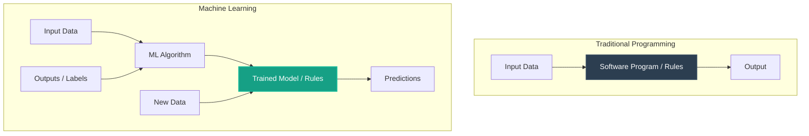

# What is Machine Learning?

[](https://colab.research.google.com/github/RiazML/machine-learning-notes/blob/main/notebooks/001_what_is_machine_learning.ipynb)

Machine Learning (ML) is one of the most rapidly growing fields in technology. In this study guide, we will explore the core concepts of Machine Learning, how it differs from traditional programming, when to apply it, its historical context, and the economic landscape of ML jobs.

---

## 1. What is Machine Learning?

Arthur Samuel (1959) defined Machine Learning as:

> _"The field of study that gives computers the ability to learn without being explicitly programmed."_

Tom Mitchell (1997) provided a more engineering-oriented definition:

> _"A computer program is said to learn from experience $E$ with respect to some class of tasks $T$ and performance measure $P$, if its performance at tasks in $T$, as measured by $P$, improves with experience $E$."_

### Traditional Programming vs. Machine Learning

In traditional computer programming, a human programmer writes explicit rules (logic) to process input data and generate output. If the requirements change or new scenarios emerge, the programmer must manually rewrite the code logic.

In Machine Learning, we reverse this process: we feed input data and the corresponding output (labels) into a machine learning algorithm. The algorithm learns the hidden patterns and automatically generates the rules (referred to as a **Model**). Once trained, this model can predict the output for new, unseen input data.



| Dimension            | Traditional Programming                                         | Machine Learning                                                           |
| :------------------- | :-------------------------------------------------------------- | :------------------------------------------------------------------------- |
| **Logic/Rules**      | Manually written by developers.                                 | Automatically discovered by algorithms.                                    |
| **Key Inputs**       | Input Data + Program logic.                                     | Input Data + Target labels (Supervised).                                   |
| **Handling Changes** | Code must be modified manually.                                 | Model is retrained automatically on new data.                              |
| **Use Cases**        | Deterministic problems (e.g., calculators, payroll processing). | Probabilistic, complex problems (e.g., image recognition, recommendation). |

---

## 2. When to Use Machine Learning?

Machine Learning is not a silver bullet, but it is highly effective in three primary scenarios:

### Scenario A: When Rules are Extremely Complex & Keep Changing (e.g., Email Spam Filtering)

If you try to write a traditional rules-based program to filter spam emails, you might write logic like:

```python
email = "huge discount! huge discount! huge discount! huge discount!"
def mark_as_spam():
    print("Spam marked")

if email.count("huge discount") > 3:
    mark_as_spam()
```

However, spammers will quickly notice this rule and adapt. They will replace words like `"huge"` with `"big"`, `"massive"`, or `"gigantic"`.
To handle this, the developer must continuously add rules:

```python
email = "big discount! big discount! big discount! big discount!"
def mark_as_spam():
    print("Spam marked")

if email.count("big discount") > 3 or email.count("massive discount") > 3:
    mark_as_spam()
```

This becomes an endless game of cat-and-mouse. The code complexity increases rapidly, making it impossible to maintain.
With **Machine Learning**, the system automatically detects these variations by analyzing millions of emails. If spam patterns shift, the model updates itself when retrained on new email data, requiring no manual rewriting of logic.

### Scenario B: When the Number of Cases is Too Vast to Code (e.g., Image Classification)

Imagine you want to write a program to detect if a picture contains a dog.

- There are hundreds of dog breeds (German Shepherd, Pug, Chihuahua, Pomeranian).
- Dogs vary wildly in color (black, white, brown), size, ear shape, and tail length.
- The environment, lighting, and camera angles change constantly.

It is humanly impossible to write a set of conditional `if-else` statements that accurately check pixel values to detect every possible dog breed.
Instead, we mimic how humans learn: we show a machine learning model thousands of images of dogs (and non-dogs) and label them. The model automatically learns what features (curves, textures, shapes) constitute a dog.

### Scenario C: Data Mining (Uncovering Hidden Information)

To understand Data Mining, we must first contrast it with standard Data Analysis:

- **Data Analysis**: Visualizing data using graphs, bar charts, and dashboards to find obvious patterns (e.g., sales dropped last month).
- **Data Mining**: Applying machine learning algorithms on massive datasets to uncover deep, non-obvious, and highly hidden relationships that humans cannot find simply by plotting graphs.

For instance, an e-commerce store might use data mining to find that people who buy a specific type of electronic item also purchase a completely unrelated home accessory, allowing them to optimize product recommendations.

---

## 3. The History & Rise of Machine Learning

Machine Learning is not a new field. Most of the mathematical algorithms (like linear regression, neural networks, and decision trees) were developed 40 to 50 years ago. However, they remained obscure for a long time.

### The "Nawazuddin Siddiqui" Analogy

The history of Machine Learning is very similar to the career of Indian actor **Nawazuddin Siddiqui**:

- Siddiqui worked in the film industry for decades, playing tiny, unnoticed roles (like a pickpocket in _Munna Bhai M.B.B.S._).
- Despite having excellent acting skills, he remained in the background until the 2010s, when the rise of OTT platforms and content-focused cinema catapulted him to stardom.

Similarly, Machine Learning existed as a niche academic field for decades. It did not gain mainstream prominence until the 2010s due to two major catalysts:

```
                  ┌──────────────────────────────┐
                  │   All math/theory existed    │
                  │   50+ years ago              │
                  └──────────────┬───────────────┘
                                 │
                                 ▼
                     Was ML useful back then?
                                 │
            ┌────────────────────┴────────────────────┐
            ▼                                         ▼
     NO: Lacked Data                           NO: Lacked Compute
(Manual data gathering was                (Computers had tiny RAM;
    tedious & expensive)                     GPUs did not exist)
            │                                         │
            └────────────────────┬────────────────────┘
                                 │  Smartphone & Internet Revolution (2010+)
                                 ▼
                 ┌──────────────────────────────┐
                 │  Data Explosion:             │
                 │  - 4B+ internet users        │
                 │  - 2016 data > all previous  │
                 │    history combined          │
                 │  Hardware Revolution:        │
                 │  - Gigabytes of RAM          │
                 │  - Cheap GPUs/TPUs           │
                 └──────────────────────────────┘
```

1. **The Data Explosion**: With smartphones, social media, and cheap internet, we began generating data at an unprecedented rate. The digital data created in 2016 alone was greater than the data generated in the entire history of mankind up to 2015.
2. **The Hardware Revolution**: Training complex models requires massive computational power. Today, standard smartphones carry 8GB–12GB of RAM and dedicated GPUs in our pockets—hardware that was completely unavailable to research scientists in the 20th century.

---

## 4. Job Market & Economics

The current high demand and premium salaries for Machine Learning professionals are explained by simple market economics.

### The "Java" Supply-Demand Curve Analogy

- When Java first entered the enterprise market, very few programmers knew it. However, companies needed to build systems in Java to compete.
- Because the **demand was high** and the **supply of developers was low**, companies engaged in bidding wars, driving Java developer salaries very high.
- Over the next 10–15 years, colleges started teaching Java, thousands of programmers learned it, and the supply caught up with the demand. Salaries eventually normalized.

```
Salary / Demand
  ▲
  │     /  <-- We are here for Machine Learning (Upward Phase)
  │    /
  │   /
  │  /    \
  │ /      \  <-- Normalization (Where Java/Web development is today)
  └────────────────────────► Time / Supply
```

Currently, **Machine Learning is on the steep upward trajectory** of this curve. Colleges are only starting to adapt, and there is a massive shortage of qualified professionals. Eventually, the supply will catch up, and salaries will normalize (just like Java or web development today). However, we are currently in the sweet spot of this technological cycle, making it the perfect time to build deep expertise in ML.
