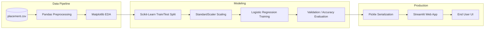

# End-to-End Machine Learning Toy Project

[](https://colab.research.google.com/github/RiazML/machine-learning-notes/blob/main/notebooks/013_end-to-end_toy_project.ipynb)

To tie together the theoretical concepts of the Machine Learning Development Life Cycle (MLDLC), this guide walks through a complete, end-to-end toy project. We will build a system that predicts whether a student will get placed based on their **CGPA** and **IQ**, save the trained model, and deploy it as a basic interactive web interface.

---

## 1. Project Workflow Architecture

The project follows a standard operational ML workflow, converting a CSV dataset into a live, interactive web page.



---

## 2. Step-by-Step Python Implementation

### Step 1: Import Libraries and Load Data

We load a synthetic dataset of 100 students containing the columns: `Unnamed: 0` (index), `cgpa`, `iq`, and `placement`.

```python
import numpy as np
import pandas as pd
import matplotlib.pyplot as plt

# Load dataset
df = pd.read_csv('placement.csv')
print(df.head())
```

### Step 2: Data Preprocessing

The column `Unnamed: 0` is redundant as it represents row indices. We remove it.

```python
# Drop the irrelevant index column (Unnamed: 0) using slicing
df = df.iloc[:, 1:]
print(df.head())

# Check for missing values
print(df.isnull().sum())
```

### Step 3: Exploratory Data Analysis (EDA)

We plot a scatter plot of CGPA vs. IQ, color-coding the points by placement status (Yellow/Red = Placed, Purple/Blue = Not Placed).

```python
# Scatter plot: CGPA vs IQ, color-coded by placement status
plt.scatter(df['cgpa'], df['iq'], c=df['placement'], cmap='bwr', alpha=0.7)
plt.xlabel('CGPA')
plt.ylabel('IQ')
plt.title('Student Placement Scatter Plot')
plt.colorbar(label='Placement Status (1=Placed, 0=Not Placed)')
plt.show()
```

### Step 4: Extract Input (X) and Output (y) Features

We separate our independent features (input) from our dependent label (target).

```python
# X contains cgpa and iq columns; y contains the placement column
X = df.iloc[:, 0:2]
y = df.iloc[:, -1]
```

### Step 5: Train-Test Split

To evaluate our model's performance on unseen data before deploying it to production, we hold back a fraction of our data (10%) for testing.

```python
from sklearn.model_selection import train_test_split

X_train, X_test, y_train, y_test = train_test_split(X, y, test_size=0.1, random_state=42)
print("Training Data Size:", X_train.shape)
print("Testing Data Size:", X_test.shape)
```

### Step 6: Feature Scaling

`cgpa` scales from $0$ to $10$, while `iq` ranges from $50$ to $150$. If we feed this data directly into distance-based or optimization-based algorithms, the larger range of the `iq` column will dominate the calculations. We scale both features to fall within a comparable range (Standardization: Mean = 0, Variance = 1).

```python
from sklearn.preprocessing import StandardScaler

scaler = StandardScaler()

# Fit and transform the training data, but ONLY transform the testing data
X_train_scaled = scaler.fit_transform(X_train)
X_test_scaled = scaler.transform(X_test)
```

### Step 7: Train the Model (Logistic Regression)

Since this is a binary classification problem (Placed vs. Not Placed) and the decision boundary is mostly linear, we train a **Logistic Regression** classifier.

```python
from sklearn.linear_model import LogisticRegression

clf = LogisticRegression()

# Train the model
clf.fit(X_train_scaled, y_train)
```

### Step 8: Model Evaluation

We predict on our testing set and calculate the accuracy score.

```python
# Predict on test set
y_pred = clf.predict(X_test_scaled)

from sklearn.metrics import accuracy_score
accuracy = accuracy_score(y_test, y_pred)
print(f"Test Accuracy Score: {accuracy * 100:.2f}%")
```

### Step 9: Visualizing the Decision Boundary

We can plot the mathematical line that our trained model uses to divide placed and non-placed students.

```python
from mlxtend.plotting import plot_decision_regions

plot_decision_regions(X_train_scaled, y_train.values, clf=clf, legend=2)
plt.xlabel('Scaled CGPA')
plt.ylabel('Scaled IQ')
plt.title('Logistic Regression Decision Boundary')
plt.show()
```

### Step 10: Model Serialization (Pickling)

To deploy our model inside a web application without retraining it every time, we must serialize (save) the trained model object and our fitted scaler object to disk.

```python
import pickle

# Save the trained model and scaler to disk
with open('model.pkl', 'wb') as model_file:
    pickle.dump(clf, model_file)

with open('scaler.pkl', 'wb') as scaler_file:
    pickle.dump(scaler, scaler_file)
```

---

## 3. Web Application Deployment (Streamlit)

Streamlit is a lightweight Python framework used to build and share interactive web apps for machine learning in minutes.

### Web App Script (`app.py`)

Create a file named `app.py`:

```python
import streamlit as st
import pickle
import numpy as np

# Set page title
st.set_page_config(page_title="Placement Predictor", layout="centered")

st.title("🎓 Student Placement Predictor")
st.write("Predict if a student will get placed based on their academic statistics.")

# Load the saved model and scaler
with open('model.pkl', 'rb') as f:
    model = pickle.load(f)

with open('scaler.pkl', 'rb') as f:
    scaler = pickle.load(f)

# Input UI Fields
cgpa = st.number_input("Enter CGPA (0.0 to 10.0)", min_value=0.0, max_value=10.0, value=7.0, step=0.1)
iq = st.number_input("Enter IQ Score (80 to 150)", min_value=80, max_value=150, value=100, step=1)

# Predict Button
if st.button("Predict Placement"):
    # 1. Format the input data as a 2D array
    input_data = np.array([[cgpa, iq]])

    # 2. Scale the input data using the loaded scaler
    scaled_data = scaler.transform(input_data)

    # 3. Predict using the loaded model
    prediction = model.predict(scaled_data)

    # 4. Display Result
    if prediction[0] == 1:
        st.success("🎉 Congratulations! The model predicts the student will get PLACED!")
    else:
        st.warning("⚠️ The model predicts the student will NOT get placed. Keep working hard!")
```

### Running the App

To launch the app locally:

```bash
streamlit run app.py
```

This launches a local web server at `http://localhost:8501/`, which can then be deployed to cloud hosting platforms like **Heroku**, **AWS**, or **GCP**.
