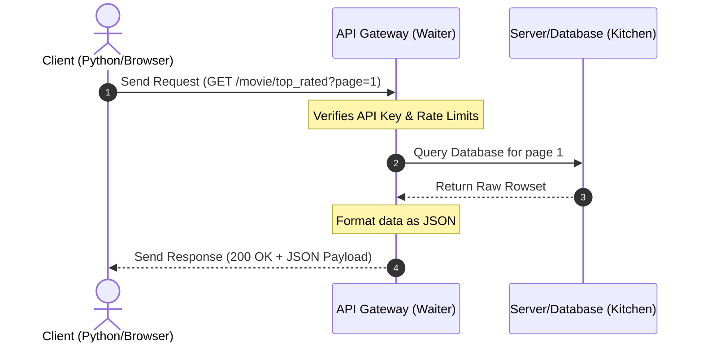
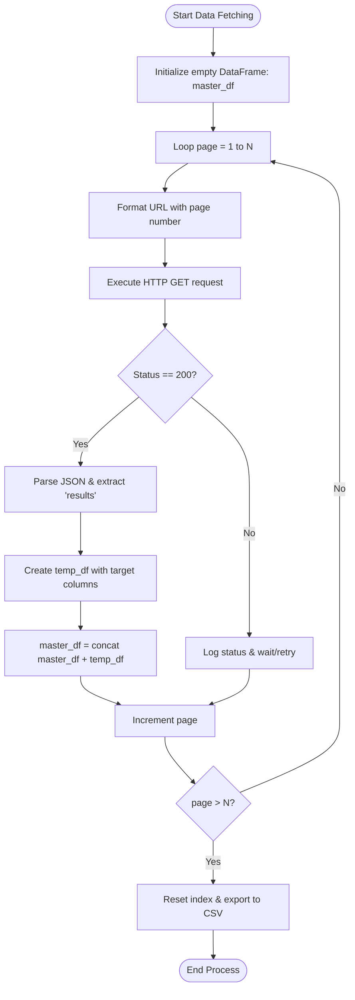

# Fetching Data From an API

[](https://colab.research.google.com/github/RiazML/machine-learning-notes/blob/main/notebooks/017_fetching_data_from_an_api.ipynb)

## 1. Understanding APIs: The Core Concept

An **API** (Application Programming Interface) is a software intermediary that allows two distinct applications to communicate with each other. In the context of data science and machine learning, APIs serve as crucial data pipelines. Instead of downloading static datasets, APIs allow us to fetch real-time, dynamic data directly from a company's database in a structured format (usually JSON).

### The Restaurant Waiter Analogy

To understand APIs, think of a dining experience at a restaurant:

- **The Customer (Client/Your Python Script):** You want to order food. You cannot go directly into the kitchen to prepare it or inspect the raw ingredients.
- **The Waiter (The API):** The waiter comes to your table, takes your order (Request), carries it to the kitchen, and returns with the prepared dish on a plate (Response).
- **The Kitchen (The Server/Database):** The place where all the raw ingredients are stored and cooked. The kitchen does not expose its internal operations to the customer; it only responds to orders placed via the waiter.



---

## 2. HTTP Fundamentals for Data Fetching

When interacting with APIs, we make HTTP requests and receive responses containing status codes and payloads.

### Key HTTP Methods

- **`GET`**: Retrieve data from a server (the primary method used for data gathering).
- **`POST`**: Submit data to a server to create/update a resource.

### Common HTTP Status Codes

- **`200 OK`**: The request succeeded, and the server returned the requested data.
- **`404 Not Found`**: The requested resource does not exist on the server.
- **`403 Forbidden`**: The server understands the request but refuses to authorize it (often due to missing API keys or user-agent blocking).
- **`429 Too Many Requests`**: The client has sent too many requests in a given amount of time (rate limit exceeded).
- **`500 Internal Server Error`**: The server encountered an unexpected condition that prevented it from fulfilling the request.

---

## 3. JSON Data Structure (JavaScript Object Notation)

APIs typically return data in **JSON** format. Structurally, JSON is identical to Python dictionaries and lists:

- **JSON Objects** $\approx$ Python Dictionaries: `{ "key": "value" }`
- **JSON Arrays** $\approx$ Python Lists: `[ "item1", "item2" ]`

### Parsing JSON Data

When we receive a JSON response from an API, we parse it to extract the fields of interest. Tools like online JSON viewers help map the hierarchy:

| Key             | Type            | Description                                         |
| :-------------- | :-------------- | :-------------------------------------------------- |
| `page`          | Integer         | The current page number of the paginated results.   |
| `results`       | List of Objects | The actual data records (e.g., list of movies).     |
| `total_pages`   | Integer         | Total number of pages available for querying.       |
| `total_results` | Integer         | Total count of database records matching the query. |

---

## 4. End-to-End Project: Harvesting TMDB Movie Data

In this project, we query **The Movie Database (TMDB)** API to harvest details of the top-rated movies across hundreds of pages, parse the nested JSON payloads, build a pandas DataFrame, and export it as a CSV dataset.

### API Endpoint details

- **Base URL:** `https://api.themoviedb.org/3`
- **Resource path:** `/movie/top_rated`
- **Query Parameters:**
  - `api_key`: Your unique authorization key.
  - `language`: e.g., `en-US`.
  - `page`: The page offset to query.

### The Pagination Loop Logic

Because a single API response only returns a small subset of movies (e.g., 20 movies per page), we write a loop that increments the `page` parameter, queries the API, parses the list of dictionaries inside the `results` key, converts it to a temporary DataFrame, and appends it to a master DataFrame.



### Complete, Runnable Python Implementation

The script below demonstrates the complete pipeline, including error handling, pagination, progress reporting, and outputting to a clean CSV file.

```python
import requests
import pandas as pd
import time

def fetch_top_rated_movies(api_key, total_pages_to_fetch=50):
    """
    Fetches top-rated movies from TMDB API across multiple pages
    and returns a structured Pandas DataFrame.
    """
    # Columns we want to extract
    target_columns = [
        'id',
        'title',
        'overview',
        'release_date',
        'popularity',
        'vote_average',
        'vote_count'
    ]

    # Initialize list to collect temporary dataframes
    df_list = []

    for page in range(1, total_pages_to_fetch + 1):
        url = f"https://api.themoviedb.org/3/movie/top_rated?api_key={api_key}&language=en-US&page={page}"

        try:
            # Send HTTP GET Request
            response = requests.get(url)

            # Check for Rate Limits (HTTP 429) or other errors
            if response.status_code == 429:
                print(f"[Warning] Rate limited on page {page}. Sleeping for 5 seconds...")
                time.sleep(5)
                # Retry once
                response = requests.get(url)

            if response.status_code != 200:
                print(f"[Error] Failed to fetch page {page}. Status Code: {response.status_code}")
                continue

            # Parse response JSON
            data = response.json()

            # Extract results list
            movies_list = data.get('results', [])

            if not movies_list:
                print(f"[Info] No movies found on page {page}. Ending loop.")
                break

            # Convert list of dicts to DataFrame
            temp_df = pd.DataFrame(movies_list)

            # Filter for our columns of interest
            temp_df = temp_df[target_columns]

            # Append to our df collection list
            df_list.append(temp_df)
            print(f"[Success] Fetched page {page}/{total_pages_to_fetch} ({len(temp_df)} movies)")

            # Polite rate-limiting buffer to be nice to servers
            time.sleep(0.2)

        except Exception as e:
            print(f"[Exception] Error parsing page {page}: {str(e)}")
            continue

    # Combine all pages
    if df_list:
        master_df = pd.concat(df_list, ignore_index=True)
        return master_df
    else:
        return pd.DataFrame(columns=target_columns)

if __name__ == "__main__":
    # REPLACE WITH YOUR ACTUAL TMDB API KEY
    TMDB_API_KEY = "YOUR_API_KEY_HERE"

    # Run the harvester (Example: 5 pages to avoid large runtime during testing)
    print("Starting TMDB Movie Harvester...")
    movies_df = fetch_top_rated_movies(api_key=TMDB_API_KEY, total_pages_to_fetch=5)

    # Display shape and first few rows
    print(f"\nFinal DataFrame Shape: {movies_df.shape}")
    print(movies_df.head())

    # Save to CSV
    output_filename = "tmdb_top_rated_movies.csv"
    movies_df.to_csv(output_filename, index=False)
    print(f"Data successfully saved to {output_filename}")
```

---

## 5. Harnessing APIs for Portfolio Building

Web APIs are one of the most powerful tools for building a unique data portfolio:

1. **Kaggle Datasets:** You can build data scrapers/harvesting scripts that query APIs from niche domains, compile them into highly polished CSV files, add documentation, and upload them to Kaggle. Contributing high-quality datasets is an direct pathway to building a strong profile, earning Kaggle medals, and attracting potential employers.
2. **Niche Repositories:** Platforms like **RapidAPI** index thousands of public APIs across diverse categories:
   - **Sports:** Live football/cricket statistics.
   - **Finance:** Historical stocks, cryptocurrency rates.
   - **Weather:** Historical precipitation, temperature records.
   - **Real Estate:** Property listings, rent valuations.
3. **Practice Assignment:** Go to RapidAPI, find a free API of interest (e.g., weather or sports), write a python script to fetch paginated/regional records, parse them into a clean CSV, and document the dataset structure. Do not just study tutorials—build your own datasets!
