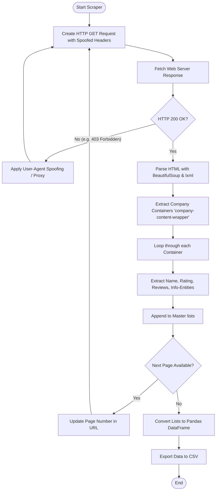

# Fetching Data Using Web Scraping

[](https://colab.research.google.com/github/RiazML/machine-learning-notes/blob/main/notebooks/018_fetching_data_using_web_scraping.ipynb)

## 1. Web Scraping Fundamentals

Web scraping is the automated extraction of data from websites. It is a vital tool for data scientists when:

1. **No API exists** for the target website.
2. The website does not offer a downloadable dataset (like a CSV or JSON file).
3. The dataset is dynamic and must be harvested periodically.

### How Web Scraping Works

Web scrapers request a webpage's raw HTML code, parse the document object model (DOM) tree, navigate using HTML tags and CSS class names, extract target text fields, and organize them into structured data frames.



---

## 2. Overcoming Scraping Obstacles: Bypassing HTTP 403 Forbidden

Many websites employ anti-scraping mechanisms to protect their servers from automated traffic. If you make a raw `requests.get(url)` call without extra parameters, the server inspects the request headers and flags your script as a bot. This returns an **HTTP 403 Forbidden** error.

### Spoofing the `User-Agent`

To bypass this block, we must customize our request headers. By adding a `User-Agent` header, we pretend that the request is originating from a standard web browser (like Google Chrome or Safari running on Windows or macOS).

```python
import requests

# Custom headers to mimic a normal browser request
headers = {
    'User-Agent': 'Mozilla/5.0 (Windows NT 10.0; Win64; x64) AppleWebKit/537.36 (KHTML, like Gecko) Chrome/80.0.3987.149 Safari/537.36'
}

# Sending the request with headers
response = requests.get('https://www.ambitionbox.com/list-of-companies?page=1', headers=headers)
```

---

## 3. DOM Tree & BeautifulSoup Mechanics

BeautifulSoup parses HTML code into a nested tree structure. We navigate this tree using tag names and class identifiers.

### Key Parsing Concepts

- **`find()`**: Finds the _first_ occurrence of a tag matching specific attributes (returns a single Element).
- **`find_all()`**: Finds _all_ occurrences of a tag matching specific attributes (returns a list of Elements).
- **`.text`**: Extracts the raw text inside a tag.
- **`.strip()`**: Removes any leading or trailing whitespace (newlines, tabs, spaces) injected during HTML rendering.

### Handling Unstructured Metadata (The `info-entity` Problem)

In the AmbitionBox company listing, key company metadata (Company Type, Headquarters Location, Years since Foundation, Employee Count) are not placed in distinct classes. Instead, they are represented as a list of paragraphs under the same class name: `info-entity`.

```html
<p class="info-entity">Public</p>
<p class="info-entity">Mumbai, Maharashtra</p>
<p class="info-entity">52 years old</p>
<p class="info-entity">10,001+ Employees</p>
```

Because some companies might have missing fields (e.g., missing location or age), globally scraping all `info-entity` paragraphs on a page will lead to misaligned columns.
**Solution:** Iterate through each company card _individually_, find the `info-entity` tags _within_ that container, and extract values safely using index-based boundary checks.

---

## 4. End-to-End Project: Scraping AmbitionBox Company Directory

This complete script demonstrates how to request paginated results from AmbitionBox, bypass bot-detection, parse details for each company card, handle missing fields, and aggregate them into a single Pandas DataFrame.

```python
import requests
from bs4 import BeautifulSoup
import pandas as pd
import time
import random

def scrape_ambitionbox_companies(start_page=1, end_page=5):
    """
    Scrapes company listings from AmbitionBox across specified pages,
    handling requests, browser header spoofing, and nested DOM structures.
    """

    # Custom headers to bypass 403 Forbidden blocks
    headers = {
        'User-Agent': 'Mozilla/5.0 (Windows NT 10.0; Win64; x64) AppleWebKit/537.36 (KHTML, like Gecko) Chrome/109.0.0.0 Safari/537.36',
        'Accept-Language': 'en-US,en;q=0.9',
        'Referer': 'https://www.google.com/'
    }

    # Storage lists for company attributes
    names = []
    ratings = []
    reviews = []
    company_types = []
    headquarters = []
    company_ages = []
    employees_counts = []

    for page in range(start_page, end_page + 1):
        url = f"https://www.ambitionbox.com/list-of-companies?page={page}"
        print(f"Scraping page {page}: {url}")

        try:
            response = requests.get(url, headers=headers)

            if response.status_code == 403:
                print(f"[Error] Access Denied (HTTP 403) on page {page}. Consider updating User-Agent or rotating proxies.")
                continue

            if response.status_code != 200:
                print(f"[Error] Failed to fetch page {page}. Status Code: {response.status_code}")
                continue

            # Load HTML content into BeautifulSoup parser using lxml
            soup = BeautifulSoup(response.text, 'lxml')

            # Find all company card containers on the current page
            # The class name 'company-content-wrapper' envelopes the entire card info
            company_cards = soup.find_all('div', class_='company-content-wrapper')

            if not company_cards:
                print(f"[Warning] No company cards found on page {page}. Structure may have changed.")
                break

            for card in company_cards:
                # 1. Company Name (usually inside h2 tag)
                name_tag = card.find('h2')
                names.append(name_tag.text.strip() if name_tag else 'N/A')

                # 2. Rating (inside p tag with class 'rating')
                rating_tag = card.find('p', class_='rating')
                ratings.append(rating_tag.text.strip() if rating_tag else 'N/A')

                # 3. Review Count (inside a tag with class 'review-count')
                review_tag = card.find('a', class_='review-count')
                reviews.append(review_tag.text.strip() if review_tag else 'N/A')

                # 4. Info Entities list (Type, Headquarters, Age, Employee Count)
                # These are unstructured, so we extract all and align based on indexes safely
                info_tags = card.find_all('p', class_='info-entity')

                # Default assignments in case fields are missing
                ctype = 'N/A'
                emp_count = 'N/A'
                hq = 'N/A'
                age = 'N/A'

                # Safe boundary assignment (assuming standard ordering)
                if len(info_tags) > 0:
                    ctype = info_tags[0].text.strip()
                if len(info_tags) > 1:
                    emp_count = info_tags[1].text.strip()
                if len(info_tags) > 2:
                    hq = info_tags[2].text.strip()
                if len(info_tags) > 3:
                    age = info_tags[3].text.strip()

                company_types.append(ctype)
                employees_counts.append(emp_count)
                headquarters.append(hq)
                company_ages.append(age)

            print(f"[Success] Extracted {len(company_cards)} companies from page {page}")

            # Add a random delay to prevent hitting server rate limits and getting banned
            time.sleep(random.uniform(1.5, 3.0))

        except Exception as e:
            print(f"[Exception] Error parsing page {page}: {str(e)}")
            continue

    # Compile lists into a unified Pandas DataFrame
    data_dict = {
        'company_name': names,
        'rating': ratings,
        'reviews_count': reviews,
        'company_type': company_types,
        'employees': employees_counts,
        'headquarters': headquarters,
        'company_age': company_ages
    }

    df = pd.DataFrame(data_dict)
    return df

if __name__ == "__main__":
    print("Initializing AmbitionBox Scraper...")
    # Scrape pages 1 to 3 for testing
    companies_df = scrape_ambitionbox_companies(start_page=1, end_page=3)

    print(f"\nScraping complete. Final dataset dimensions: {companies_df.shape}")
    print(companies_df.head(10))

    # Save the output CSV file
    output_path = "ambitionbox_companies.csv"
    companies_df.to_csv(output_path, index=False)
    print(f"Data successfully saved to {output_path}")
```
