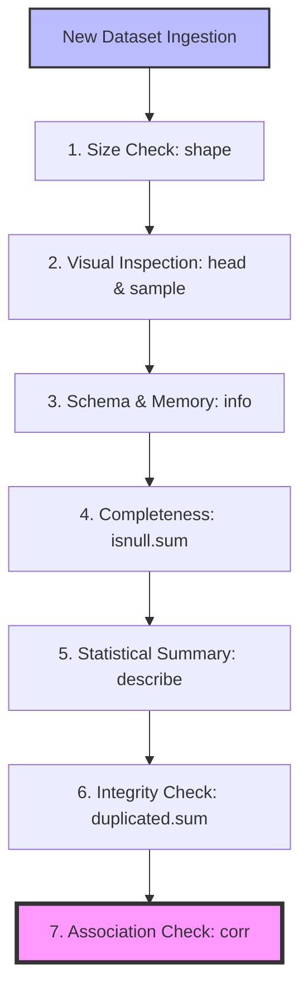

# Understanding Your Data

[](https://colab.research.google.com/github/RiazML/machine-learning-notes/blob/main/notebooks/019_understanding_your_data.ipynb)

Before jumping into complex visualizations or model building, you must ask the right diagnostic questions of your dataset. This guide covers the **7 key diagnostic questions** that every data scientist must ask upon receiving a new dataset, using the classic **Titanic dataset** as our case study.

---

## 1. The 7-Question Data Diagnosis Pipeline

When you first import a dataset, think of yourself as a doctor diagnosing a patient. You do not perform surgery immediately; instead, you take the patient's temperature, blood pressure, and pulse. Similarly, these 7 steps provide a comprehensive checkup of your data.



---

## 2. Deep Dive: The 7 Diagnostic Questions

### Question 1: How Big is the Data?

- **Command**: `df.shape`
- **Intuition**: Understanding the dimensions of your dataset helps you estimate computational requirements, choose appropriate algorithms, and plan cross-validation splits.
- **Titanic Dataset Application**:

```python
import pandas as pd
df = pd.read_csv("../data/titanic.csv")
print(df.shape)
# Output: (891, 12)
```

    This means we are dealing with **891 rows** (passengers) and **12 columns** (features/attributes).

---

### Question 2: How Does the Data Look?

- **Commands**: `df.head(n)`, `df.tail(n)`, `df.sample(n)`
- **Intuition**: Seeing actual rows helps you understand the representation of each column (e.g., is `Survived` represented as 0/1 or Yes/No?).
- **Why `df.sample()` is Critical**:
  `df.head()` only shows the top rows, which might have a natural ordering bias (e.g., sorted by Class, Age, or Survival). `df.sample(n)` extracts random rows from across the entire dataframe, bypassing this bias and revealing issues that might exist deep in the dataset.
- **Example**:

```python
# Inspect 5 random rows to avoid systematic ordering bias
df.sample(5)
```

---

### Question 3: What are the Column Data Types?

- **Command**: `df.info()`
- **Intuition**: This reveals which columns are numerical (integers, floats) and which are categorical/text (objects). It also shows the memory consumption of the dataframe.
- **Memory Optimization & Downcasting**:
  By default, Pandas imports integers as `int64` and floats as `float64`. If a column containing age has values only from 0 to 80, storing it as `float64` is a massive waste of memory. Downcasting columns to smaller types (e.g., `float32`, `int16`) can reduce memory usage by over 50%, speeding up downstream training algorithms.
- **Example**:

```python
df.info()
```

---

### Question 4: Are There Missing Values?

- **Command**: `df.isnull().sum()`
- **Intuition**: Missing values can crash standard machine learning libraries (like Scikit-Learn). Knowing which columns have missing values—and in what proportion—helps you choose between deletion and imputation strategies.
- **Titanic Dataset Application**:

```python
df.isnull().sum()
```

    *   `Age`: 177 missing values (~20%). Must be imputed (e.g., with mean, median, or predictive modeling).
    *   `Cabin`: 687 missing values (~77%). Too many missing values; it is usually dropped or converted to a binary feature (`HasCabin` 0/1).
    *   `Embarked`: 2 missing values. Can be imputed using mode or dropped.

---

### Question 5: How Does the Data Look Mathematically?

- **Command**: `df.describe()`
- **Intuition**: Provides a statistical summary of all numerical columns. It outputs count, mean, standard deviation (std), minimum, maximum, and the 25th, 50th (median), and 75th percentiles (the 5-number summary).
- **Understanding Percentiles**:
  - **25% (Q1)**: 25% of the data points are less than or equal to this value.
  - **50% (Q2 / Median)**: The middle value of the sorted data.
  - **75% (Q3)**: 75% of the data points are less than or equal to this value.
- **Example**:

```python
df.describe()
```

    *If the maximum value of a column is many standard deviations away from the 75th percentile (e.g., `Fare` max is $512 while 75% is $31), it indicates the presence of extreme outliers.*

---

### Question 6: Are There Duplicate Values?

- **Command**: `df.duplicated().sum()`
- **Intuition**: Duplicate records introduce redundancy, cause overfitting, and artificially inflate model metrics.
- **Handling Duplicates**:

```python
print("Duplicate Rows:", df.duplicated().sum())
# If duplicates exist, drop them:
# df.drop_duplicates(inplace=True)
```

---

### Question 7: How are Columns Correlated?

- **Command**: `df.corr(numeric_only=True)`
- **Intuition**: Measures the linear relationship between numerical variables using the **Pearson Correlation Coefficient** ($r$), which ranges from $-1$ to $+1$.
  - $r = +1$: Perfect positive linear correlation (as $X$ increases, $Y$ increases).
  - $r = -1$: Perfect negative linear correlation (as $X$ increases, $Y$ decreases).
  - $r = 0$: No linear correlation.
- **Titanic Key Correlations**:
  - `Survived` vs. `Pclass`: Negatively correlated (~$-0.338$). Higher passenger class (where 3 is lowest class) correlates with lower survival rate.
  - `Survived` vs. `Fare`: Positively correlated (~$0.257$). Passengers who paid higher fares had a higher chance of survival.
  - `Survived` vs. `Age`: Weakly correlated (~$-0.077$).

---

## 3. End-to-End Diagnostic Code Implementation

This Python script performs a complete diagnostic evaluation on the Titanic dataset, outputting key mathematical statistics and checking for schema anomalies:

```python
import pandas as pd

# Load dataset directly from source
url = "../data/titanic.csv"
df = pd.read_csv(url)

print("=== 1. DATA SHAPE ===")
print(f"Rows: {df.shape[0]}, Columns: {df.shape[1]}")

print("\n=== 2. RANDOM SAMPLE ===")
print(df.sample(3))

print("\n=== 3. DATA SCHEMA & MEMORY UTILITIES ===")
df.info()

# Memory Downcasting Demonstration
print("\n--- Memory Optimization Demo ---")
initial_memory = df['Age'].memory_usage(index=False, deep=True)
# Downcast float64 to float32
df['Age'] = df['Age'].astype('float32')
optimized_memory = df['Age'].memory_usage(index=False, deep=True)
print(f"Initial Age Memory: {initial_memory} bytes")
print(f"Optimized Age (float32) Memory: {optimized_memory} bytes")

print("\n=== 4. MISSING VALUES CHECK ===")
missing_series = df.isnull().sum()
missing_percent = (df.isnull().sum() / len(df)) * 100
missing_df = pd.DataFrame({'Missing Count': missing_series, 'Percentage (%)': missing_percent})
print(missing_df[missing_df['Missing Count'] > 0])

print("\n=== 5. MATHEMATICAL DESCRIPTIONS ===")
print(df.describe())

print("\n=== 6. DUPLICATE CHECK ===")
print(f"Number of duplicate rows: {df.duplicated().sum()}")

print("\n=== 7. CORRELATION MATRIX ===")
correlation_matrix = df.corr(numeric_only=True)
print(correlation_matrix['Survived'].sort_values(ascending=False))
```

---

## 4. Practical Tips and Analogies

> [!NOTE]
> **The Ordering Bias**: When datasets are compiled, they are often saved in the order they were collected. For example, in a medical dataset, survival outcomes might be sorted such that all deceased patients are at the bottom. Relying strictly on `.head()` might mislead you into thinking "everyone survived" or "everyone is under 30". Always use `.sample()` to get an unbiased, horizontal view of the data.

> [!TIP]
> **Why Correlation is not Causation**: A correlation of $+0.257$ between `Fare` and `Survived` does not mean money physically shielded people from drowning. Instead, it indicates that paying higher fares granted access to first-class cabins located on upper decks, which were closer to the lifeboats. Always seek the structural explanation behind correlations.
