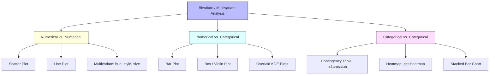

# EDA using Bivariate & Multivariate Analysis

[](https://colab.research.google.com/github/RiazML/machine-learning-notes/blob/main/notebooks/021_eda_using_bivariate_and_multivariate_analysis.ipynb)

Univariate analysis tells us how a single variable behaves, but machine learning models rely on relationships between variables. **Bivariate Analysis** examines two variables together, while **Multivariate Analysis** uncovers interactions among three or more variables simultaneously.

---

## 1. Bivariate & Multivariate Analysis Framework

To choose the right visualization or mathematical check, map out the data types of the variables you are analyzing:



---

## 2. Combination 1: Numerical vs. Numerical

When both variables are continuous/numerical, we seek to understand correlation, trends, and clusters.

### 2.1. Scatter Plot & Line Plot

- **Scatter Plot (`sns.scatterplot`)**: Plots individual points representing observations. Great for checking linear or non-linear correlation.
- **Line Plot (`sns.lineplot`)**: Ideal for ordered variables like time-series data (e.g., year-on-year changes).

### 2.2. Adding Dimensions (Multivariate Analysis)

We can scale a scatter plot to represent up to 5 dimensions of information using Seaborn:

1. **X-axis**: Variable 1 (Numerical)
2. **Y-axis**: Variable 2 (Numerical)
3. **Hue**: Variable 3 (Categorical color)
4. **Style**: Variable 4 (Categorical marker shape, e.g., $\times$ vs $\circ$)
5. **Size**: Variable 5 (Numerical size of marker)

_Example (Restaurant Tips Dataset)_: Plotting `Total Bill` vs `Tip` grouped by `Sex` (hue), `Smoker` (style), and table `Size` (size).

---

## 3. Combination 2: Numerical vs. Categorical

We use this combination to compare numerical distributions across different discrete groups.

### 3.1. Bar Plot (`sns.barplot`)

A bar plot represents the central tendency (typically the mean) of a numerical variable for each category, with vertical error bars indicating confidence intervals or standard deviation.

### 3.2. Box / Violin Plot (`sns.boxplot` / `sns.violinplot`)

- **Box Plot**: Compares the 5-number summary across categories side-by-side (e.g., Age distribution of survivors vs. non-survivors).
- **Violin Plot**: Combines a box plot with a KDE curve, showing the distribution's density shape directly.

### 3.3. Overlaid KDE Plots (`sns.kdeplot(hue)`)

Plots overlapping probability distribution curves for different classes.

- _Titanic Insight_: By plotting the KDE of `Age` split by `Survived` (0 vs. 1), we see a peak in survival probability for children under 10 years old, and a peak in death probability for adults aged 20–30.

---

## 4. Combination 3: Categorical vs. Categorical

When comparing two categorical features, we look for group associations and proportions.

### 4.1. Crosstab & Contingency Tables (`pd.crosstab`)

Calculates the raw counts of combinations between categories.

```python
import pandas as pd
df = pd.read_csv("../data/titanic.csv")
pd.crosstab(df['Pclass'], df['Survived'])
```

### 4.2. Heatmap (`sns.heatmap`)

Translates cross-tabulated tables into a color-intensity grid. Light/dark shades indicate concentrations of records.

### 4.3. Groupby & Stacked Bar Charts

By running a groupby operation and calculating percentages (e.g., percentage survival by gender), we can visualize conditional probabilities.

- _Titanic Insight_: Calculating survival rates:
  - **Class 1**: 62.9% survival
  - **Class 2**: 47.2% survival
  - **Class 3**: 24.2% survival

---

## 5. Matrix & Grid Plots

For high-dimensional exploratory sweeps:

### 5.1. Pair Plot (`sns.pairplot`)

Automatically plots pairwise scatter plots for all numerical variables in the dataframe, with histograms/KDEs along the diagonal.

- **Limitation**: Computationally expensive for datasets with many columns. Filter to key columns first.

### 5.2. Correlation Heatmap (`sns.heatmap(df.corr())`)

Plots the full correlation matrix as a heatmap, allowing instant detection of multicollinearity.

---

## 6. Comprehensive Python Implementation Script

Here is an end-to-end Python script using built-in Seaborn datasets to perform all Bivariate and Multivariate operations:

```python
import pandas as pd
import matplotlib.pyplot as plt
import seaborn as sns

# Load built-in datasets
tips = sns.load_dataset("tips")
titanic = pd.read_csv("../data/titanic.csv")
flights = sns.load_dataset("flights")
iris = sns.load_dataset("iris")

# Set up matplotlib figure grid
fig, axes = plt.subplots(3, 2, figsize=(16, 20))
sns.set_theme(style="whitegrid")

# 1. Numerical-Numerical (Multivariate Scatter Plot)
# 5 dimensions: Total Bill (x), Tip (y), Gender (hue), Smoker (style), Size (size)
sns.scatterplot(data=tips, x="total_bill", y="tip", hue="sex", style="smoker", size="size",
                sizes=(20, 200), ax=axes[0, 0])
axes[0, 0].set_title("Numerical-Numerical: Total Bill vs Tip (Multivariate)")

# 2. Numerical-Numerical (Temporal Trend Line Plot)
# Aggregates flights data to plot passenger counts over time
flights_grouped = flights.groupby('year')['passengers'].sum().reset_index()
sns.lineplot(data=flights_grouped, x="year", y="passengers", marker="o", color="darkblue", ax=axes[0, 1])
axes[0, 1].set_title("Numerical-Numerical: Yearly Flights Passengers Trend")

# 3. Numerical-Categorical (Bar Plot with Hue)
# Shows average age by Class, separated by Gender (Hue)
sns.barplot(data=titanic, x="Pclass", y="Age", hue="Sex", ax=axes[1, 0], palette="muted")
axes[1, 0].set_title("Numerical-Categorical: Average Age by Class & Gender")

# 4. Numerical-Categorical (Boxplot with Hue)
# Analyzes Age distribution of Survived (0/1) split by Sex (Hue)
sns.boxplot(data=titanic, x="Survived", y="Age", hue="Sex", ax=axes[1, 1], palette="pastel")
axes[1, 1].set_title("Numerical-Categorical: Age Distribution by Survival & Sex")

# 5. Categorical-Categorical (Heatmap from Crosstab)
# Cross-tabulates Passenger Class vs Survival status
crosstab_res = pd.crosstab(titanic['Pclass'], titanic['Survived'])
sns.heatmap(crosstab_res, annot=True, fmt="d", cmap="YlGnBu", cbar=True, ax=axes[2, 0])
axes[2, 0].set_title("Categorical-Categorical: Pclass vs Survived Contingency Heatmap")

# 6. Numerical-Categorical Overlaid KDE
# Plots Age distributions comparing Survived vs Not Survived
sns.kdeplot(data=titanic, x="Age", hue="Survived", fill=True, common_norm=False, alpha=0.5, palette="Set1", ax=axes[2, 1])
axes[2, 1].set_title("Numerical-Categorical: Age distribution of Survived vs Died")

plt.tight_layout()
plt.show()

# 7. Pair Plot Grid (Executed separately because it creates its own figure)
print("\n--- Generating Iris Pair Plot Grid ---")
pair_grid = sns.pairplot(iris, hue="species", palette="bright")
plt.show()

# 8. Groupby Survival Percentages
print("\n=== Survival Rate Calculations ===")
print("Survival Rate by Gender:")
print(titanic.groupby('Sex')['Survived'].mean() * 100)
print("\nSurvival Rate by Passenger Class:")
print(titanic.groupby('Pclass')['Survived'].mean() * 100)
```

---

## 7. Practical Tips and Analogies

> [!NOTE]
> **Understanding the Error Bars**: In a bar plot (`sns.barplot`), the small black T-shaped lines at the top of each bar are not decoration. They represent the **95% Confidence Interval (CI)**. If the confidence intervals of two bars overlap significantly, it suggests that the difference in means between those two categories is statistically insignificant.

> [!TIP]
> **The PDF Overlay Advantage**: When comparing distributions across categories (like Age vs Survived), overlapping KDE plots are often far more descriptive than box plots. They immediately reveal sub-population interactions—such as the rescue priority of children under 10 years old—which a box plot's median line hides.
