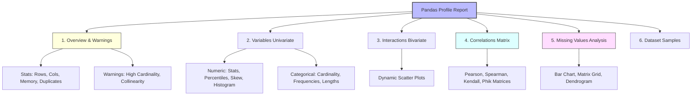

# Automated EDA with Pandas Profiling (`ydata-profiling`)

[](https://colab.research.google.com/github/RiazML/machine-learning-notes/blob/main/notebooks/022_pandas_profiling.ipynb)

Manual exploratory data analysis using Seaborn and Matplotlib is critical for custom insights, but it can be time-consuming. **Pandas Profiling** (now maintained as **`ydata-profiling`**) automates this entire pipeline, generating a comprehensive, interactive HTML report on your dataset with just a single line of code.

---

## 1. Structure of the Generated Profile Report

An automated profile report organizes data checkups into six structured components:



---

## 2. Setting Up the Environment

The library was originally named `pandas-profiling`, but it has transitioned to `ydata-profiling`. You should install the current package:

```bash
pip install ydata-profiling
```

### Basic Generation Code

```python
import pandas as pd
from ydata_profiling import ProfileReport

# Load dataset
df = pd.read_csv("../data/titanic.csv")

# Generate the report
profile = ProfileReport(df, title="Exploratory Data Analysis Report", explorative=True)

# Save as an interactive HTML webpage
profile.to_file("eda_report.html")
```

---

## 3. Deep Dive: The 6 Sections of the Report

### Section 1: Overview & Warnings

- **Dataset Info**: Shows total rows, columns, missing cells, missing percentage, duplicate rows, duplicate percentage, and memory footprint.
- **Variables Types**: Lists how many columns are categorical vs. numerical.
- **Warning Triggers**: Flags critical issues automatically:
  - _High Cardinality_: Categorical columns with too many unique values (e.g., `Name`, `Ticket` in Titanic).
  - _High Correlation_: Pairs of columns that are highly correlated (e.g., multicollinearity between `Pclass` and `Fare`).
  - _Constant Values_: Columns with a single value (can be safely dropped).
  - _Zeroes_: Columns with an unusually high proportion of zero values.

---

### Section 2: Variables (Univariate Analysis)

Provides an exhaustive univariate review of each column. Clicking **"Toggle details"** reveals:

- **For Numerical Columns**:
  - _Quantile Statistics_: Min, Q1, median, Q3, max, range, IQR.
  - _Descriptive Statistics_: Mean, standard deviation (std), variance, skewness, kurtosis.
  - _Histogram_: Interactive frequency distribution plot.
  - _Extreme Values_: Lists the top 5 lowest and top 5 highest values (outlier sweep).
- **For Categorical Columns**:
  - Frequencies of unique values, missing percentages, and character length distributions.

---

### Section 3: Interactions (Bivariate Analysis)

Allows the user to select any two numerical variables and dynamically plots their relationship as a scatter plot. This is excellent for scanning clusters, linear patterns, or boundaries.

---

### Section 4: Correlations

Displays heatmaps using multiple correlation coefficients:

- **Pearson ($r$)**: Measures linear relationships.
- **Spearman ($\rho$)**: Measures monotonic (order-based) relationships.
- **Kendall ($\tau$)**: Measures ordinal associations.
- **Phik ($\phi_K$)**: A correlation coefficient capable of capturing non-linear relationships and interactions between categorical-numerical variable pairs.

---

### Section 5: Missing Values

Visualizes the structure of missingness using four methods:

1. **Count Bar**: Simple bar chart of non-null counts per column.
2. **Matrix**: A visual grid of your dataset. White lines represent missing cells, allowing you to see if missingness is randomly distributed or clustered in specific sequences of rows.
3. **Heatmap**: Correlates the presence/absence of data between columns.
4. **Dendrogram**: Clusters columns using hierarchical clustering. Columns that branch together have similar patterns of missingness.

---

### Section 6: Sample

Shows the head (first 10 rows) and tail (last 10 rows) of the dataset to verify that the parsing was correct.

---

## 4. Complete Python Implementation Script

This script downloads the Titanic dataset, prints high-level dataset statistics programmatically using the ProfileReport API, and outputs the HTML file:

```python
import pandas as pd
from ydata_profiling import ProfileReport

# 1. Load Titanic dataset
url = "../data/titanic.csv"
df = pd.read_csv(url)

# 2. Initialize the Profile Report
# The 'explorative=True' flag enables deeper analysis like correlations and Phik matrix
print("Initializing Profile Report...")
profile = ProfileReport(
    df,
    title="Titanic Dataset Profiling Report",
    explorative=True,
    dark_mode=True  # Renders the HTML report in a modern dark theme
)

# 3. Print high-level overview metrics programmatically to the console
print("\n=== PROGRAMMATIC STATISTICS SUMMARY ===")
description = profile.description_set
stats = description['table']
print(f"Number of observations (rows): {stats['n']}")
print(f"Number of variables (columns): {stats['n_var']}")
print(f"Missing cells percentage: {stats['p_cells_missing']:.2%}")
print(f"Duplicate rows percentage: {stats['p_duplicates']:.2%}")
print(f"Memory footprint: {stats['memory_size'] / 1024:.2f} KB")

# 4. Export the interactive HTML report to disk
output_file = "titanic_profiling_report.html"
print(f"\nExporting interactive report to '{output_file}'...")
profile.to_file(output_file)
print("Export Complete! Open the HTML file in your web browser to interact with the report.")
```

---

## 5. Practical Tips and Analogies

> [!WARNING]
> **The Out-of-Memory (OOM) Danger**: Automated profiling executes pairwise comparisons ($O(N^2)$ operations). Running it on a dataset with millions of rows or hundreds of columns will crash your system or hang indefinitely.
>
> _The Fix_: If your dataset is massive, sample it first:
>
> ```python
> # Profile a representative sample of 10,000 rows
> sampled_df = df.sample(n=10000, random_state=42)
> profile = ProfileReport(sampled_df)
> ```

> [!TIP]
> **The Dendrogram Trick**: When look at the Dendrogram in Section 5 (Missing Values), if `Age` and `Cabin` cluster together at a low height, it implies that when a passenger's age is missing, their cabin number is also highly likely to be missing. This reveals systemic data gathering issues (e.g., survival logs compiled from survivors only).
