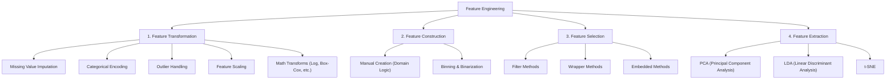

# What is Feature Engineering?

[](https://colab.research.google.com/github/RiazML/machine-learning-notes/blob/main/notebooks/023_what_is_feature_engineering.ipynb)

Feature Engineering is one of the most critical phases in the Machine Learning Development Life Cycle (MLDLC). According to machine learning pioneer Andrew Ng:

> _"Coming up with features is difficult, time-consuming, requires expert knowledge. 'Applied machine learning' is basically feature engineering."_

Similarly, Pedro Domingos, in his famous paper _A Few Useful Things to Know About Machine Learning_, states:

> _"At the end of the day, some machine learning projects succeed and some fail. What makes the difference? Easily the most important factor is the features used."_

This guide explores the concept, taxonomy, pillars, and practical implementations of feature engineering.

---

## 1. Defining Feature Engineering

### Formal Definition

> **Feature Engineering** is the process of using domain knowledge of the data to create features (input columns) that make machine learning algorithms work.

If raw data is the fuel, feature engineering is the refining process that turns it into rocket fuel. Machine learning models cannot directly ingest raw, noisy, and unstructured data and produce optimal predictions. You must transform, construct, select, and extract the right representations.

```
+------------+     +-------------------+     +---------------------+     +-----------------+
|  Raw Data  | --> | Data Preprocessing | --> | Feature Engineering | --> | Model Training  |
+------------+     +-------------------+     +---------------------+     +-----------------+
```

### The "Art vs. Science" Philosophy

Feature engineering is widely considered an **art** rather than a rigid science. Unlike model training—which involves executing predefined mathematical optimization algorithms—feature engineering relies heavily on:

1. **Domain Expertise**: Understanding the business context (e.g., in medical data, combining systolic and diastolic blood pressure into Mean Arterial Pressure).
2. **Intuition & Experience**: Recognizing patterns and knowing how certain transformations affect specific algorithms.
3. **Continuous Experimentation**: Generating hypotheses, building features, testing model performance, and iterating.

A simple algorithm (like Logistic Regression) trained on highly engineered, clean features will frequently outperform a highly complex algorithm (like a Deep Neural Network) trained on poor, noisy features.

---

## 2. The Taxonomy of Feature Engineering

Feature engineering can be categorized into four primary pillars. The diagram below illustrates the hierarchical taxonomy:



---

## 3. Deep Dive: The 4 Pillars

### Pillar 1: Feature Transformation

Feature Transformation involves taking an existing feature and modifying its representation to make it more suitable for the machine learning model.

#### A. Missing Value Imputation

Real-world datasets are rarely complete. However, standard scikit-learn algorithms (e.g., `LinearRegression`, `SupportVectorMachines`) do not accept missing values (`NaN`).

- **Univariate Imputation**: Imputing a missing value using other values from the _same_ column (e.g., Mean, Median, Mode, Arbitrary Value, or End of Distribution).
- **Multivariate Imputation**: Imputing missing values by modeling them as a function of other features (e.g., `KNNImputer`, `MICE` - Multivariate Imputation by Chained Equations).

#### B. Categorical Encoding

Machine learning algorithms operate on numbers, not strings. Categorical variables must be converted to numeric form.

- **Nominal Encoding (No Order)**: One-Hot Encoding (OHE), Frequency/Count Encoding, Target Encoding.
- **Ordinal Encoding (Has Order)**: Ordinal Encoding (e.g., Education: High School = 0, UG = 1, PG = 2), Label Encoding (specifically for target labels).

#### C. Outlier Detection & Handling

Outliers are extreme observations that deviate significantly from the rest of the data. They can severely distort models that rely on variance or distance.

- _Analogy_: In a class where most students score between 40 and 60, "Sharma ji's son" scores 980 (an error or extreme outlier). This single data point shifts the mean and pulls a Linear Regression line far away from the general pattern of the data.
- **Detection**: Z-Score Method ($\mu \pm 3\sigma$), IQR Method ($[Q_1 - 1.5 \times \text{IQR}, Q_3 + 1.5 \times \text{IQR}]$), or Percentile Method.
- **Handling**:
  - _Trimming_: Deleting the outlier rows.
  - _Capping (Winsorization)_: Restricting extreme values to a maximum/minimum threshold.

#### D. Feature Scaling

When features have vastly different ranges (e.g., Age: 18–80 vs. Annual Salary: \$15,000–\$1,000,000), distance-based algorithms (KNN, K-Means, SVM) or optimization algorithms (Gradient Descent) will perform poorly. The scale of the larger feature will dominate the distance calculations or cause gradients to oscillate.

- **Standardization**: Centering the distribution around 0 with a standard deviation of 1.
- **Normalization**: Scaling features to a fixed range (typically 0 to 1).

#### E. Mathematical Transforms

Some algorithms assume that features are normally distributed. Mathematical transformations help convert skewed distributions into Gaussian-like distributions.

- **Common Transforms**: Log Transform ($\log(x)$), Reciprocal Transform ($1/x$), Square Root Transform ($\sqrt{x}$), Power Transforms (Box-Cox, Yeo-Johnson).

---

### Pillar 2: Feature Construction

Feature Construction is the manual creation of new features from existing columns based on business logic, physics, or domain intuition.

#### Titanic Dataset Example

In the Titanic dataset, we have two columns representing family relationships:

- `SibSp`: Number of Siblings / Spouses aboard.
- `Parch`: Number of Parents / Children aboard.

Individually, these columns might show a weak correlation with survival. However, by combining them, we can construct:
$$\text{Family\_Size} = \text{SibSp} + \text{Parch} + 1$$
We can also derive a binary feature:
$$\text{Is\_Alone} = \begin{cases} 1 & \text{if } \text{Family\_Size} == 1 \\ 0 & \text{otherwise} \end{cases}$$
Small families often had higher survival rates (due to mutual assistance and prioritizations), whereas solo travelers or extremely large families had lower survival rates. This constructed feature captures this non-linear interaction directly.

---

### Pillar 3: Feature Selection

Feature Selection is the process of selecting a subset of the most relevant features from the dataset. It helps combat the **Curse of Dimensionality**, reduces overfitting, increases model interpretability, and drastically decreases training time.

#### MNIST Border Pixel Example

The MNIST dataset consists of $28 \times 28$ grayscale images of handwritten digits, resulting in $784$ features (pixels).

- Because digits are written in the center, the pixels along the margins/borders are always white/black (value = 0) across all images.
- These margin pixels have **zero variance**. They contain no information to distinguish a '0' from a '9'.
- By performing feature selection, we can drop these inactive border pixels entirely, reducing the feature space from 784 to under 400 without losing any predictive accuracy.

---

### Pillar 4: Feature Extraction

Feature Extraction is the process of programmatically projecting high-dimensional data into a lower-dimensional space. Unlike Feature Construction (which is manual and intuitive), Feature Extraction is automated and mathematical.

#### Real Estate Analogy

- **Feature Construction**: You combine `Num_Rooms` and `Num_Bathrooms` to create a manual feature `Total_Rooms`.
- **Feature Extraction**: Instead of manual features, you pass 20 different architectural details (room count, hallway widths, window count, ceiling height) through a dimensionality reduction algorithm like **Principal Component Analysis (PCA)**. The algorithm automatically compresses these 20 dimensions into 2 orthogonal components that capture 95% of the variance.

---

## 4. Hands-on Python Implementation

The following Python script demonstrates:

1. **Feature Construction**: Creating family metrics from Titanic features.
2. **Preprocessing Pipeline**: Using `ColumnTransformer` to impute missing values, encode categorical variables, and scale numerical variables in a unified pipeline.

```python
import numpy as np
import pandas as pd
from sklearn.model_selection import train_test_split
from sklearn.compose import ColumnTransformer
from sklearn.impute import SimpleImputer
from sklearn.preprocessing import OneHotEncoder, StandardScaler
from sklearn.pipeline import Pipeline
from sklearn.ensemble import RandomForestClassifier
from sklearn.metrics import accuracy_score

# 1. Create a Mock Titanic Dataset
np.random.seed(42)
n_samples = 200

data = {
    'Age': np.random.choice([np.nan, 22, 38, 26, 35, 54, 2, 27, 14, 4], size=n_samples, p=[0.1, 0.1, 0.1, 0.1, 0.1, 0.1, 0.1, 0.1, 0.1, 0.1]),
    'Fare': np.random.exponential(scale=32.0, size=n_samples),
    'SibSp': np.random.choice([0, 1, 2, 3], size=n_samples, p=[0.7, 0.2, 0.05, 0.05]),
    'Parch': np.random.choice([0, 1, 2], size=n_samples, p=[0.8, 0.1, 0.1]),
    'Embarked': np.random.choice(['S', 'C', 'Q', np.nan], size=n_samples, p=[0.7, 0.2, 0.08, 0.02]),
    'Sex': np.random.choice(['male', 'female'], size=n_samples),
    'Survived': np.random.choice([0, 1], size=n_samples, p=[0.6, 0.4])
}

df = pd.DataFrame(data)
print("--- Raw Data Sample ---")
print(df.head(), "\n")

# 2. Step 1: Feature Construction (Done on the DataFrame)
# We calculate family size and create an indicator for traveling alone
df['Family_Size'] = df['SibSp'] + df['Parch'] + 1
df['Is_Alone'] = (df['Family_Size'] == 1).astype(int)

# Drop original construction columns to avoid redundancy
X = df.drop(columns=['Survived', 'SibSp', 'Parch'])
y = df['Survived']

# Split train and test sets
X_train, X_test, y_train, y_test = train_test_split(X, y, test_size=0.2, random_state=42)

# 3. Define Preprocessing for Column Transformer
# Numerical columns
num_features = ['Age', 'Fare', 'Family_Size']
num_transformer = Pipeline(steps=[
    ('imputer', SimpleImputer(strategy='median')),
    ('scaler', StandardScaler())
])

# Categorical columns
cat_features = ['Embarked', 'Sex']
cat_transformer = Pipeline(steps=[
    ('imputer', SimpleImputer(strategy='most_frequent')),
    ('onehot', OneHotEncoder(handle_unknown='ignore', sparse_output=False))
])

# Combine preprocessing steps
preprocessor = ColumnTransformer(
    transformers=[
        ('num', num_transformer, num_features),
        ('cat', cat_transformer, cat_features)
    ],
    remainder='passthrough' # Keeps 'Is_Alone' column unchanged as it's already a scaled binary feature
)

# 4. Create the final Pipeline containing Preprocessing & Classifier
clf = Pipeline(steps=[
    ('preprocessor', preprocessor),
    ('classifier', RandomForestClassifier(random_state=42))
])

# 5. Fit the model and evaluate
clf.fit(X_train, y_train)
y_pred = clf.predict(X_test)

print("--- Preprocessed Transformed Columns ---")
# Let's inspect the preprocessed columns of the training set
transformed_cols = clf.named_steps['preprocessor'].transform(X_train)
print(f"Transformed Training Shape: {transformed_cols.shape}")
print("Sample Transformed Row:")
print(transformed_cols[0])

print(f"\nModel Accuracy: {accuracy_score(y_test, y_pred) * 100:.2f}%")
```

---

## 5. Summary: When to Apply Feature Engineering?

Feature engineering is applied sequentially during data prep:

1. **Impute missing values** first.
2. **Construct features** that depend on multiple columns before transforming them.
3. **Encode categorical features** to convert text to numeric values.
4. **Detect and handle outliers** so they do not skew the scaling parameters.
5. **Scale numerical values** (Standardize or Normalize) as the final step before feeding them into models.
