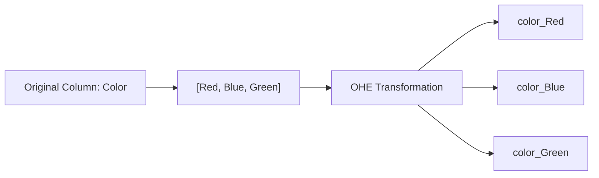

# One-Hot Encoding (OHE)

[](https://colab.research.google.com/github/RiazML/machine-learning-notes/blob/main/notebooks/027_one_hot_encoding.ipynb)

One-Hot Encoding (OHE) is the standard technique for transforming **nominal categorical data** (categories without any intrinsic order) into a numerical format suitable for machine learning models.

---

## 1. How One-Hot Encoding Works

For a categorical column with $k$ unique categories, OHE creates $k$ new binary columns (often called **dummy variables**). For each row, a `1` is placed in the column corresponding to its category, and `0` in all other columns.



### Example Mapping

If we have a feature `Color` with values `["Red", "Blue", "Green"]`:

| Color | color_Red | color_Blue | color_Green |
| :---- | :-------: | :--------: | :---------: |
| Red   |     1     |     0      |      0      |
| Blue  |     0     |     1      |      0      |
| Green |     0     |     0      |      1      |

---

## 2. The Dummy Variable Trap & Multicollinearity

When you represent a variable with $k$ categories using $k$ dummy columns, you introduce **perfect multicollinearity**.

### The Mathematical Problem

The sum of the values across all dummy columns for any given row is always equal to 1:
$$\sum_{i=1}^{k} \text{dummy}_i = 1$$

Because one dummy column can be perfectly predicted using a linear combination of the other dummy columns:
$$\text{dummy}_k = 1 - \sum_{i=1}^{k-1} \text{dummy}_i$$

This linear dependency is called the **Dummy Variable Trap**.

- It causes the input matrix $X^TX$ to be singular (non-invertible), which breaks linear algorithms like Linear Regression and Logistic Regression that rely on matrix inversion to calculate coefficients.
- **Solution**: Drop one of the dummy columns. A variable with $k$ categories is represented using $k-1$ columns. If all $k-1$ columns are `0`, the model infers that the dropped category is `1`.

---

## 3. Pandas `get_dummies` vs. Scikit-Learn `OneHotEncoder`

There are two primary ways to implement OHE in Python:

### A. Pandas `pd.get_dummies`

- **Pros**: Extremely simple to use and returns a clean, labeled DataFrame immediately.
- **Cons**: **Not suitable for production machine learning pipelines**. It does not save the mapping or state of the categories. If your test set or real-world web data has fewer or different categories than your training set, the number of generated columns will differ, crashing your model.

### B. Scikit-Learn `OneHotEncoder`

- **Pros**: Saves the list of categories during the `fit()` stage on the training data. Ensures that the transformed training and test sets always have the exact same shape and columns.
- **Cons**: Returns a numpy array (or sparse matrix) and requires manual concatenation if you aren't using `ColumnTransformer`.

---

## 4. Handling High Cardinality (Rare Category Clustering)

When a nominal feature has many unique categories (e.g., brand of cars with 30+ brands, or country code with 190+ countries), applying OHE creates a massive number of sparse columns. This leads to the **curse of dimensionality**, slowing down model training and causing overfitting.

### The Solution: Top-N Thresholding

1. Identify the frequency of each category.
2. Keep the top $N$ most frequent categories.
3. Group all other remaining categories into a single new category (e.g., `"others"` or `"uncommon"`).
4. Apply One-Hot Encoding on this reduced set of $N+1$ categories.

---

## 5. Complete Implementation Code

Below is the complete, runnable Python script showing how to perform One-Hot Encoding, drop the first column to avoid the dummy trap, and handle high cardinality columns.

```python
import numpy as np
import pandas as pd
from sklearn.model_selection import train_test_split
from sklearn.preprocessing import OneHotEncoder

# --- PART 1: Standard One-Hot Encoding ---

# Create a sample dataset
data = {
    'brand': ['Maruti', 'Hyundai', 'Tata', 'Mahindra', 'Maruti', 'Hyundai', 'Honda', 'Tata', 'Ford', 'Ford'],
    'km_driven': [50000, 30000, 60000, 25000, 15000, 45000, 35000, 80000, 90000, 40000],
    'fuel': ['Diesel', 'Petrol', 'Diesel', 'Petrol', 'Petrol', 'Diesel', 'CNG', 'Diesel', 'Diesel', 'Petrol'],
    'owner': ['First Owner', 'Second Owner', 'First Owner', 'First Owner', 'Third Owner', 'First Owner', 'First Owner', 'Second Owner', 'Third Owner', 'First Owner'],
    'selling_price': [450000, 350000, 500000, 600000, 250000, 400000, 300000, 200000, 150000, 380000]
}

df = pd.DataFrame(data)

# Split features (X) and target (y)
X = df[['brand', 'km_driven', 'fuel', 'owner']]
y = df['selling_price']

# Train-test split
X_train, X_test, y_train, y_test = train_test_split(X, y, test_size=0.3, random_state=42)

# Using Scikit-Learn's OneHotEncoder on 'fuel' and 'owner'
# drop='first' removes the first category column to prevent the Dummy Variable Trap.
# sparse_output=False ensures we get a dense numpy array directly instead of a sparse matrix.
ohe = OneHotEncoder(drop='first', sparse_output=False, dtype=np.int32)

# Fit on training data and transform both sets
X_train_ohe = ohe.fit_transform(X_train[['fuel', 'owner']])
X_test_ohe = ohe.transform(X_test[['fuel', 'owner']])

# Concatenate back with non-categorical columns ('brand', 'km_driven')
# We extract numerical/other arrays manually
X_train_remaining = X_train[['brand', 'km_driven']].values
X_train_transformed = np.hstack((X_train_remaining, X_train_ohe))

print("--- Transformed X_train Shape ---")
print(X_train_transformed.shape)
print("Categories learned:", ohe.categories_)

# --- PART 2: High Cardinality & Top-N Encoding ---

# Let's inspect the brand column counts
brand_counts = df['brand'].value_counts()
print("\n--- Brand Frequency Counts ---")
print(brand_counts)

# Suppose we only want to keep brands that appear more than 1 time in the dataset.
# Any brand with frequency <= 1 will be grouped into 'others'
threshold = 1
repl = brand_counts[brand_counts <= threshold].index

# Apply the replacement on the dataset
df['brand'] = df['brand'].replace(repl, 'others')

print("\n--- Brand Counts After Rare Clustering ---")
print(df['brand'].value_counts())
```

---

## 6. Key Highlights

1. **Drop First Parameter**: In `OneHotEncoder`, setting `drop='first'` resolves the dummy variable trap by dropping the first class alphabetically.
2. **Sparse Output**: By default, `OneHotEncoder` returns a scipy sparse matrix (`sparse_output=True`) to save memory when there are many categories. Set `sparse_output=False` to return a dense array.
3. **Pipeline Alignment**: Always perform fit operations on the training subset only. Test subsets must only be transformed using the learned categories.
