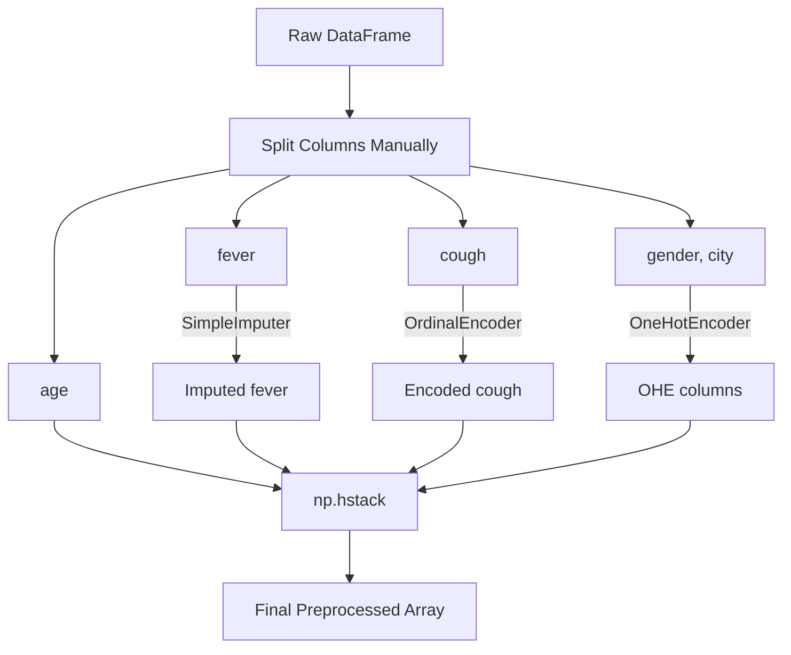

# ColumnTransformer in Machine Learning

[](https://colab.research.google.com/github/RiazML/machine-learning-notes/blob/main/notebooks/028_column_transformer_in_machine_learning.ipynb)

When building machine learning workflows, different columns in your dataset require different preprocessing steps:

- Numerical columns with missing values require **Imputation**.
- Highly skewed numerical columns require **Mathematical Transforms**.
- Nominal categorical columns require **One-Hot Encoding**.
- Ordinal categorical columns require **Ordinal Encoding**.

Applying these transformations manually column by column, converting them into separate numpy arrays, and joining them back is extremely tedious and error-prone. Scikit-Learn's **`ColumnTransformer`** class solves this problem.

---

## 1. Manual Stacking (The Hard Way) vs. `ColumnTransformer` (The Modern Way)

### The Hard Way (Manual Stacking)

1. Extract the `age` column.
2. Extract the `fever` column, impute missing values using `SimpleImputer`, and save it.
3. Extract the `cough` column, encode it using `OrdinalEncoder`, and save it.
4. Extract the `gender` and `city` columns, encode them using `OneHotEncoder`, and save it.
5. Horizontally stack (`np.hstack` or `np.concatenate`) all four arrays.



### The Modern Way (`ColumnTransformer`)

You define a single preprocessing blueprint using `ColumnTransformer` and fit-transform the entire DataFrame in a single step.

```mermaid
graph TD
    A["Raw DataFrame"] --> B["ColumnTransformer Preprocessing Blueprint"]
    B --> C["SimpleImputer("'fever'")"]
    B --> D["OrdinalEncoder("'cough'")"]
    B --> E["OneHotEncoder("'gender', 'city'")"]
    B --> F["remainder='passthrough' ('age')"]
    C & D & E & F --> G["Single Concatenated Output Array"]
```

---

## 2. API Architecture

To use `ColumnTransformer`, import it from the `sklearn.compose` module:

```python
from sklearn.compose import ColumnTransformer
```

The constructor accepts two main parameters:

1. **`transformers`**: A list of 3-element tuples representing the transformations:

    ```text
    (name, transformer_object, column_list)
    ```

2. **`remainder`**: Specifies what to do with columns not listed in any transformer.
    - `remainder='drop'` (default): Drops all remaining columns.
    - `remainder='passthrough'`: Keeps remaining columns without any transformation.

---

## 3. Complete Implementation Code

Below is the complete, runnable Python code comparing manual stacking to the `ColumnTransformer` implementation.

```python
import numpy as np
import pandas as pd
from sklearn.model_selection import train_test_split
from sklearn.impute import SimpleImputer
from sklearn.preprocessing import OneHotEncoder, OrdinalEncoder
from sklearn.compose import ColumnTransformer

# 1. Create a dummy Covid dataset (10 samples)
# Note: 'fever' has some NaN (missing) values.
data = {
    'age': [23, 44, 30, 22, 55, 60, 25, 38, 41, 19],
    'gender': ['Male', 'Female', 'Female', 'Male', 'Female', 'Male', 'Female', 'Male', 'Female', 'Male'],
    'fever': [98.6, 102.1, np.nan, 99.8, 101.5, np.nan, 98.4, 100.2, 103.0, 99.0],
    'cough': ['mild', 'strong', 'mild', 'mild', 'strong', 'strong', 'mild', 'strong', 'mild', 'mild'],
    'city': ['Kolkata', 'Delhi', 'Mumbai', 'Kolkata', 'Delhi', 'Kolkata', 'Mumbai', 'Delhi', 'Mumbai', 'Kolkata'],
    'has_covid': ['no', 'yes', 'no', 'no', 'yes', 'yes', 'no', 'no', 'yes', 'no']
}

df = pd.DataFrame(data)

# Split features (X) and target (y)
X = df.drop(columns=['has_covid'])
y = df['has_covid']

# Train-test split
X_train, X_test, y_train, y_test = train_test_split(X, y, test_size=0.3, random_state=42)

print("--- Original X_train ---")
print(X_train)

# 2. Define the ColumnTransformer Preprocessing Blueprint
transformer = ColumnTransformer(
    transformers=[
        # Tuple 1: Impute missing fever values with mean
        ('impute_fever', SimpleImputer(), ['fever']),

        # Tuple 2: Ordinal encode cough values
        ('ordinal_cough', OrdinalEncoder(categories=[['mild', 'strong']]), ['cough']),

        # Tuple 3: One-hot encode gender and city (drop='first' to avoid multicollinearity)
        ('ohe_gender_city', OneHotEncoder(drop='first', sparse_output=False), ['gender', 'city'])
    ],
    remainder='passthrough'  # Pass 'age' through without modifying it
)

# 3. Fit and Transform on training data
X_train_transformed = transformer.fit_transform(X_train)
X_test_transformed = transformer.transform(X_test)

# Show shape of preprocessed dataset
print("\n--- Transformed X_train Shape ---")
print(X_train_transformed.shape)

# Convert output back to DataFrame for display
# Output is a dense numpy array of shape (7, 6):
# col0: imputed fever
# col1: ordinal encoded cough
# col2: one-hot encoded gender (Male)
# col3: one-hot encoded city (Kolkata vs Delhi)
# col4: one-hot encoded city (Mumbai vs Delhi)
# col5: passthrough age
transformed_df = pd.DataFrame(X_train_transformed)
print("\n--- Transformed X_train DataFrame ---")
print(transformed_df)
```

---

## 4. Key Highlights

1. **Remainder Passthrough vs Drop**: Always set `remainder='passthrough'` if you want columns not specified in the transformations to remain in your dataset. The default is `remainder='drop'`, which will delete all unlisted features.
2. **Output Format**: `ColumnTransformer` concatenates columns in the order defined in the `transformers` list, followed by any `passthrough` columns. This rearranges your columns, so you must track column positions if converting the output back to a Pandas DataFrame.
3. **Pipeline Ready**: Using `ColumnTransformer` allows you to wrap your entire preprocessing logic inside a single object that integrates cleanly into Scikit-Learn `Pipeline` classes, preventing data leakage during cross-validation.
