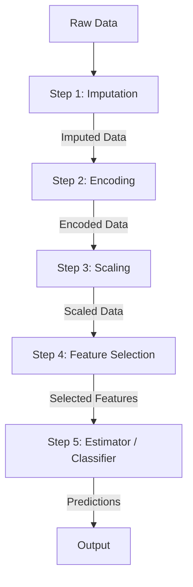
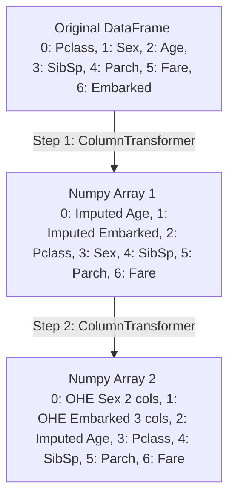

# Machine Learning Pipelines A–Z

[](https://colab.research.google.com/github/RiazML/machine-learning-notes/blob/main/notebooks/029_machine_learning_pipelines_a-z.ipynb)

In machine learning, preprocessing and modeling are typically chained together. When we have a complex series of preprocessing steps (e.g., handling missing values, encoding categorical variables, scaling numerical data, selecting key features) followed by an estimator (e.g., a Decision Tree), managing these steps individually becomes chaotic.

An **ML Pipeline** chains these transformers and estimators together into a unified workflow. The output of each step serves as the input to the next step.



---

## 1. The Chaos of Machine Learning Without Pipelines

To understand the beauty of pipelines, we must first experience the pain of building a project without them.

Let's assume we want to preprocess the Titanic dataset:

1. **Drop** irrelevant columns (`PassengerId`, `Name`, `Ticket`, `Cabin`).
2. **Split** data into training and testing sets.
3. **Impute** missing values: Mean imputation for `Age`, mode (most frequent) imputation for `Embarked`.
4. **Encode** categorical features: One-Hot Encoding for `Sex` and `Embarked`.
5. **Concatenate** everything back into a single matrix.
6. **Train** a classifier.
7. **Deploy** the model (exporting model parameters & preprocessing configurations).

### The Challenge of Deployment

Without a pipeline, you must export:

- The trained model (`model.pkl`)
- The age imputer (`imputer_age.pkl`)
- The embarked imputer (`imputer_embarked.pkl`)
- The gender one-hot encoder (`ohe_sex.pkl`)
- The embarked one-hot encoder (`ohe_embarked.pkl`)

In the production script, you have to load all 5 pickle files, preprocess the new user input in the exact same sequence, align the columns in the exact same positions, and only then pass them to `model.predict()`. A single mistake in column order results in wrong predictions or application crashes.

---

## 2. Pipeline Implementation (Standard Blueprint)

Scikit-Learn's [Pipeline](file:///Users/prime/Developer/ml/029_machine_learning_pipelines_a-z.md#pipeline) class wraps the entire preprocessing sequence and the model estimator into a single object.

### Understanding Index Shifts

When using multiple [ColumnTransformer](file:///Users/prime/Developer/ml/028_column_transformer_in_machine_learning.md) steps in a pipeline, remember that:

- A [ColumnTransformer](file:///Users/prime/Developer/ml/028_column_transformer_in_machine_learning.md) outputs a numpy array.
- The columns are reordered: transformed columns are moved to the front, while passthrough columns are shifted to the back.
- Therefore, subsequent steps in the pipeline must reference columns by their **new index positions** (0-indexed) rather than their original DataFrame names.



### End-to-End Pipeline Code Example

Below is the complete, runnable Python code showing how to define, train, test, export, and load a Scikit-Learn [Pipeline](file:///Users/prime/Developer/ml/029_machine_learning_pipelines_a-z.md#pipeline).

```python
import numpy as np
import pandas as pd
from sklearn.model_selection import train_test_split
from sklearn.impute import SimpleImputer
from sklearn.preprocessing import OneHotEncoder, MinMaxScaler
from sklearn.feature_selection import SelectKBest, chi2
from sklearn.tree import DecisionTreeClassifier
from sklearn.pipeline import Pipeline
from sklearn.compose import ColumnTransformer

# 1. Create Mock Titanic Dataset
raw_data = {
    'Pclass': [3, 1, 3, 1, 3, 3, 1, 3, 2, 3],
    'Sex': ['male', 'female', 'female', 'female', 'male', 'male', 'male', 'female', 'female', 'male'],
    'Age': [22.0, 38.0, 26.0, 35.0, 35.0, np.nan, 54.0, 2.0, 27.0, 14.0],
    'SibSp': [1, 1, 0, 1, 0, 0, 0, 3, 1, 0],
    'Parch': [0, 0, 0, 0, 0, 0, 0, 1, 0, 0],
    'Fare': [7.25, 71.28, 7.92, 53.10, 8.05, 8.46, 51.86, 21.07, 30.07, 30.07],
    'Embarked': ['S', 'C', 'S', 'S', 'S', 'Q', 'S', 'S', 'C', np.nan],
    'Survived': [0, 1, 1, 1, 0, 0, 0, 0, 1, 0]
}

df = pd.DataFrame(raw_data)
X = df.drop(columns=['Survived'])
y = df['Survived']

X_train, X_test, y_train, y_test = train_test_split(X, y, test_size=0.2, random_state=42)

# Step 1: Impute Missing Values (Age -> Mean, Embarked -> Most Frequent)
# Note: Input has columns: Pclass(0), Sex(1), Age(2), SibSp(3), Parch(4), Fare(5), Embarked(6)
trf1 = ColumnTransformer(
    transformers=[
        ('impute_age', SimpleImputer(), [2]),
        ('impute_embarked', SimpleImputer(strategy='most_frequent'), [6])
    ],
    remainder='passthrough'
)

# Step 2: One-Hot Encoding (Sex and Embarked)
# After trf1, the columns are:
# Index 0: Imputed Age
# Index 1: Imputed Embarked
# Index 2: Pclass
# Index 3: Sex
# Index 4: SibSp
# Index 5: Parch
# Index 6: Fare
# We need to One-Hot Encode Sex (Index 3) and Embarked (Index 1)
trf2 = ColumnTransformer(
    transformers=[
        ('ohe_sex_embarked', OneHotEncoder(sparse_output=False, handle_unknown='ignore'), [1, 3])
    ],
    remainder='passthrough'
)

# Step 3: Feature Scaling (Scale all features to [0, 1])
# After OHE, output columns count expands. We can scale all columns using slice.
trf3 = ColumnTransformer(
    transformers=[
        ('scale', MinMaxScaler(), slice(0, 10))
    ]
)

# Step 4: Feature Selection (Select top 5 features using Chi-Square test)
trf4 = SelectKBest(score_func=chi2, k=5)

# Step 5: Classifier Model
trf5 = DecisionTreeClassifier()

# Connect the Steps into a Pipeline
pipe = Pipeline([
    ('trf1', trf1),
    ('trf2', trf2),
    ('trf3', trf3),
    ('trf4', trf4),
    ('trf5', trf5)
])

# Fit the entire Pipeline on Training Data
pipe.fit(X_train, y_train)

# Inspect individual steps
print("Pipeline steps configured successfully.")
print("Named steps inside pipeline:", pipe.named_steps.keys())

# Make predictions on test set
preds = pipe.predict(X_test)
print("Predictions:", preds)
```

---

## 3. Alternative Syntax: `make_pipeline`

If you do not want to manually specify names for each step (like `'trf1'`, `'trf2'`), Scikit-Learn provides `make_pipeline`. It automatically names each step based on its class name (in lowercase).

```python
from sklearn.pipeline import make_pipeline

# Creation using make_pipeline
pipe_simple = make_pipeline(trf1, trf2, trf3, trf4, trf5)
```

---

## 4. Hyperparameter Tuning on Pipelines

One of the greatest benefits of pipelines is that you can optimize hyperparameters for both the preprocessors and the model concurrently using `GridSearchCV`.

```python
from sklearn.model_selection import GridSearchCV

# Define grid parameters
# Note the double underscore syntax: stepName__parameterName
param_grid = {
    'trf5__max_depth': [2, 3, 5, None],
    'trf4__k': [3, 5, 8]
}

grid = GridSearchCV(pipe, param_grid, cv=2, scoring='accuracy')
grid.fit(X_train, y_train)

print("Best Parameters:", grid.best_params_)
print("Best Accuracy:", grid.best_score_)
```

---

## 5. Summary of Pipeline Benefits

1. **Code Cleanliness**: The entire workflow is bundled into a single object, reducing variable clutter and boilerplate.
2. **No Data Leakage**: Transformers are fitted _only_ on training data and subsequently applied to test data. This guarantees that test set parameters (e.g., test set mean/variance) never bleed into model fitting.
3. **Cross-Validation**: Preprocessing steps are executed inside each fold of cross-validation automatically.
4. **Effortless Deployment**: You can serialize the entire fitted pipeline using `pickle` or `joblib` and deploy it directly. The production script receives raw JSON or DataFrame inputs, calls `pipe.predict()`, and yields predictions in a single line.
